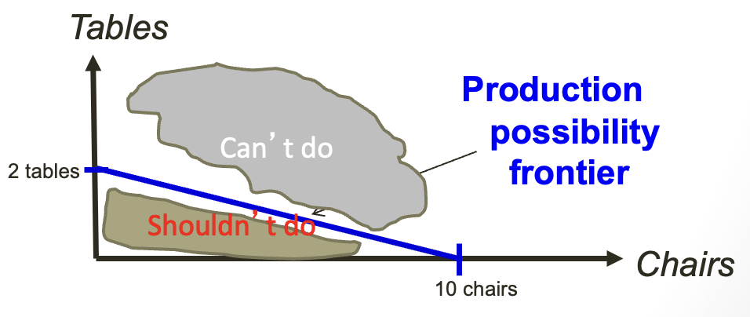
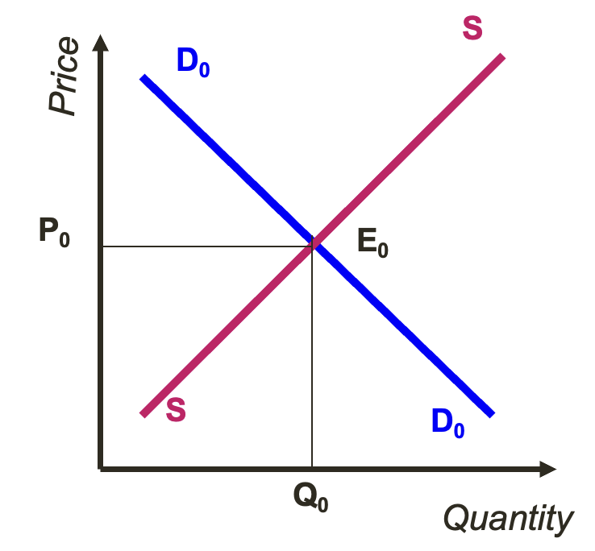
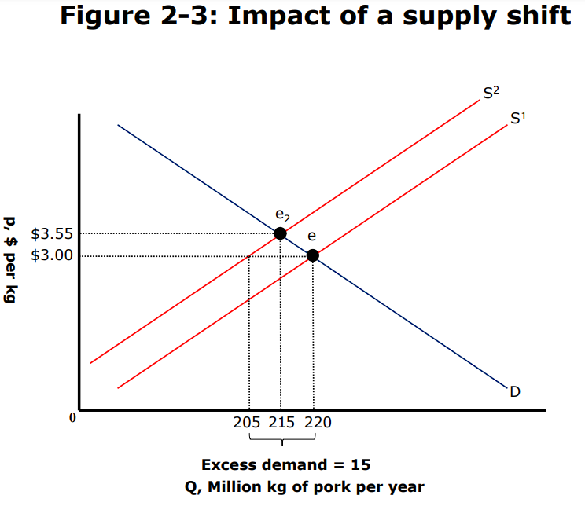
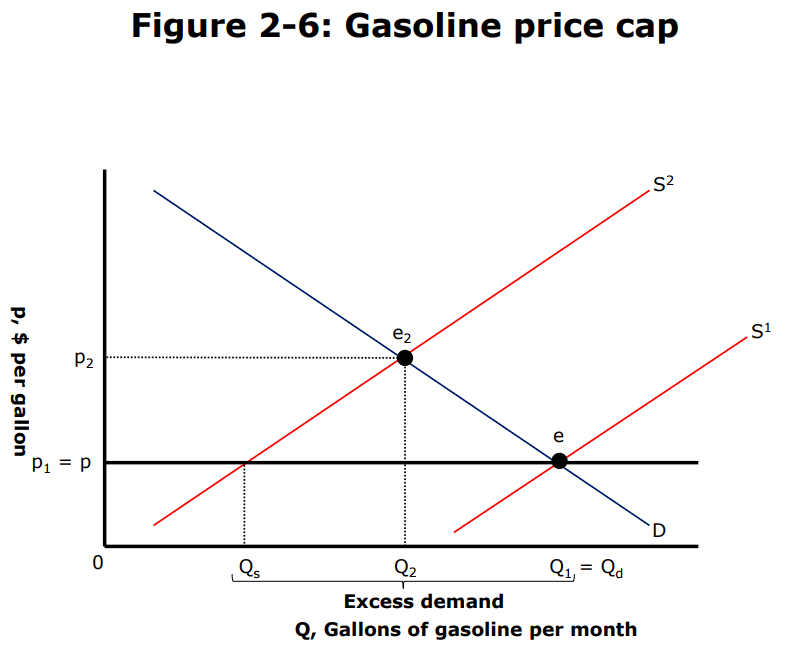

```{r setup, include=FALSE}
knitr::opts_chunk$set(echo = TRUE)
```

```{=html}
<style>
  body .main-container {
    max-width: 1100px;
  }
</style>
```
[EU409 Homepage](https://kevinli03.github.io/notes/#EU409_Basic_Economics)

------------------------------------------------------------------------

# Economics and Political Economy

### Economics

**Economics** is the study of how decisions are taken:

-   What to produce, how to produce something, and who to produce something for

-   What to consume, when to consume, and who to consume

These decisions are subject to constraints, such as preferences and technology.

<br />

Who decides these questions about production and consumption?

-   Individual actors (including producers and consumers)

-   These decisions are mediated through **prices**

<br />

### Political Economy

**Political Economy** is the study of economics, but with additional constraints

-   Political economists consider interests, institutions, and ideas

-   These decisions are mediated through **power/interests** of Governments, Organised Actors, and Institutions.

<br />

Thus, Political Economy is the study of how the political sphere interacts with economics:

-   How society affects and dictates our preferences

-   How allocation is determined by history, power, governments, and institutions

-   How information is often asymmetric, and perfect knowledge often does not exist.

<br />

### Types of Economics

**Positive Economics**: How things work in real life

-   Positive economics is objective - we test hypothesis to see how the economy operates in real life

-   Ex. If a tax is introduced on a good, what will happen to the price of the good? We can objectively measure the answer to this.

<br />

**Normative Economics**: How things [should]{.underline} work

-   Normative Economics is subjective - based on values

-   Ex. Is it morally right to impose a tax on tobacco products? There are arguments for both sides, and we cannot objectively prove anything.

<br />

**Macroeconomics**: The economy as a whole

-   Not concerned with individual actors - but rather, the economics of states, countries, the world, etc.

-   Topics include markets & government, growth, inflation, interest rates, unemployment

<br />

**Microeconomics**: How individuals and entities make decisions:

-   Small scale - focused on how preferences of individuals/firms/households alters their behaviour

-   Topics include firms and households, consumption, investment, labour supply, demand

<br />

------------------------------------------------------------------------

[EU409 Homepage](https://kevinli03.github.io/notes/#EU409_Basic_Economics)

# Core Economic Terms

### Scarcity

Scarcity is the core problem of economics

-   Scarcity means that there is some limit to the amount of a good - where one person's use of that good simultaneously diminishes the amount of that good available for others.

-   If there wasn't scarcity, then prices would be zero - everyone would just get what they want, and consume what they want.

<br />

But, because there is scarcity, we he have to make tough choices:

-   What should we produce with our limited resources?

-   How much does each person consume?

-   What is the right price?

<br />

Scarcity implies **allocation**

-   Allocation of a consumer's personal income - you have to choose what to buy with your limited money

-   Allocation of a producer's resources - you only have so much money/equipment/resources/labour, so you have to choose what you want to make

-   Allocation of how much money to save between the present and future

-   Allocation of an individual's time - often between work and leisure

<br />

### Opportunity Costs

Because of our limited resources, if we choose 1 option, we must be giving up some other options.

-   For example, if I have £5, and I buy pizza with that £5, I cannot spend it on anything else. Thus, by spending my money on pizza, I am sacrificing my other options.

-   [Opportunity cost is the value of the best alternative use of money, that we sacrificed to choose a specific option.]{.underline}

-   For example, if I have the options of a £40,000, £45,000, and £50,000 job to utilise my time (assuming I only derive utility from income), and I choose the £45,000 job, I am giving up the £50,000 and £40,000 job. Thus, my opportunity cost is £50,000, the highest valued alternative use of my time.

<br />

The concept of **rationality** means that I will choose the option with the lowest opportunity cost

-   Makes sense - you want to choose the choice that you will give up the least for.

-   This applies to all sorts of decisions - from what to produce, to what to consume, to what job to get

<br />

### Production Possibilities Frontier

If I have limited resources (such as oil, labour, etc.), I can only produce so many products.

-   Thus, choosing to produce one thing over another, means that I am giving up the benefit of producing the alternative.

-   [The Production Possibilities Frontier is a Graph, that shows the maximum combinations of two goods that can be produced together]{.underline}

-   For example, if I can produce t-shirts and pants, given my limited resources, I may only be able to produce 5 t-shirts and 0 pants, or 0 t-shirts and 5 pants, or 2 t-shirts and 3 pants.

<br />

We can connect these points on a graph (x axis being one good, y being another), to get our production possibilities frontier

-   Anything on the line is efficient - I am producing the most of the two goods I can with my limited resources

-   Any point in the area below the line (towards the origin) is inefficient - I can produce more.

-   Any point beyond the line (away from the origin) is impossible - I don't have the resources to produce that.

<br />

For example, take the following production possibilities curve:

{width="60%"}

<br />

------------------------------------------------------------------------

[EU409 Homepage](https://kevinli03.github.io/notes/#EU409_Basic_Economics)

# Supply and Demand

### Economic Models

Economics is complex - every day, millions of transactions are being made

-   To understand such a complex thing, we need to make simplifications and simplifying assumptions

-   Using these simplifications, we can create a "picture" of reality - a model

-   Models are not "perfect", however, they can allow us to focus on key elements, and find relationships - which allows us to derive theories which we can later test with empirical data.

<br />

**Supply and Demand** models, well, supply and demand, within a market, and helps us make a prediction of the price of a good.

-   A Market is formally, a set of arrangements by which buyers and sellers are in contact to exchange goods or services.

-   We are interested in the amount of goods, and the price of goods. We typically put the amount (quantity) on the x axis, and the price of goods on the y axis

<br />

### Demand

**Demand** is the quantity consumers want, at every possible price.

-   This is based on the preferences of consumers

-   Thus, every good will have its own demand curve, and demand of a good can shift over time due to changing preferences, income, etc.

<br />

Demand is typically downward sloping

-   The more expensive a good is (high price/high Y axis), the amount people want is very low (low quantity/low X axis)

    -   Ex. If a book costs £1,000, not many people will want it, partly because not many can afford it, and even the ones who can afford it don't believe it to be very worth that money. Thus, quantity demanded will be very low

-   The more cheap a good is (low price/low X axis), the more people want to buy a good (high quantity/high X axis)

    -   Ex. if that book costs £1, many people can afford it, and it very likely will give more happiness/utility than the £1 cost, so quantity demanded will be very high.

<br />

### Supply

**Supply** is the quantity producers want to make and sell, at every possible price.

-   Supply curves are also known as marginal cost curves - basically the cost it takes to make a certain number of products

    -   Marginal cost is the cost to produce the next product (so the slope of the cost function, which excludes upfront costs like factories and land)

-   Why is supply = marginal cost? Well, suppliers will only sell a product if they break even - and anything above the marginal cost is when they break even.

-   Supply can shift due to changes in production costs, such as changing technology, global events that effect supply chains and input costs, government regulations, etc.

<br />

Supply is typically upward sloping

-   The more expensive a good is (high price/high Y axis), the more producers want to make and sell of that good (high quantity/high X axis)

    -   Why? Well there is a lot of profit to be made! More firms will join the market which further increases quantity.

-   The more cheap a good is (low price/low X axis), the less produces will want to make and sell of that good (low quantity/low X axis)

    -   If there isn't much money to be made, firms won't make that much of a product.

<br />

### Market Equilibrium

Market Equilibrium is the intersection of the Demand and Supply curves of a good

-   At this point, the price and quantity of both demand and supply is equal

{width="60%"}

<br />

Why is this point Equilibrium? Because this is the quantity and price combination that the market tends to stabilise at. Why?

-   Well, to complete a transaction in a market (assuming no coercion), suppliers have to agree to sell, and buyers have to agree to buy.

-   Suppliers specifically have an incentive to match the price-quantity combination demanded.

-   If they produce too much and set the price high, no one is demanding that, thus no one will buy, wasting a bunch of money.

-   If they under-produce, they are leaving profit on the table - as making more units at a higher price would still sell

-   Thus, they have an economic incentive to reach equilibrium.

<br />

### Shifts in the Market

A shift in demand is basically, drawing a new, parallel demand curve to the right or left of the original demand curve.

-   For example, demand shifting rightwards means that the is an increase in quantity demanded for the same price (and vice versa)
-   This occurs due to many factors, such as a alternative/subsitute good becoming more expensive, which makes more people want to buy this good
    -   For example, if Burger King increases its prices, more people will want to go to McDonalds, thus increasing the quantity demanded at McDonalds

<br />

A shift in supply is basically, drawing a new, parallel supply curve to the right or left of the original supply curve

-   For example, supply shifting leftwards means that for each price, the producer wants to decrease the amount of goods sold

-   This occurs often due to supply shocks - if a good becomes more expensive to produce, suppliers will want to produce less of it (often not even want to, they have to because of a lack of resources)

-   This can also happen as regulation is shifted - which may affect the cost of producing a good.

<br />

For example, below is a shift of Supply of Pork from the original $S_1$ curve to $S_2$, due to a disease that is affecting pigs, making it more expensive to produce pork.

-   Note how the equilibrium price and quantity change

{width="60%"}

<br />

------------------------------------------------------------------------

[EU409 Homepage](https://kevinli03.github.io/notes/#EU409_Basic_Economics)

# Price Floors and Ceilings

### Price Floors

Price floors are when a government requires that all producers sell their goods/services above a certain price

-   This affects the market if the price floor is above the equilibrium price

-   Why? because the government is saying that the market is not allowed to reach the low equilibrium price, and must settle for the higher price set by the government.

-   However, this means we can't reach the original equilibrium. So what happens?

<br />

Below is a figure of a price floor. The government says that the price of a good in the market, must be higher (above) the price it has set (so in the figure, above the price $W$). This means that the equilibrium price $W^*$ is no longer possible

{width="60%"}

<br />

What is the result of a price floor?

-   Well since the price is set, we simply find the quantity that will be supplied/demanded based on the price floor's intersection with the Supply and Demand curves.

-   We will notice, that the quantity demanded $L_d$ at the price floor is different than the quantity supplied $L_s$

-   More importantly, the supplied quantity is greater than the demanded quantity ( $L_s > L_d$ ), which means there will be a **surplus** of that good - i.e. a lot of extra good produced that no one wants to buy.

-   Demand determines how much of a good is actually sold - since if there is no demand, it won't be bought. So, we will only have $L_d$ amount of goods sold.

<br />

Examples of real world price floors include:

-   Minimum wage - the labour market is the price at which workers are willing to sell their labour. The government says that workers must sell this above a certain price.

    -   This results in supply quantity exceeded demand quantity - i.e. more people wanting a job then jobs available.

    -   Thus, some argue that minimum wage causes unemployment

-   The US government (and many others) also set price floors for agricultural products. The US does this for corn, hence why there is a huge amount of corn produced that no one wants to buy.

<br />

### Price Ceilings

Price Ceilings/Caps are the opposite of price floors - the government mandates a maximum price for goods

-   This is often used when extreme inflation occurs

<br />

Just like Price Floors, Price Ceilings also effect market equilibrium.

Take the following figure below, where a price ceiling is set below the equilibrium price, meaning the price cannot reach equilibrium:

{width="60%"}

<br />

What is the result of a price ceiling?

-   Well since the price is set, we simply find the quantity that will be supplied/demanded based on the price ceiling's intersection with the Supply and Demand curves.

-   We will notice, that the quantity demanded $L_d$ at the price floor is different than the quantity supplied $L_s$

-   More importantly, the supplied quantity is less than the demanded quantity ( $L_s < L_d$ ), which means there will be a **shortage** of that good - i.e. a lot of people want to buy a good, but producers don't want to produce that much at that price level

-   Supply determines how much of a good is actually sold - since if there is no supply, the good doesn't exist, and can't be bought. So, we will only have $L_s$ amount of goods sold.

<br />

Examples of real world price ceilings include many governments trying to fight inflation:

-   The US government implemented price caps in the 1970s to combat the rise in oil prices

-   The Venezuelan government implemented price caps for supermarkets after hyperinflation made prices too high for everyday people

Almost every implementation of price caps results in **shortages**, as well showed in the model above.

-   That's why in the US, long lines formed outside gas stations after price caps were implemented

-   That's why in Venezuela, you saw empty shelves in supermarkets, because there was a shortage of products.

<br />

------------------------------------------------------------------------

[EU409 Homepage](https://kevinli03.github.io/notes/#EU409_Basic_Economics)
