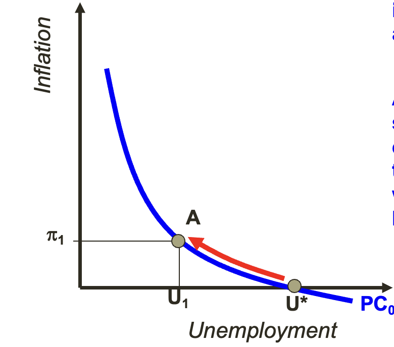
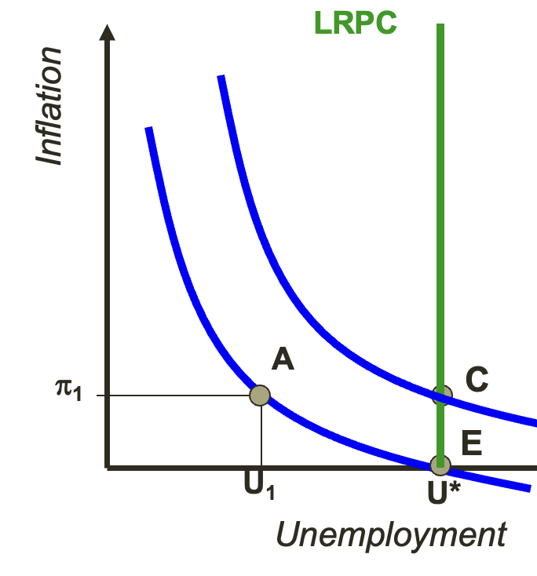
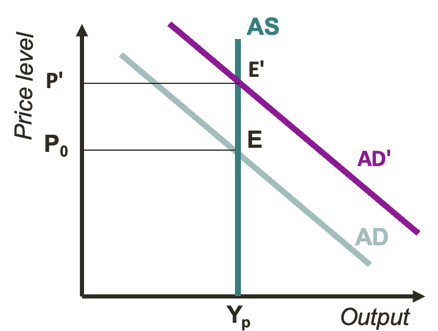
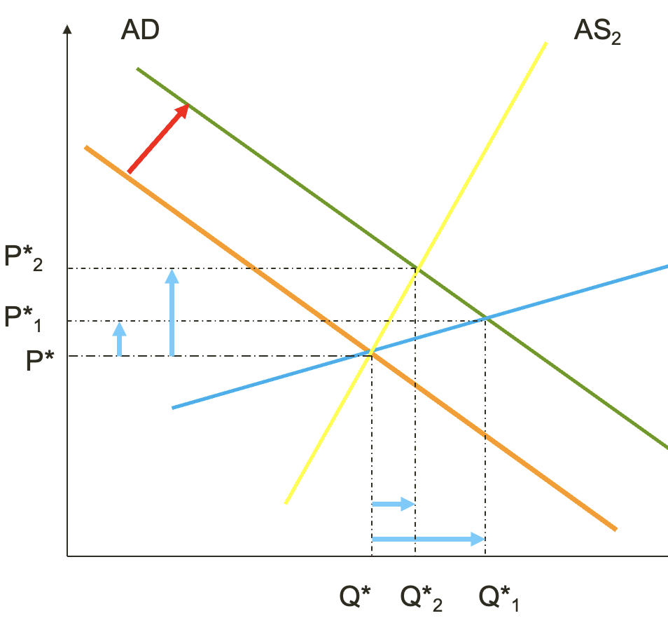

```{r setup, include=FALSE}
knitr::opts_chunk$set(echo = TRUE)
```

```{=html}
<style>
  body .main-container {
    max-width: 1100px;
  }
</style>
```
[EU409 Homepage](https://kevinli03.github.io/notes/#EU409_Basic_Economics)

------------------------------------------------------------------------

# Inflation

### Overview

Inflation is the rate of change of prices

-   The rate at which prices change over a period

-   Negative inflation (where prices decrease over time), is often called Deflation

<br />

Is inflation good or bad?

-   Some inflation is generally good - ensures returns to investment and encourages consumption (hence the 2% target)

-   However, too much inflation is bad:

    -   Can lead to uncertainty, which results in sub-optimal allocation of resources and lower efficiency

    -   Leads to higher costs

    -   Redistribution issues - not all people face the same rate of inflation, depending on what or how much they buy, how they make money, how they finance things, etc.

<br />

Hyperinflation is super high inflation (usually 20-30%, often 3 digits)

-   This is often uncontrollable - and requires devaluation and policy break

-   Hyperinflation erodes asset values, investment, incomes, and competitiveness, which can result in major shocks to the economy and society

<br />

### Causes of Inflation

Inflation can be caused in numerous ways:

1.  Excess demand/positive shocks at full employment (we will see this later)
2.  Excessive increase in money supply
    -   Since amount of products is similar, more money means people will bid up prices
3.  Expectations - inflation can be self fulfilling
    -   if people expect inflation to occur, they will spend their money as if there will be inflation, which causes more inflation
4.  Rising prices abroad/supply shocks (imported inflation)
    -   If a product requires imports to create, then a supply shock will make those goods more expensive
    -   Ex. rise in oil prices abroad can make all products more expensive, creating inflation
5.  Rising wages/costs and domestic supply shocks
    -   If consumers have more money, that will increase demand and increase equilibrium prices
    -   If domestic supply shocks occur, supply will decrease and equilibrium price will rise

<br />

### Solving Inflation

There are different school of thoughts regarding how to deal with inflation

1.  **Monetarists** (like Milton Friedman):

    -   Inflation is the outcome of wasteful/extravagant fiscal/monetary policies that increase the money supply

    -   High wages do not cause permanent inflation, and expectations play a crucial role in inflation

    -   Thus, to deal with inflation, we must control the money supply and monetary policy (like the Federal Reserve does)

2.  Keynesians (like John Manyard Keynes)

    -   Inflation is the result of asset-speculation

    -   Thus, government should regulate to prevent speculation

    -   Government should also act as a manager - boost demand when it is needed (such as increased government spending to boost demand in recessions)

3.  Neoclassicals:

    -   Inflation is due to shocks or distortions

    -   Since these shocks are difficult to predict or prevent, there isn't much to do about them

    -   Some methods to deal with inflation include conservative monetary policy, reduce inflation expectations, and raise policy credibility

    -   Implement policy reforms to remove some sources of distortions, such as unions

<br />

------------------------------------------------------------------------

[EU409 Homepage](https://kevinli03.github.io/notes/#EU409_Basic_Economics)

# Phillips Curve

### Inflation and Unemployment

Inflation and unemployment are two phenomenons that can coexist together (which is often called Stagflation)

-   When rising production costs create inflation, despite falling demand

-   When expansionary policy is called upon to address supply-side shocks/competitiveness problems

-   When inflation erodes investment leading to deficient demand

<br />

But, often, in the short-run, there is a trade-off between inflation and unemployment:

-   We saw this on the supply-demand model - the supply curve is upward sloping, meaning higher prices results in higher quantity - which results in more output and employment expansion

<br />

### Short Run Phillips Curve

Dr. A. W. Phillips demonstrated a statistical relationship between annual inflation and unemployment in the UK:

-   When inflation is high, typically unemployment is low

-   When inflation is low, typically unemployment is high

This suggests that we have a trade-off between unemployment and inflation - focusing on lowering one will raise the other.

<br />

For example, take the following scenario and figure below:

-   Suppose the economy begins at the point $U^*$, with 0 inflation and unemployment at $U^*$

-   Then, the government spends money, funded by an expansion in money supply, increases aggregate demand and creates more jobs, lowering the unemployment rate to $U_1$. However, that is accompanied by an increase of inflation to $\pi_1$. Thus, we end up at point $A$

{width="60%"}

<br />

### Long Run Phillips Curve

Note - what we just described is just a short-run trade off. In the long run, the economy always adjusts back to the natural unemployment rate $U^*$ (but the inflation change remains at $\pi_1$)

-   So in the long run, in the figure above, the economy would move from point $A$ to the point $(U^*, \pi_1)$

<br />

So essentially, the long run Phillips Curve, as shown below in green, is just a vertical line at the natural rate of unemployment - no matter what happens in the short term, we will return to $U^*$

-   So, any short term decrease of unemployment to point $A$ will revert to $C$ in the long-run

{width="60%"}

<br />

### Implications of Phillips Curve

In the Short Run, as we saw above, unemployment can vary

-   However, in the long run, unemployment returns to its natural state

-   That means, if we increase monetary supply and government spending to reduce unemployment in the short term - in the long term, unemployment will go back to its natural level, while the increase of monetary supply will create permanent inflation

-   Thus, any attempts to lower unemployment will simply accelerate inflation

-   Unemployment thus requires supply-side policies to manage

<br />

Thus, there are two views to deal with unemployment:

1.  Monetarists:
    -   Monetarists believe the economy operates always near full capacity
    -   Thus, the only way to raise the capacity of the economy is for increases in technology or reductions in frictions
    -   These boost the supply/output of the economy up, leading to more employment
    -   This will shift the vertical Long Run Phillips Curve (and natural unemployment rate) to the left
2.  Keynesians:
    -   Keynesians do not believe the economy is at full capacity
    -   Government can thus stimulate demand, which increases supply

Note how we talked a lot about Aggregate Supply - we will expand on this in the next section

<br />

------------------------------------------------------------------------

[EU409 Homepage](https://kevinli03.github.io/notes/#EU409_Basic_Economics)

# Aggregate Supply

### Factors of Aggregate Supply

First, let us just take aggregate demand "as given" for now, we will expand on this in a later session

<br />

Aggregate supply is the volume of output firms wish to supply, at every price level

-   Thus, it depends on how much producers want to produce at any given price

-   That depends on the input prices of labour, capital, materials, and technology

In the short term, **prices are key**, as technology and capital don't change in the short term

<br />

### Elasticity of Supply

In the classical world, the economy is at full potential output:

-   That means, aggregate supply is vertical on the quantity/price axis

-   Why? well if the economy is at capacity, that means that even though producers would like to sell more if prices are high, they physically can't, because all resources are being used.

-   Thus it is a vertical line with a constant quantity for all prices.

<br />

In a Keynesian world, the economy is not at full output:

-   That means, the supply curve is upward shifting (as explained in session 1 regarding the supply and demand level)

<br />

Why does the slope (elasticity) matter? Well, assuming aggregate demand is negative sloping, the different slope of the supply curve can mean different outcomes for changes in demand.

For example, take this supply curve that is vertical (the classical world). Notice how an increase in Demand from curve $AD$ to $AD'$, does not change output, only the price:

-   This implies that boosting demand through government spending doesn't actually change output - and thus are ineffective (in the classical world)

{width="60%"}

<br />

What this tells us is that, as the economy approaches full capacity (full use of resources), that means the Aggregate Supply curve is more vertical

-   A more vertical supply curve means changing demand has less an impact on output (a perfectly vertical supply line has no change in output for a shift in demand)

-   Thus, expansionary policies become less and less effective as the economy approaches full capacity - and only raise the prices

<br />

Another important point is that the result of stimulating demand through expansionary monetary policy is - dependent on the slope of the supply curve:

-   See the figure below - the blue and yellow supply curves, when dealt with the same change in demand from orange to blue, result in different changes of output and price.

{width="60%"}

<br />

------------------------------------------------------------------------

[EU409 Homepage](https://kevinli03.github.io/notes/#EU409_Basic_Economics)

# Approaches to Policy

### Supply Side Economics

Supply side economics assumes that to address unemployment, we need to boost supply (and production/output)

-   This is because as we saw earlier, if supply elasticity is vertical, then changing demand won't do anything except raise prices. Thus, we need to shift the supply curve

-   By shifting the supply curve outward, we can reduce unemployment

<br />

To do this, common supply-side policies aim to lower costs and rigidities, such as:

-   Trade union reform, making them less powerful so they can't distort the market as much

-   Training/retraining to improve efficiency of labour

-   Investment and increases in technology

-   Reducing regulation and tax cuts

<br />

### Keynesian Economics

Keynesian economics believes that the economy is not at full capacity

-   Thus, boosting demand can increase output

-   The general story is recession means lower demand, which leads to lower investment, which leads to lower capital stock, which lowers productivity and demand, and so on in a circle

-   This leads to persistent unemployment

-   Thus, to break this cycle, the government needs to spend to boost consumer demand (especially during recessions)

<br />

It is useful to note that modern economists often take a nuanced view and incorporate aspects from both schools

<br />

------------------------------------------------------------------------

[EU409 Homepage](https://kevinli03.github.io/notes/#EU409_Basic_Economics)
