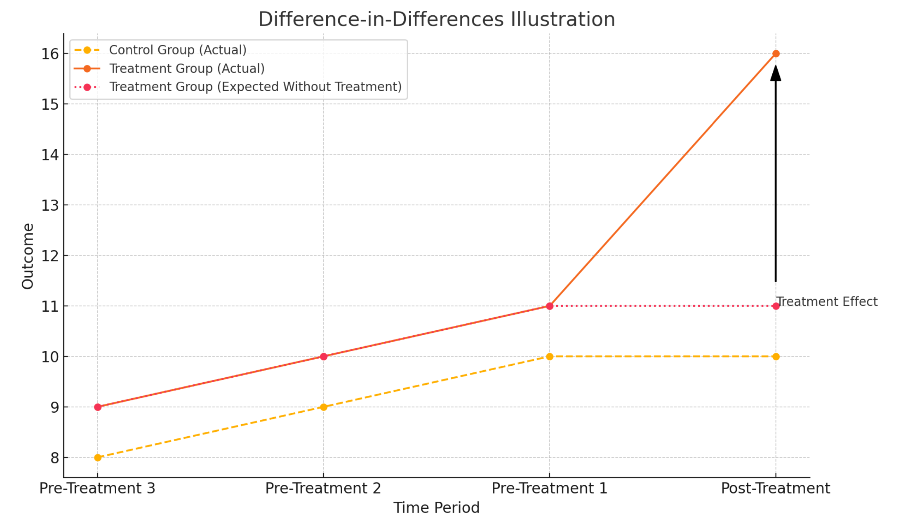
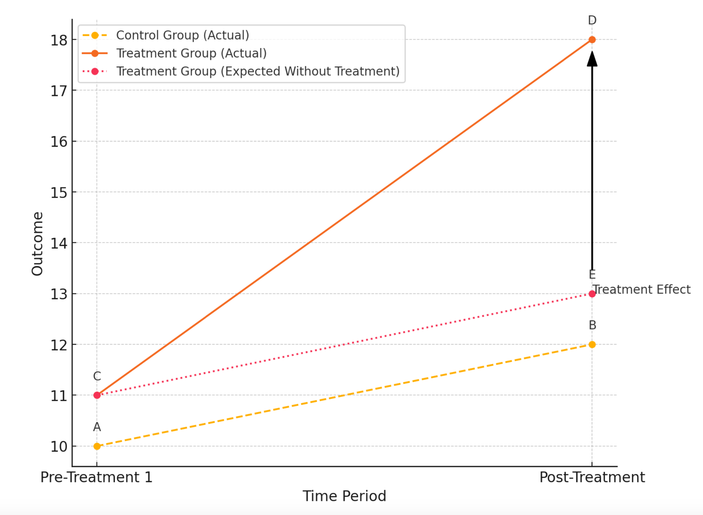
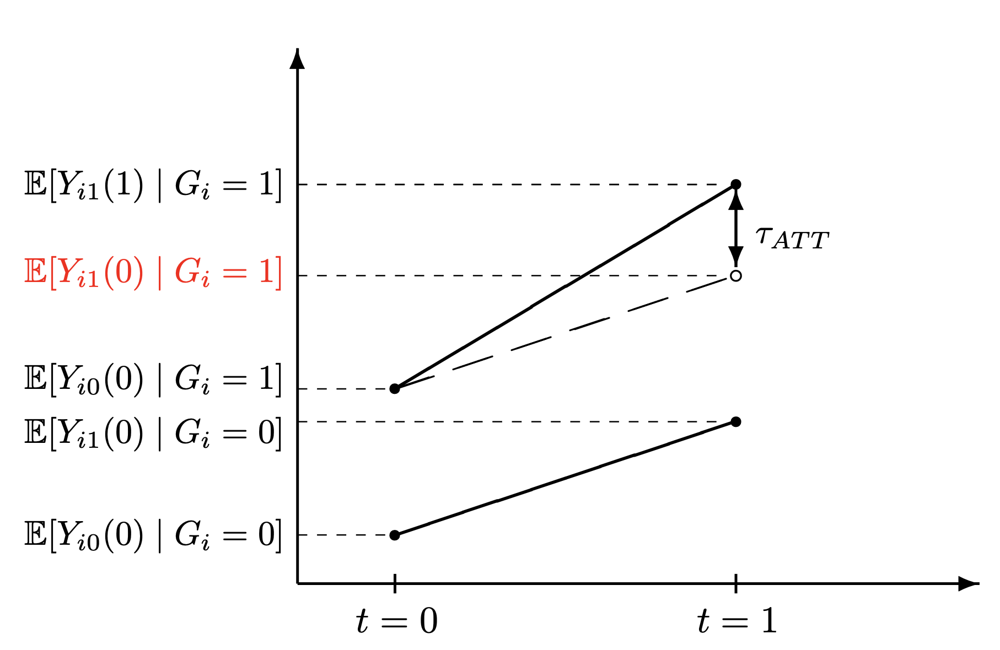
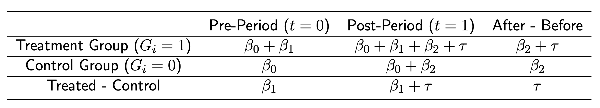

```{r setup, include=FALSE}
knitr::opts_chunk$set(echo = TRUE)
```

```{=html}
<style>
  body .main-container {
    max-width: 1100px;
    font-size: 12pt;
  }
</style>
```
[GV481 Homepage](https://kevinli03.github.io/notes/#GV481_Quantitative_Analysis)

**Week 10, GV481 Quantitative Analysis for Political Science**

-   Title: Regression Discontinuity

-   Topics:

-   Readings:

<br />

------------------------------------------------------------------------

[GV481 Homepage](https://kevinli03.github.io/notes/#GV481_Quantitative_Analysis)

# Key Points

<br />

------------------------------------------------------------------------

[GV481 Homepage](https://kevinli03.github.io/notes/#GV481_Quantitative_Analysis)

# **Differences-in-Differences**

### Introduction

So far, we have covered methods that deal with either randomised assignment (and non-compliance with IV), or assignment based on observable covariates (selection on observables, regression discontinuity)

However, what if we do not know if treatment was assigned based on some observable covariates?

We can use differences-in-differences, if there are multiple time periods.

-   The simplest case is there are two periods and two groups

-   In the first time period, neither group is treated.

-   In the second period, the treatment group is treated and the control group is not treated.

The differences-in-differences method identifies the change in outcome in the treatment group over time, compared to control. We are focused on differential trendss in treatment and control.

For example, take this illustration of DiD:

{width="80%"}

<br />

### Example: Effect of Minimum Wage

Question: Do higher minimum wages decrease low-wage employment?

Card and Krueger (1994) consider the impact of New Jersey's 1992 minimum wage increase from \$4.25 to \$5.05

-   They compare the impact of New Jersey's 1992 minimum wage increase to nearby restaurants in eastern pennsylvania (who serve as the control group).

-   They take data one month before the minimum wage, and data 8 months after minimum wage increase.

This is not random assignment - New Jersey selects into the treatment. We also do not know if eastern pennsylvania is identical to New Jersey.

<br />

### Set Up of DiD

We have $N$ units, denoted by $i \in \{1, ..., N \}$

We have two time periods, denoted by $t \in \{0, 1 \}$

-   Period $t=0$ indicates the time period before the treatment (pre-treatment)

-   Period $t=1$ indicates the time period after the treatment.

Two groups, denoted by $G_i \in \{0, 1\}$

-   $G_i = 0$ control group do not receive treatment

-   $G_i = 1$ treatment group has no treatment in period $t=0$, but gets the treatment in period $t=1$

A unit's treatment status defined by the notation $Z_{it}$. $Z_{it}=0$ means the unit $i$ is untreated, and $Z_{it} = 1$ if a unit is treated.

-   In period $t=0$, all units have $Z_{i0} = 0$ (since no groups are treated in both group for the period $t=0$).

-   In period $t=1$, the treatment group has $Z_{i1} = 1$, and the control group has $Z_{i1} = 0$.

Each unit has two potential outcome in each period $Y_{it}(z)$.

-   So, in period $t=0$, since all units are in control, we get observed outcome $Y_{i0} (0)$

-   In period $t=1$, the treatment group has observed outcome $Y_{i1}(1)$, and the control group has observed outcome $Y_{i1} (0)$.

<br />

### Estimand and Issues

Our estimand we are interested in is the ATT

$$
ATT = E[Y_{i1}(1) - Y_{i1}(0) | G_i = 1]
$$

-   Essentially, for only members of the treatment group, their observed outcomes in period $t=1$ of receiving the treatment, and their potential outcome (not observed) of in period $t=1$ them not getting the treatment.

However, as we can see, we never observe potential outcome $Y_{i1}(0)$ for group $G_i = 1$.

-   In the figure below, we don't know point $E$. which is an issue, since if we do not know $E$, we cannot calculate the ATT.

{width="80%"}

NOTE: We cannot compare C and D for the treatment.

-   Why? Look at the yellow line of the control group. Time passing increases the outcome in this example. So time is a sort of confounder - time is having an effect.

-   Thus, if we did D-C, we would clearly see that this would get a different result that D-E.

NOTE: We also cannot compare D and B.

-   Even though the yellow group is the control group, treatment is not randomly assigned, so we cannot do that either.

<br />

### Solution to Issues and Estimation

So how can we estimate the missing potential outcome?

-   We essentially do as the figure above suggests - what is called **parallel trends**

-   Basically, even though there is a difference between control and treatment, we are assuming that over time, they will change the same. Thus, we can assume that without treatment, the treatment group has the same slope over time as the control group.

With this, we get the ATT to be:

$$
\begin{split}
ATT & = \{E[Y_{i1}(1)|G_i = 1] - E[Y_{i1}(0)|G_i = 0] \} - \{E[Y_{i0}(1)|G_i = 1] - E[Y_{i0}(0)|G_i = 0] \} \\
& = \text{Diff in means in post-treat period} - \text{diff in means in pre-treat period}
\end{split}
$$

Graphically, we assume that the missing potential outcome value, by assuming that the treatment group, having not received the treatment, would follow the same trend as the control group (same slope).

-   Or in other words, the difference in potential outcomes of Not-treated between $t=0$ and $t=1$ is the same.



<br />

### Assumption of Parallel Trends

We have noted that there must be parallel trends in order for this calculation to work.

-   That the trend over time is the same between control and treatment group, assuming no one gets the treatment (so same slope, as the figure showed above)

We can state this assumption in two ways:

-   Parallel Trends: if treated units did not receive the treatment, they would have followed the same trend as the control units.

-   No Time-varying con founders: Omitted variables related to both treatment and outcome, must be fixed over time

Parallel Trends mathematically is defined as:

$$
E[Y_{i1}(0) - Y_{i0}(0) | G_i = 1] = E[Y_{i1}(0) - Y_{i0}(0) | G_i = 0]
$$

<br />

------------------------------------------------------------------------

[GV481 Homepage](https://kevinli03.github.io/notes/#GV481_Quantitative_Analysis)

# **Estimation Process**

### Types of Data

Panel data is data with multiple observations for the same units

-   For example, in our example on minimum wage in New Jersey/Pennsylvania, we will have two observations for each fast food restaurant, one in $t=0$, and one in $t=1$

Panel data can be in two different ways

-   Wide format: $N$ rows - each row corresponds to one unit, with all the time period values included in that row (so the same unit over different time will be included in the same rows)

-   Long format: $N \times T$ rows: each row corresponds to a unit-time value (so the same unit over different time will be included in different rows)

We can also have repeated cross-sectional data.

-   This is when we have two time periods $t=0$ and $t=1$, but the units in both time periods are different, so we do not have multiple observations for each unit.

<br />

### Estimation with Wide Format

Let us say we have wide format

-   Where we have $N$ rows, with each row containing $t=0$ column values, and $t=1$ column values.

What we simply do to estimate the ATT is. as following regression

$$
\Delta Y_i = \gamma + \tau G + u_i
$$

-   Where $\Delta Y_i$ is calculated by creating a new variable that is $Y_{1i} - Y_{i0}$ (so difference in outcomes between pre-treatment and post-treatment for every unit.

By doing the regression above, $\tau$ coefficient will be our ATT estimate.

<br />

### Estimation with Long Format

Let us say we have a long format

-   Where we have $N \times 2$ rows, where each $N, t=0$ and $N, t=1$ take separate rows.

With panel data in a long format, we can estimate $\tau = ATT$ in the post treatment using the following regression (with two-way fixed effects for unit and period)

$$
Y_{it} = \alpha_i + \gamma_t + \tau Z_{it} + u_{it}
$$

-   Where $Y_{it}$ are the observed outcomes

-   Where $Z_{it}$ is the treatment status of the unit $i$ in period $t$.

-   Where $T$ is the time period data

-   Where $\alpha_i$ are fixed effects for each unit $N$ (so each unit has two observations $t=0$ and $t=1$).

-   where $\gamma_t$ are fixed effects for years.

The coefficient of $\tau$ is our coefficient.

<br />

### Repeated Cross-Sectional Analysis

Repeated cross sectional analysis means that our units change between $t=0$ and $t=1$.

-   So we don't actually have multiple observed outcomes for a specific unit $n$, so it is not panel data.

We can estimate this with a regression:

$$
Y_i = \beta_0 + \beta_1 G_i + \beta_2 T_i + \tau(G_i T_i) + u_i
$$

-   Where $G_i$ is the group of the unit (treatment/control)

-   Where $T_i$ is the time period of the observation.

The regression results the following interpretations:

{width="100%"}

<br />

<br />

------------------------------------------------------------------------

[GV481 Homepage](https://kevinli03.github.io/notes/#GV481_Quantitative_Analysis)

# **Parallel Trends Assumption**

### Introduction

As discussed before, there must be parallel trends in order for this calculation to work.

-   That the trend over time is the same between control and treatment group, assuming no one gets the treatment (so same slope, as the figure showed above)

We can state this assumption in two ways:

-   Parallel Trends: if treated units did not receive the treatment, they would have followed the same trend as the control units.

-   No Time-varying con founders: Omitted variables related to both treatment and outcome, must be fixed over time

Parallel Trends mathematically is defined as:

$$
E[Y_{i1}(0) - Y_{i0}(0) | G_i = 1] = E[Y_{i1}(0) - Y_{i0}(0) | G_i = 0]
$$

There is actually no real way to test this assumption

<br />

### Potential Violations of Assumptions

There are several ways this parallel trend assumption may be not met.

1.  Treatment assignment may depend on time-varying factors.
    -   For example - self selection: participants in worker training programmes experience a decrease in earnings before they enter the programme.
    -   Another example is targeting: Policies may be targeted at units that are currently performing best (or worse).
2.  Composition differences across different time periods
    -   This is especially a concern in repeated cross-sections, where the units involved in time periods may differ
    -   If it is easy to move from treatment to control group, then we might get mixed results.
    -   For example, if you have a food truck with the New Jersey/Pennsylvania minimum age example, you could just drive across the border after the minimum age rise in New Jersey. These relocaters could change the trends in control group Pennsvylania, which makes the parallel trends assumption more difficult to met.

<br />

### Diagnosing Parallel Trends

There are a few things we can try to do to convince people that the assumption holds.

First, we can check pre-treatment trends in the outcome:

-   So, we can include multiple pre-treatment periods, like $t=-1,-2,...$, and see if the two groups have similar trends

This isn't a direct test of the assumption (something could change during your specific time period), but, it can help strengthen your argument of this assumption.

<br />

We can do this by creating leads and lags:

-   Leads are time periods before the treatment period

-   Lags are time periods after the treatment period

<br />

### Placebo Test

Suppose we have time periods $t=1$, $t=2$, and $t=3$, where treatment occurs in $t=3$.

-   We can do a placebo test by excluding $t=3$ (when treatment occurs), and re-estimate differences-in-differences

-   Obviously, we should not see a major difference since the treatment has not occured yet.

We can also do placebo tests using alternative groups

-   Re-code some control groups as treated

-   Re-estimate Differences-in-differences with the placebo treated units, without the actual treated units.

-   Naturally, you should not expect a significant difference, since these *fake-treatment* (that we re-coded from control observations) did not actually receive the treatment.
