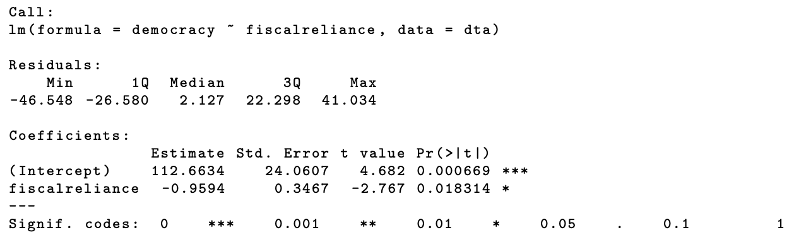
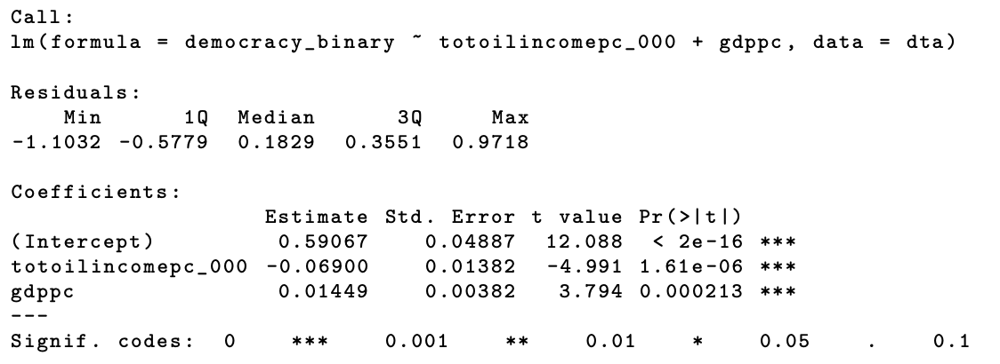

```{r setup, include=FALSE}
knitr::opts_chunk$set(echo = TRUE)
```

```{=html}
<style>
  body .main-container {
    max-width: 1100px;
    font-size: 12pt;
  }
</style>
```
[GV481 Homepage](https://kevinli03.github.io/notes/#GV481_Quantitative_Analysis)

Week 1, Quantitative Analysis for Political Science

-   Title: Bivariate and Multivariate OLS

-   Topics:

-   Readings:

    1.  Chapters 4 and 5, Mesquita et al (2021) *Thinking Clearly with Data: A Guide to Quantitative Reasoning and Analysis*

    2.  Chapters 2.1-2.14, Cunningham, S. (2021) *Causal Inference: The Mixtape*

    3.  Fowler, A. (2018) 'Do Shark Attacks Influence Presidential Elections', *The Journal of Politics*, 80(4), pp. 1423-1437

    4.  Suryanarayan, P. and Steven, W. (2021) 'Slavery, Reconstruction, and Bureaucratic Capacity in the American South', *The American Political Science Review*, 155(2), pp. 568-584

    5.  Haber, S. and Victor, M. (2011) 'Do Natural Resources Fuel Authoritarianism? A Reappraisal of the Resource Curse', *The American Political Science Review*, 105(1), pp. 1-26.

<br />

------------------------------------------------------------------------

[GV481 Homepage](https://kevinli03.github.io/notes/#GV481_Quantitative_Analysis)

# Key Points

The [**best linear predictor**]{.underline} is the function $Y = \alpha + \beta X$ that best predicts $Y$.

-   Where $\alpha$ and $\beta$ are parameters we estimate from a dataset of values

We can estimate $\beta$ with the [**OLS estimator**]{.underline}, as follows:

$$
\hat{\beta} = \frac{\sum (x_i - \bar{y}) (x_i - \bar{x}) }{\sum (x_i - x)^2}
$$

<br />

In our model $\hat{Y} = \alpha + \beta X$, the [**interpretation**]{.underline} is as follows

-   coefficient $\alpha$ is the predicted $Y$ when $X=0$

-   Coefficient $\beta$ is the predicted change in $Y$ given a one unit increase of $X$

-   You will need to know how $Y$ and $X$ are measured to make this meaningful.

If one of the measurements is not very meaningful (ex. a 0-100 scale of democracy), we can also do another [**interpretation in terms of standard deviation**]{.underline}

-   The predicted change in $Y$ in terms of standard deviation, with one standard deviation increase in $X$

-   This value is equal to: $\Delta y = (SD_X \times \beta_1)/SD_Y$

-   Anything more than 0.31 standard deviation change in $Y$ is considered quite large

<br />

[**Multivariate models**]{.underline} take the following form:

$$
Y = \alpha + \beta_1 X_1 + \beta_2 X_2 + ... + \beta_nX_n +\epsilon
$$

Now, $\beta_1$ represents the expected change of $Y$ given a one unit of $X_1$, given other variables $X_2, X_3, ...$ are held constant

The $\beta_1$ has a different estimation formula:

$$
\hat{\beta_1} = \frac{ \sum \hat{r}_{i1} y_i}{ \sum \hat{r}_{i1}^2}
$$

Where $\hat{r}_{i1}$ are the residuals obtained from regressing $X_1$ on $X_2$. This gives the part of $X_1$ that is uncorrelated with $X_2$

<br />

------------------------------------------------------------------------

[GV481 Homepage](https://kevinli03.github.io/notes/#GV481_Quantitative_Analysis)

# OLS Regression

### Background

The best linear predictor is the function $Y = \alpha + \beta X$ that best predicts $Y$.

-   This takes the form of a linear line - a straight line

-   This should give us our best guess for $Y$, given a value of $X$

<br />

How do we choose this line, specifically the coefficient $\beta$ ?

-   We choose the line that minimises the sum of the squared prediction errors

-   A squared prediction error is the difference between the actual $y$ value at a point, and its estimate $\hat{y}$, then squared

    -   I.e. $(y - \hat{y})^2$

-   Then, we sum up all these squared errors: $\sum (y - \hat{y})^2$

-   We choose the line that minimises this value

<br />

The coefficient $\beta$ tells us the following:

-   The sign of beta tells us the direction of relationship (positive or negative)

-   $\beta$ itself represents the expected change in $Y$, given an increase of one unit of $X$

<br />

### OLS Estimator

Of course, drawing every possible linear line, and measuring the sum of squared errors, is very inefficient.

One way to estimate this with much less effort but strong accuracy is the ordinary least squares estimator. The procedure is as follows:

1.  Sample units from the population, and collect data on both $X$ and $Y$ for each individual in the sample
2.  Find $\alpha$ and $\beta$ that minimise the sum of squared errors

The formula for the $\beta$ in OLS is as follows:

$$
\hat{\beta} = \frac{\sum (x_i - \bar{y}) (x_i - \bar{x}) }{\sum (x_i - x)^2}
$$

<br />

### Application: Resource Curse

Question: are oil-rich countries less likely to be democratic, than non-oil countries?

-   Or in other words, is there a correlation between large oil revenues, and democracy

Our equation is as follows: Democracy $= \alpha + \beta_1$Fiscal Reliance $+ \epsilon$

-   The sign of $\beta_1$ tells us the direction of the relationship between the two variables

Remember: $X$ is our explanatory variable, $Y$ is the outcome variable

<br />

### Interpretation of OLS Model

Haber and Menaldo (2011) collected data for some countries on regime type and oil reliance.

To implement in R, you do the following:

```{r, eval = FALSE}
model <- lm(democracy ~ fiscalreliance, data = mydata)
```

The output is as follows:

{width="100%"}

<br />

This tells us that for every one unit increase of fiscal reliance, democracy decreases by -0.9594.

-   But what does this actually mean? We need to know how fiscal reliance and democracy is measured

-   Fiscal reliance is measured between 0 and 100 percent. Democracy is measured between 0 and 100, where 100 means more democracy

That means, a 1 percentage point increase in fiscal reliance on oil, there is a -0.9594 predicted change in democracy.

<br />

It is still hard to understand what this means in terms of democracy - since it is such an arbitrary scale

-   So instead, we often use standard deviation change

-   Why? if we have normally distributed variables, we know that 2/3 of the distribution is within one standard deviation. 2 standard deviations should cover 95% of the distribution of the variable.

-   Thus, we can use standard deviation to see how drastic the change is, in respect to the variable

How do we get $Y$ in respect to 1 standard deviation increase of $X$?

-   $Y$ changes by $(SD_X \times \beta_1)/SD_Y$

So in this case, one standard deviation increase in fiscal reliance $X$, is associated with a 0.61 standard deviation increase in democracy

-   Generally anything above a 1/3 standard deviation change is considered a big change.

<br />

$\beta_0$ gives us the predicted value of $Y$, when $X=0$

-   So in this case, when fiscal reliance is 0, the expected value of democracy is 112.6634 (obviously, this doesn't make much sense)

-   As a product of OLS, sometimes, $\beta_0$ may not make much sense in terms of contextual interpretation

<br />

### Binary Y Variable

Generally, you should use a logistic model for binary $Y$. But, it is still possible in linear regression.

Interpretation of the coefficients is still mostly the same, with a slight changes:

-   $\alpha$ tells us the predicted probability of $Y=1$, when $X = 0$

```{=html}
<!-- -->
```
-   $\beta$ is now the predicted change in the probability of event $Y=1$, given one unit increase of $X$

-   Once again, we can do the expected standard deviation change in $Y$, given one standard deviation increase in $X$

<br />

------------------------------------------------------------------------

[GV481 Homepage](https://kevinli03.github.io/notes/#GV481_Quantitative_Analysis)

# Multivariate Models

### Introduction

The best linear predictor allows us to understand the expected change of $Y$, for every unit change in $X$

-   However, this approach is limited - since we are not accounting for other factors

-   Maybe $X$ is associated with something else which explains $Y$

-   To be sure of the $X$ impact on $Y$, we need to control other explanations of $Y$

For example, we might want to know what the expected change in democracy is, when fiscal reliance on oil increases, for countries with comparable levels of GDP

<br />

### Multivariate Regression

Now, our regression takes the form of:

$$
Y = \alpha + \beta_1 X_1 + \beta_2 X_2 + ... + \beta_nX_n +\epsilon
$$

Now, $\beta_1$ represents the expected change of $Y$ given a one unit of $X_1$, given other variables $X_2, X_3, ...$ are held constant

<br />

The $\beta_1$ has a different estimation formula:

$$
\hat{\beta_1} = \frac{ \sum \hat{r}_{i1} y_i}{ \sum \hat{r}_{i1}^2}
$$

Where $\hat{r}_{i1}$ are the residuals obtained from regressing $X_1$ on $X_2$. This gives the part of $X_1$ that is uncorrelated with $X_2$

<br />

### Application: Resource Curse

Now, let us look at the relationship between democracy and oil revenues, while controlling for GDP per capita:

-   Democracy = $\alpha + \beta_1$Oil Income $+ \beta_2$GDP per capita

In R, this is how you execute it:

```{r, eval = FALSE}
model <- lm(democracy_binary ~ totalincomepc_000 + gdppc, data = mydata)
```

The output is as follows:

{width="100%"}

<br />

You would interpret as following:

-   Intercept $\alpha$ is the predicted probability of a country being a democracy, given total oil income is 0 and gdp per capita is 0

-   $\beta_1$ shows that for a \$1000 increase in total oil income per capita, and GDP per capita is held constant, there is an expected 6.9 percentage point decrease in the probability that a country is a democracy

    -   Std. Deviation change $(SD_X \times \beta_1)/SD_Y$ = $(2.808 \times -0.069)/0.47$

-   $\beta_2$ shows that for every \$1000 increase in GDP per capita, and total oil income per capita is held constant, then there is an expected 1.4 percentage point increase in the probability that a country is a democracy

    -   St. deviation change $(SD_X \times \beta_1)/SD_Y$

<br />

### Linearity in Linear Regression

Linear regression does not always mean a straight line

-   Linearity means linearity in parameters

-   Notice how each parameter is added together $Y = \alpha + \beta_1 X_1 + \beta_2 X_2 + ... + \beta_nX_n$

-   A non-linear relationship would be if $\beta$'s were multiplied or divided by each other

-   This does not mean that explanatory variables $X_1,...X_n$ cannot be multiplied or raise to powers

<br />

------------------------------------------------------------------------
