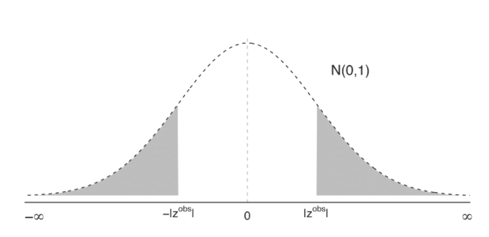

```{r setup, include=FALSE}
knitr::opts_chunk$set(echo = TRUE)
```

```{=html}
<style>
  body .main-container {
    max-width: 1100px;
    font-size: 12pt;
  }
</style>
```
[GV481 Homepage](https://kevinli03.github.io/notes/#GV481_Quantitative_Analysis)

**Week 3, GV481 Quantitative Analysis for Political Science**

-   Title: Uncertainty and Hypothesis Testing

-   Topics: Bias and Variance, Sampling Distribution, Confidence Intervals, Hypothesis Testing

-   Readings:

    1.  Chapter 6, Mesquita et al (2021) *Thinking Clearly with Data: A Guide to Quantitative Reasoning and Analysis*

    2.  Chapters 2.15-2.27, Cunningham, S. (2021) *Causal Inference: The Mixtape*

<br />

------------------------------------------------------------------------

[GV481 Homepage](https://kevinli03.github.io/notes/#GV481_Quantitative_Analysis)

# Key Points

[**Bias and Noise**]{.underline}:

-   Bias is the difference between the estimate and estimand, that arises for systematic reasons

-   Noise is the differences between the estimate and estimand due to randomness of the sample.

<br />

[**Confidence Intervals**]{.underline} are calculated by doing the following interval:

$$
CI(0.95) = [\hat{\beta}_1 - 1.96 \times SE, \space \space \hat{\beta}_1 + 1.96 \times SE]
$$

We are 95% confident that the true population $\beta_1$ will lie within this confidence interval.

-   Or in other words, if we repeated the sampling process many many times, 95% of the confidence intervals we get from the samples, would correctly contain the true $\beta_1$

-   NOT 95% PROBABILITY!! NOT PROBABILITY!! You cannot have probability since we already have the intervals. It either contains it, or doesn't contain it. It is like after flipping a coin and seeing heads, asking the probability of that the previous flip would result in heads.

<br />

[**Hypothesis Testing**]{.underline} is a sort of proof-by-contradiction

1.  State the hypothesis that we would like to refute (Null Hypothesis $H_0$)
    -   This is generally $H_0 : \beta_1 = 0$, which is basically no relationship between $X_1$ and $Y$.
2.  Pick a significance threshold $\alpha$: the probability that we observe the result we estimate, just by change, given the null hypothesis is true (usually $\alpha = 0.05$ )
3.  Compute the probability that we would observe a value at least as extreme, as the one we observed, given the null hypothesis is true (p-value)
    -   We do this by calculating a test statistic, then finding the associated p-value (see below)
4.  If our p-value is lower than the significant threshold, we can reject the null hypothesis.

<br />

A [**test statistic**]{.underline} for a normal distribution (z-statistic) is the following:

$$
Z = \frac{\hat{\beta}_1}{\text{Standard Error of } \hat{\beta}_1}
$$

-   Essentially, measures the distance of $\hat{\beta}_1$ from 0, in terms of standard errors

-   Basically same formula for t-statistic, it just uses the t-distribution instead of the normal distribution.

<br />

The [**P-Value**]{.underline} tells us how likely it is that we get a test statistic equal or larger, given the null hypothesis is true.

-   Naturally, if the probability (p-value) is low, it is unlikely the null hypothesis is true.

If the p-value is less than 0.05, we typically reject the null, and conclude the alternate hypothesis:

-   Or in other words, we reject that there is no relationship between $X_1$ and $Y$, and conclude that there is a relationship between $X_1$ and $Y$

If the p-value is greater than 0.05, then we cannot reject the null

-   Or in other words, we **fail to reject** that there is no relationship between $X_1$ and $Y$

<br />

------------------------------------------------------------------------

[GV481 Homepage](https://kevinli03.github.io/notes/#GV481_Quantitative_Analysis)

# Bias and Precision

### Key Definitions

There are three key definitions:

-   Estimand: Unobserved quantity that we are trying to learn about - the true value in the population

    -   For example, the true relationship between $X$ and $Y$ om the world

-   Estimator: the procedure we apply to data, in order to generate a numerical result

    -   Ordinary least squares is an estimator of the relationship, and we can use hypothesis testing.

-   Estimate: is the numerical result arising from our estimators

    -   Our coefficients, confidence intervals, etc.

<br />

### Sample Mean as an Estimator

The sample mean of a sample, is our attempt to predict the true mean in the population (which is the estimand)

The sample mean is an estimator:

1.  Constitute a sample size $n$
2.  Collect data on $X$ variable for units in the sample
3.  Calculate the average in the sample

The result of all of this, is a numerical estimate of the population of the mean.

<br />

### Estimate Error

How do we know how good our estimate is?

With every estimation, there is an associated estimate error:

-   Estimate error = estimate - truth (the difference between the estimate and the truth)

-   The issue is that, we do not know the truth - we are trying to estimate that.

So instead, we will reason about the average magnitude of estimator error

-   Think about, if we drew another random sample, what would be our estimate?

-   Keep drawing random samples and getting new estimates

-   We will explore this in more detail in the next section

<br />

### Bias and Noise

Estimate is equal to: Estimand + Bias + Noise

-   Bias is the difference between the estimate and estimand, that arises for systematic reasons

-   Noise is the differences between the estimate and estimand due to randomness of the sample.

Imagine you are an archer, trying to hit a bullseye:

-   The bias section is your skill level or aim - if you are bad and you miss, that is the bias part (your skill level - systematic)

-   Noise (or variance) is the random effects - such as wind speed, that affect the consistency of your shots

<br />

In statistics, you can get bias in a few ways:

1.  A non-representative sample: your sample is not representative of the population, so your estimate is off
2.  Unit non-response: if there is a group of people/individuals who do not respond to your sample more than others, you might have a non-representative sample, so your estimate is off
3.  Misreporting: people lying, so your estimate is off

<br />

In statistics, you can get noise in a few ways:

Sampling Variability: Even if you random sample, you will get slightly different estimates, as every sample is slightly different

-   For example, if you sample all UK individuals on their income, each sample might have a similar distribution of incomes, but each individuals will be slightly different from the other sample, so you would get a slightly different estimate.

<br />

------------------------------------------------------------------------

[GV481 Homepage](https://kevinli03.github.io/notes/#GV481_Quantitative_Analysis)

# Statistical Inference

### Sampling Distribution

Let us say we want to find the average age of students at the school.

-   We take one random sample of students, and find the average age estimate

-   Then we take another random sample, and get a slightly estimate

-   Keep taking more and more and more samples

Then, we can plot the frequency of different estimates in a histogram/density plot.

-   We will get a sampling distribution - or also the distribution of sample means

The sampling distribution is hypothetical - you are not going to estimate a sample 1000 times, that is way too much effort

-   But if does tell you the likelihood of getting a specific estimate

<br />

### Standard Error for OLS

As we noted before, sampling distribution is the imaginary distribution of estimates, if we repeated the sampling and estimation process many many times.

[The standard error is the standard deviation of the sampling distribution]{.underline}.

We have looked so far, at the sampling distribution of means.

-   But, we can also do this for any other estimate, such as the coefficient $\beta_1$ in our linear model.

<br />

The standard error of $\hat{\beta_1}$ is the standard deviation of the sampling distribution of $\beta_1$

-   R can help us estimate this standard error

<br />

### Confidence Intervals

We have estimated a $\beta_1$, but we know there is sample variation. So, what we want is a range within which the true $\beta_1$ would fall in?

-   We want to construct an interval around our estimate, that contains the true $\beta_1$ value 95% of the time under repeated sampling

-   Why 95%? Just tradition

We want to create an interval around our estimate $\hat{\beta}_1$. We can add a value and subtract a value from our estimate to get a upper and lower bounds for our interval:

$$
CI(0.95) = [\hat{\beta}_1 - t \times SE, \space \space \hat{\beta}_1 + t \times SE]
$$

<br />

According to the central limit theorem, all sampling distributions of the OLS estimate is approximately normally distributed in large enough samples.

-   This is great, because in a normal distribution, 95% of the data lies within under 1.96 standard deviations above and below the mean.

-   This is useful, because we know the standard error is the standard deviation of the sampling distribution. We also know the sampling distribution is a normal distribution.

Thus, we can rewrite the confidence interval as:

$$
CI(0.95) = [\hat{\beta}_1 - 1.96 \times SE, \space \space \hat{\beta}_1 + 1.96 \times SE]
$$

We are 95% confident that the true population $\beta_1$ will lie within this confidence interval.

-   Or in other words, if we repeated the sampling process many many times, 95% of the confidence intervals we get from the samples, would correctly contain the true $\beta_1$

-   NOT 95% PROBABILITY!! NOT PROBABILITY!! You cannot have probability since we already have the intervals. It either contains it, or doesn't contain it. It is like after flipping a coin and seeing heads, asking the probability of that the previous flip would result in heads.

<br />

------------------------------------------------------------------------

[GV481 Homepage](https://kevinli03.github.io/notes/#GV481_Quantitative_Analysis)

# Hypothesis Testing

### Procedure

We want to draw conclusions about our estimates - for example, is there a relationship between $X_1$ and $Y$?

-   But, how do you know that our estimated $\hat{\beta}_1$, is that the true $\beta_1$, or sampling variation? What if we got a noisy sample?

Hypothesis testing is a sort of proof-by-contradiction

1.  State the hypothesis that we would like to refute (Null Hypothesis $H_0$)
    -   This is generally $H_0 : \beta_1 = 0$, which is basically no relationship between $X_1$ and $Y$.
    -   If we do refute this hypothesis, we have a alternate hypothesis $H_a$ that we can conclude. Generally, $H_a : \beta_1 ≠ 0$
        -   Technically, you can have one sided tests, such as $H_a : \beta_1 > 0$ and vice versa. But, we generally don't do this since the 2-sided test is more rigorous and conservative.
2.  Pick a significance threshold $\alpha$: the probability that we observe the result we estimate, just by change, given the null hypothesis is true (usually $\alpha = 0.05$ )
3.  Compute the probability that we would observe a value at least as extreme, as the one we observed, given the null hypothesis is true (p-value)
4.  If our p-value is lower than the significant threshold, we can reject the null hypothesis.

<br />

For example, let us take the example where our sample produces $\hat{\beta}_1 = 2$

1.  Let us say our null hypothesis is no relationship: $H_0 : \beta_1 = 0$. We are trying to disprove this, so our alternate hypothesis is $H_a: \beta ≠ 0$
2.  Then, let us say our significance threshold is the standard 0.05
3.  What is the probability that we would get a $\hat{\beta}$ equal or larger than 2, or lower than -2 (more extreme than our sample estimate)
4.  If that probability is less than 0.05, then we can reject the null hypothesis, and conclude $\beta_1 ≠ 0$, thus there is a relationship between $X_1$ and $Y$

<br />

### Test Statistic and Distribution

A test statistic is a function of observed data, that can be used to test the null hypothesis

-   It is how many standard deviations away our estimate is from the null, given the null is true (basically, number of standard deviations away from 0 as null generally is 0).

The reference distribution is the probability distribution of the test statistics

-   Basically, what is the distribution we are interested in: Normal or T distribution

A test statistic for a normal distribution (z-statistic) is the following:

$$
Z = \frac{\hat{\beta}_1}{\text{Standard Error of } \hat{\beta}_1}
$$

-   Essentially, measures the distance of $\hat{\beta}_1$ from 0, in terms of standard errors

For example, if our $z$ statistic is 1.62, that means our $\hat{\beta}_1$ is 1.62 standard deviations away from 0.

<br />

### P-Value

We know that the area under the the curve of a distribution is the probability

Since we know how many standard deviations away our estimate is from 0 (from our $z$ statistic), we can calculate the probability of getting a $z$ statistic equal or larger than the one we have for our estimate:

The P-Value tells us how likely it is that we get a test statistic equal or larger, given the null hypothesis is true.

-   Naturally, if the probability (p-value) is low, it is unlikely the null hypothesis is true.

Graphically, the p-value is the gray highlighted areas

{width="100%"}

<br />

If the p-value is less than 0.05, we typically reject the null, and conclude the alternate hypothesis:

-   Or in other words, we reject that there is no relationship between $X_1$ and $Y$, and conclude that there is a relationship between $X_1$ and $Y$

If the p-value is greater than 0.05, then we cannot reject the null

-   Or in other words, we **fail to reject** that there is no relationship between $X_1$ and $Y$

<br />

------------------------------------------------------------------------
