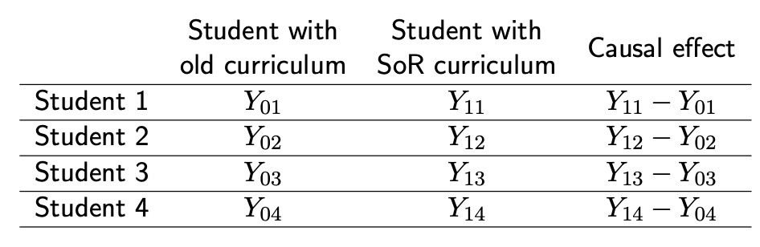

```{r setup, include=FALSE}
knitr::opts_chunk$set(echo = TRUE)
```

```{=html}
<style>
  body .main-container {
    max-width: 1100px;
    font-size: 12pt;
  }
</style>
```
[GV481 Homepage](https://kevinli03.github.io/notes/#GV481_Quantitative_Analysis)

**Week 3, GV481 Quantitative Analysis for Political Science**

-   Title: Introduction to Causal Inference

-   Topics: Causal States, Potential Outcomes Framework, Average Treatment Effect, Selection Bias

-   Readings:

<br />

------------------------------------------------------------------------

[GV481 Homepage](https://kevinli03.github.io/notes/#GV481_Quantitative_Analysis)

# Key Points

[**Causal States**]{.underline} are hypothetical states of the world:

-   [Control state]{.underline}: units do not receive the treatment $D = 0$

-   [Treatment state]{.underline}: identical to the control state, with the only exception that units receive the treatment $D = 1$

<br />

For each unit $i$ (observation, individual, etc.), we define two [**potential outcomes**]{.underline} to the control state $D_i = 0$ and the treatment state $D_i = 1$

-   $Y_{1i}$ is the potential outcome for unit $i$ in the treatment state $D_i=1$

-   $Y_{0i}$ is the potential outcome for unit $i$ in the control state $D_i=0$

Thus, the [**causal effect**]{.underline} of treatment $D$ on individual $i$ is: $\tau_i = Y_{1i} - Y_{0i}$

<br />

The [**observed outcomes**]{.underline} (in the real world) of some unit $Y_i$ is:

$$
Y_i = D_i \times Y_{1i} + (1 - D_i) \times Y_{0i}
$$

-   This is quite simple - if $D_i = 1$ (plug it in the equation)you will get outcome $Y_{1i}$, which makes sense, since that is the treatment state outcome

-   If you plug in $D_i = 0$ into the equation, you will get an outcome of $Y_{0i}$, which makes sense, since that is the control state outcome.

<br />

The [**fundamental problem of causal inference**]{.underline} (FPCI) is that, we only have one can observe one of the two parallel universes at the same time:

-   Thus, we cannot estimate individual treatment effects. However, there are other treatment effects that we can attempt to estimate.

<br />

Estimands (things we try to estimate):

[**Average Treatment Effect (ATE)**]{.underline} is the, well, average, of all the unit treatment effects.

$$
E[\tau_i] = E[Y_{1i} - Y_{0i}] = \frac{1}{n} \left( \sum Y_{1i} - \sum Y_{0i} \right)
$$

The [**average treatment effecton the treated (ATT)**]{.underline} is the treatment effect of only people who received the treatment $D_i = 1$

$$
\tau_{ATT} = E[Y_{1i} - Y_{0i}|D_i = 1]
$$

The [**average treatment effect on the controls (ATC)**]{.underline} is the treatment effect of people who only did not receive the treatment $D_i = 0$

$$
\tau_{ATT} = E[Y_{1i} - Y_{0i}|D_i = 0]
$$

The [**conditional average treatment effect (CATE)**]{.underline} is the treatment effect of people, given they have a another variable specific $X$ value.

-   For example, if $X$ is gender, we could calculate the average treatment effect of only females $X=1$.

$$
\tau_{ATT} = E[Y_{1i} - Y_{0i}|X = x]
$$

<br />

A simple (but bad) estimator of the ATE is the [**naive estimator**]{.underline}:

$$
E[Y_{1i}|D_i = 1] - E[Y_{0i} | D_i = 0]
$$

The issue with the naive estimator is that it contains [**selection bias**]{.underline}. We can illustrate this by manipulating the naive estimator:

$$
E[Y_{1i}|D_i = 1] - E[Y_{0i} | D_i = 0]
$$

$$
E[Y_{1i}|D_i = 1] - E[Y_{0i}|D_i=0] + \left( E[Y_{1i}|D_i=1] - E[Y_{1i}|D_i=1] \right)
$$

$$
=E[Y_{1i} - Y_{0i}|D_i = 1] + E[Y_{0i}|D_i = 1] - E[Y_{0i}|D_i = 0]
$$

-   The first part, $E[Y_{1i} - Y_{0i}|D_i = 1]$, is the average treatment effect of the treated $\tau_{ATT}$.

-   The second part, $E[Y_{0i}|D_i1 = 1] - E[Y_{0i}|D_i = 0]$, is bias resulting from selection.

What you are estimating is with the naive estimator essentially, is the average treatment effect PLUS some bias resulting from selection.

<br />

------------------------------------------------------------------------

[GV481 Homepage](https://kevinli03.github.io/notes/#GV481_Quantitative_Analysis)

# Potential Outcomes Framework

### Causal Inference

Up to this point, we have focused on descriptive inference - establishing relationships between features of the world.

-   The estimand was the relationship between two variables

Now, we will move to discussing the idea of causal inference.

-   The estimand is the causal effect of a treatment on an outcome in the population.

-   For example, does $X$ cause $Y$ to change. Does experience of migration [make]{.underline} migrants more tolerant. Does interacting with co-ethnic bureaucrat [improve]{.underline} trust in the state.

-   We are no longer just focused on correlation - but now, causation.

<br />

### Causal Effects

Let us take an example to explain causal effect: *Does adopting the new "science of reading" curriculum (that emphasises reading over instruction) improve student reading outcomes?*

A causal effect is a change in some feature of the world $Y$, that would result directly from a change to some other feature of the world $D$

-   Essentially, change in $D$ causes change in $Y$

In our example, we are wondering if changing $D$, the reading curriculum, will cause a change in $Y$, student reading outcomes.

-   The causal effect of imposing a new curriculum, is the change in the students' reading scores, that would result from the new curriculum adoption.

-   This can be positive/negative/no effect.

<br />

### Counterfactuals

The causal effect - how $D$ would change $Y$, implies a counterfactual:

-   A counterfactual is a comparison between the outcome in the real world, vs. the outcome in a hypothetical world, up until the point where the feature $F$ claimed to have a causal effect is changed.

-   Imagine there are 2 worlds, exactly the same until the treatment $D$ occurs. One world gets the treatment $D$, and one world does not get the treatment.

-   The effect of the treatment $D$ is the difference between the world's $Y$ outcome where the treatment is enacted, and the world where the treatment is not enacted.

<br />

Causal States are hypothetical states of the world:

-   Control state: units do not receive the treatment $D$

-   Treatment state: identical to the control state, with the only exception that units receive the treatment $D$

In our example:

-   Control state: one world with individuals, where the new science reading curriculum is not adopted

-   Treatment state: same world, same individuals, but the new science reading curriculum is adopted.

Since these two worlds are the same besides the treatment $D$, that means the differences in the world must be due to the treatment $D$.

<br />

### Potential Outcomes and Effect

For each unit $i$ (observation, individual, etc.), we define two potential outcomes to the control state $D = 0$ and the treatment state $D = 1$

-   $Y_{1i}$ is the potential outcome for unit $i$ in the treatment state $D=1$

-   $Y_{0i}$ is the potential outcome for unit $i$ in the control state $D=0$

NOTE: these are not the real world. These are what we would observe, if we could see the two hypothetical worlds of the control state and the treatment state.

<br />

Thus, the causal effect of the treatment $\tau$ on the outcome, for unit $i$, is the difference between its two potential outcomes:

$$
\tau_i = Y_{1i} - Y_{0i}
$$

This makes sense - since these two worlds are the same besides the treatment $D$, that means the differences in the world must be due to the treatment $D$.

<br />

For example, in our example regarding the curriculum:

{width="70%"}

<br />

### Treatment

However, in the real world, we don't have parallel worlds. However, we do know which units have undergone the treatment in real world, and the units who have not undergone the treatment in the real world. We can indicate the treatment state of an observation:

-   $D_1$ is if the unit $i$ is assigned to the treatment state in the real world

-   $D_0$ is if unit $i$ is assigned to the control state

Thus, the observed outcomes $Y_i$ is:

$$
Y_i = D_i \times Y_{1i} + (1 - D_i) \times Y_{0i}
$$

-   This is quite simple - if $D_i = 1$ (plug it in the equation)you will get outcome $Y_{1i}$, which makes sense, since that is the treatment state outcome

-   If you plug in $D_i = 0$ into the equation, you will get an outcome of $Y_{0i}$, which makes sense, since that is the control state outcome.

<br />

------------------------------------------------------------------------

[GV481 Homepage](https://kevinli03.github.io/notes/#GV481_Quantitative_Analysis)

# Causal Estimands

### Fundamental Problem

The fundamental problem of causal inference (FPCI) is that, we only have one can observe one of the two parallel universes at the same time:

-   If a real world student gets the new curriculum, we cannot see the hypothetical scenario where they do not get the curriculum, since that did not really happen in the world.

Thus, we cannot estimate individual treatment effects. However, there are other treatment effects that we can attempt to estimate.

<br />

### Treatment Effects

Since we cannot observe the individual treatment effects, we can change our estimand to the **average treatment effect (ATE)**.

This is exactly what it sounds like - the average treatment effect of all individuals:

$$
E[\tau_i] = E[Y_{1i} - Y_{0i}] = \frac{1}{n} \left( \sum Y_{1i} - \sum Y_{0i} \right)
$$

<br />

We can also use other treatment effects:

The **average treatment effect** **on the treated (ATT)** is the treatment effect of only people who received the treatment $D_i = 1$

$$
\tau_{ATT} = E[Y_{1i} - Y_{0i}|D_i = 1]
$$

The **average treatment effect on the controls (ATC)** is the treatment effect of people who only did not receive the treatment $D_i = 0$

$$
\tau_{ATT} = E[Y_{1i} - Y_{0i}|D_i = 0]
$$

The **conditional average treatment effect (CATE)** is the treatment effect of people, given they have a another variable specific $X$ value.

-   For example, if $X$ is gender, we could calculate the average treatment effect of only females $X=1$.

$$
\tau_{ATT} = E[Y_{1i} - Y_{0i}|X = x]
$$

<br />

### Assignment Outcomes

Even for average treatment effects (ATE), we still need to know $Y_{1i}$ and $Y_{0i}$ to calculate these estimands.

-   However, we do not have these values (as based on the Fundamental Problem of Causal Inference)

We resolve this problem by making assumptions about the assignment mechanism to do so

-   So essentially, we make assumptions based on how we selected our units in our sample.

-   For example, random sample, selection on observable (certain characteristics), selection on unobservables.

-   Most causal inference strategies attain identification of treatment effects by restricting the assignment mechanism in some way, which allows us to estimate the missing potential outcomes.

<br />

### Stable Unit Treatment Value

Earlier, we described the observed outcomes as:

$$
Y_i = D_i \times Y_{1i} + (1 - D_i) \times Y_{0i}
$$

This formula assumes that the potential outcomes for unit $i$, are not affected by the treatment assignment for unit $j$. This assumption is called the Stable Unit Treatment Value Assumption (SUTVA)

-   Essentially, assigning treatment to $j$ does not affect the results of $i$

-   Essentially, independence of observations.

<br />

The reason we make this assumption is that without SUTVA, there are many problems:

-   Since $i$'s result is not only affected by its own treatment, but also $j$, then we would have 4 potential outcomes:

    -   $i$ exposed, $j$ exposed;

    -   $i$ exposed, $j$ not exposed;

    -   $i$ not exposed, $j$ exposed;

    -   $i$ not exposed, $j$ not exposed

-   With more individuals $k, l, ...$, this can become very very messy.

With SUTVA, the treatment of $j$ does not matter, so we only have 2 states: $i$ exposed, and $i$ not exposed.

<br />

### Examples of SUTVA Violations

When are the potential outcomes of individuals, likely to be affected by the treatment exposures of all other individuals? i.e. likely violations of SUTVA.

-   Influence Patterns/Peer Effects: when social contact occurs between $i$ and $j$, it could violate SUTVA. For example, if $j$ gets the new reading curriculum, they might teach $i$ who did not get the new reading curriculum. Thus, state of $j$ affects outcome of $i$.

-   Dilution/Concentration effects arising from the prevalence of the treatment in a population. For example, if vaccination treatment is very common, even unvaccinated people are less likely to get sick.

<br />

------------------------------------------------------------------------

[GV481 Homepage](https://kevinli03.github.io/notes/#GV481_Quantitative_Analysis)

# Naive Estimator and Bias

### Naive Estimator

One way we might try to esimtate the average treatment effect is by comparing the observed outcome for the treatment units and control units.

-   Literally, observed treatment unit's avergae $Y$ minus observed control unit's average $Y$

Or more mathematically, the naive estimator is:

$$
E[Y_{1i}|D_i = 1] - E[Y_{0i} | D_i = 0]
$$

However, this is a bad idea. Comparisons between observed outcomes of the treated and the control can often be misleading:

-   Correlation is not causation! What we are doing is correlation, since we are looking just at observed values. Causation is done with the counterfactuals (potential outcomes framework), not just the correlation of observed outcomes.

-   For example, there is a strong relationship between ice cream sales and shark attacks. Does that mean selling ice cream increases shark attacks? no.

In the next sections, we will go through the issues of the Naive Estimator.

<br />

### Confounders and Reverse Causality

Here are potential reasons why correlation is not causation:

1.  A confounder is a feature that affects whether units are assigned to treatment $D_i$, and has an effect on the outcome.
2.  Reverse Causality takes place when instead of the treatment $D_i$ leading to an outcome $Y_i$, it is the outcome $Y_i$ that leads to $D_i$.

<br />

Let us look at Confounding variables in the relationship between ice cream sales and shark attacks.

-   When it is sunny, more people go to the beach

-   Thus, more people on the beach both eat more ice cream, and experience more shark attacks

-   Importantly, ice cream sales are not causing shark attacks. It is the sunny weather and people going to the beach, that is causing both trends.

The figure below shows this thinking

[IMAGE pg 44/49]

<br />

An example of reverse causality is the relationship between country's economic productivity, and whether it experiences civil war.

-   However, we could just as easily think that the lack of civil war is causing economic productivity.

<br />

### Selection Bias

Selection bias is another issue with the Naive Estimator. We can mathematically show the issue with selection bias:

We know that the naive estimator is:

$$
E[Y_{1i}|D_i = 1] - E[Y_{0i} | D_i = 0]
$$

$$
E[Y_{1i}|D_i = 1] - E[Y_{0i}|D_i=0] + \left( E[Y_{1i}|D_i=1] - E[Y_{1i}|D_i=1] \right)
$$

$$
=E[Y_{1i} - Y_{0i}|D_i = 1] + E[Y_{0i}|D_i = 1] - E[Y_{0i}|D_i = 0]
$$

-   The first part, $E[Y_{1i} - Y_{0i}|D_i = 1]$, is the average treatment effect of the treated $\tau_{ATT}$.

-   The second part, $E[Y_{0i}|D_i1 = 1] - E[Y_{0i}|D_i = 0]$, is bias resulting from selection.

What you are estimating is with the naive estimator essentially, is the average treatment effect PLUS some bias resulting from selection.

<br />

For a more intuitive example, let us look at the relationship of attending church and turning out to work.

-   Those who attend church are likely to differ from non-churchgoers on a range of background characteristics (e.x. feelings toward civic duty, networks, etc.)

-   Given these differences, turnout for churchgoers would be higher than non-churchgoers, EVEN if churchgoers had decided not to attend church.

-   Basically, people who go to church are already more likely to vote, so church did not make them more likely to vote.

Another example is that migrants have a higher tolerance towards other ethnic groups.

-   However, people who decide to migrate, are likely already more open-minded to new countries and more tolerant

-   So, the act of migration did not make them more tolerant, other factors before they migrated made them tolerant.

<br />

------------------------------------------------------------------------

[GV481 Homepage](https://kevinli03.github.io/notes/#GV481_Quantitative_Analysis)
