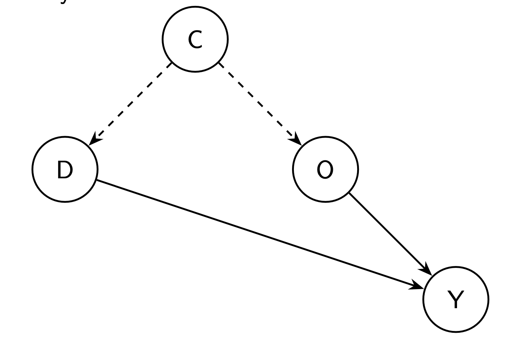
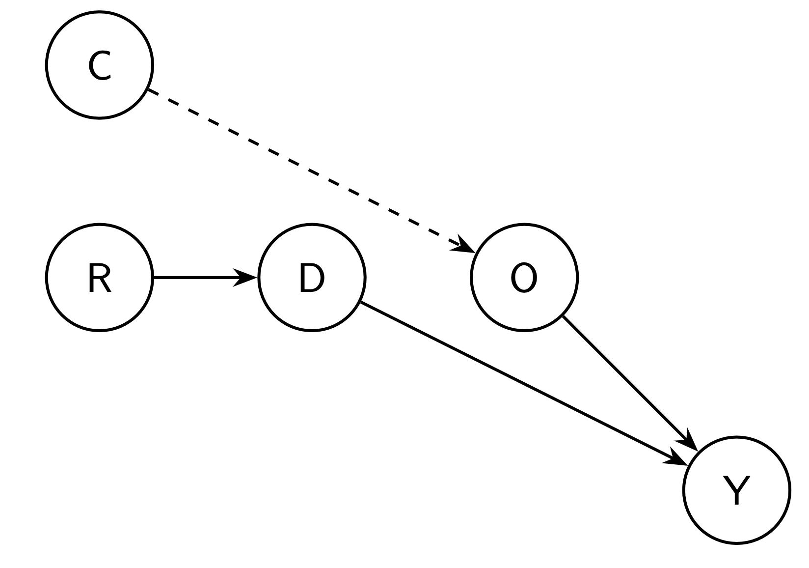
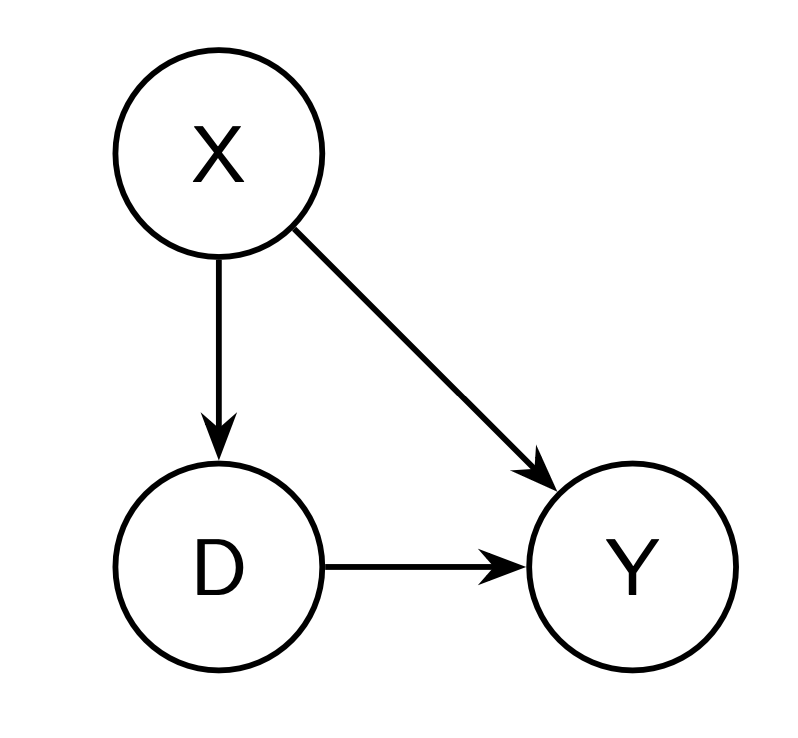
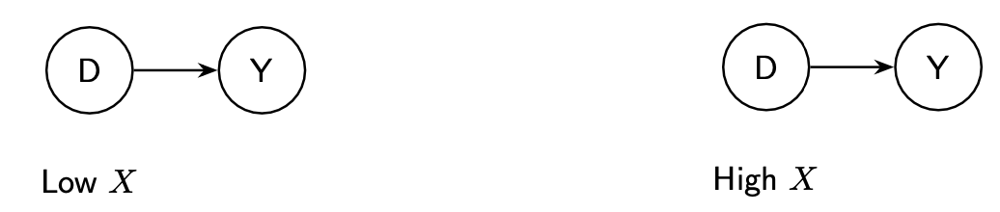

```{r setup, include=FALSE}
knitr::opts_chunk$set(echo = TRUE)
```

```{=html}
<style>
  body .main-container {
    max-width: 1100px;
    font-size: 12pt;
  }
</style>
```
[GV481 Homepage](https://kevinli03.github.io/notes/#GV481_Quantitative_Analysis)

**Week 7, GV481 Quantitative Analysis for Political Science**

-   Title: Selection on Observables

-   Topics: Randomisation

-   Readings:

<br />

------------------------------------------------------------------------

[GV481 Homepage](https://kevinli03.github.io/notes/#GV481_Quantitative_Analysis)

# Key Points

<br />

------------------------------------------------------------------------

[GV481 Homepage](https://kevinli03.github.io/notes/#GV481_Quantitative_Analysis)

# **Selection on Observables**

### Introduction

We know from previous lectures, the naive estimator has selection bias.

-   In order to draw valid causal inferences, we must consider why some units received treatment, rather than another unit.

-   Essentially, the assignment mechanism to treatment/control.

In random controlled trials, the assignment mechanism is randomly assigning units to treatment and control.

-   However, this is not always possible

<br />

### Back-Door Confounders

Often, we are trying to capture the impact of treatment $D$ on outcome $Y$, but $Y$ is related to $D$ in multiple ways.

For example, in the figure below, if we regress $D$ on $Y$, we are capturing both the relationship between $D$ and $Y$, and the relationship between $O$ and $Y$, where $D$ is related to $O$ through variable $C$.

-   $C$ is basically the selection bias - a variable that affects who goes into treatment. For example, if the treatment is hospital, $C$ might be prior health of the individual.

<!-- -->

-   However, we want to only find the direct causal effect of $D$ on $Y$, not the other section. How do we isolate $D \rightarrow Y$ without the effect of $O \rightarrow Y$.

{width="35%"}

<br />

Random assignment solves this issue by randomly determining who gets $D$, isolating the selection bias from confounder $C$.

{width="35%"}

<br />

### Selection on Observables

In an observational study, we cannot determine who gets assigned to treatment or control.

Under the selection on observables, we make the assumption that assignment to treatment was based on some observable characteristics

-   Some confounding variables that are observable, causes units to be assigned into either treatment or control.

<!-- -->

-   If we observe all the confounders that caused units to be assigned to treatment, we can partial out that confounding variable and eliminate selection bias.

<br />

For example, in the figure below, we know that some observed characteristic $X$ determines who gets treatment versus control. If we account for $X$, we can isolate the effect of $D$ on $Y$.

{width="25%"}

We can do this by dividing the experiment into smaller randomised controlled trials. For example, we could divide confounder $X$ into two categories: low $X$ and high $X$ (we can do a lot more categories than this).



NOTE: Selection on observables only works when we know what is causing selection into treatment. It is not just controlling for any random variable we think might work. We must know what causes selection into treatment.

<br />

### Example: Violence to Voting

Let us look at a paper of the impact of violence on turning out to vote:

-   Treatment $D$: Being abducted

-   Outcome $Y$: turning out to vote.

Can we naively compare the people who were abducted vs. not abducted, and determine the causal effect?

-   Unless the abductions were done completely randomly, then we cannot, since some factors might affect who gets abducted and who does not (selection bias).

Blattman 2009 finds that age is the primary way violent groups choose to abduct individuals. "Abduction parties were under instruction to release only young children and older adults, but keep all adolescent and young adult males".

-   Within these specific age group, abductions were quasi-random.

Thus, age is a confounder variable that affects who gets the treatment:

-   If we hold age constant, potential outcomes should not be different between abducted and not abducted, since we have accounted for the selection bias.

<br />

### Identification Assumptions

Selection on Observables: the treatment is randomly assigned within the observable characteristic $X$.

-   Mathematically: $(Y_1, Y_0) \ \bot \ D|X$.

-   In our example, within each age group (young, middle, old), we should have random assignment within these groups.

<br />

Common Support Assumption: we observe participants and non-participants with the same characteristics

-   Mathematically: $0 < Pr(D = 1|X) < 1$

<!-- -->

-   We need treated and untreated individuals within every $X$ category/level of observable characteristic. This allows us to find the potential outcomes.

-   In our example, we need to have both abducted and non abducted units in the young, middle, and old age group (and every age group).

<br />

### Identification of Estimand

Our estimated is the average treatment effect

$$
\tau_{ATE} = \mathbb{E}[Y_1 - Y_0] = \int \mathbb{E}[Y_1 - Y_0 \ | \ X]dP(X)
$$

Given our selection on observables, we have the following property: since within each category of $X$, there is random assignment, we are basically running "mini" randomised controlled trials within each category of $X$. Thus, we can basically use the naive estimator within each $X$ category:

$$
\begin{split}
\mathbb{E}[Y_1 - Y_0 \ | \ X] & = \mathbb{E}[Y_1 - Y_0 \ | \ X, D=1] \\
& = \mathbb{E}[Y \ | \ X, D = 1] - \mathbb{E}[Y \ | \ X, D = 0]
\end{split}
$$

Therefore, the average treatment effect of observed outcomes is, inputting the above property:

$$
\tau_{ATE} = \int \left( \ \mathbb{E}[Y | X, D = 1] - \ \mathbb{E}[Y \ | \ X, D = 0] \ \right) dP(X)
$$

Or in other words, the integral of expected value of $Y$ in each group of $X$ that are in the treatment group, minus the expected value of $Y$ in each group of $X$ that are in the control state.

<br />

Or even more simply, if selection on observables $(Y_1, Y_0) \ \bot \ D|X$ assumption holds, we are basically doing a randomised controlled trial within each group of $X$.

<br />

### Estimation Methods

There are 3 ways to estimate the ATE for selection on observables (assuming you meet both of the identification assumptions:

1.  Subclassification
2.  Matching
3.  Regression

We will dicuss each of these in the next few sections of the lesson.

<br />

------------------------------------------------------------------------

[GV481 Homepage](https://kevinli03.github.io/notes/#GV481_Quantitative_Analysis)

# **Subclassification**

### Introduction

Subclassification is basically how we have been thinking about selection on observables so far:

1.  Divide the sample into bins/groups/categories based on the value of key covariates $X$
2.  Within each bin, estimate the difference in means between treated and untreated units (just like in a random experiment)
3.  Construct weighted averages of these differences in means estimates using the proportion of units in each bin to recover the ATE. (and proportion of treated units in each bin for ATT, and proportion of untreated units in each bin to recover ATC).

<br />

### Subclassification Estimator

We know that ATE is:

$$
\tau_{ATE} = \mathbb{E}[Y_1 - Y_0] = \int \mathbb{E}[Y_1 - Y_0 \ | \ X]dP(X)
$$

Assuming $X$ takes in $K$ different bins, $X^1, ..., X^k, ..., X^K$, then our estimator is as follows:

$$
\hat{\tau}_{ATE} = \sum\limits_{k=1}^K \left[ \left( \bar{Y}_1^k - \bar{Y}_0^k \right) \times \left( \frac{N^k}{N} \right) \right]
$$

Where:

-   $N^k$ is the number of observations in bin $k$

-   $\bar{Y}_1^k$ is the mean outcome for treated in bin $K$, and $\bar{Y}_0^k$ is the mean outcome for untreated in bin $k$

<br />

More intuitively:

1.  Choose one bin of $X$. Find the mean $Y$ of the treated minus the mean $Y$ of the untreated.
2.  Multiply that difference, by the number of observations in this bin divided by total number of observations.
3.  Do for every bin, and sum every value of the bin up.

<br />

### Multiple Confounders

We can do multiple confounders. For example, say $X_1$ has 2 bins, ad $X_2$ has 2 bins.

-   We would need to create a bin for each possible interactino between the two confounders

-   For example, we would need 4 bins here: (Low $X_1$ Low $X_2$); (Low $X_1$ High $X_2$); (High $X_1$ Low $X_2$), (High $X_1$, High $X_2$).

<br />

Subclassification becomes unfeasible with many covariates.

-   Assume we have $k$ covariates, and divide them each into 3 categories.

-   The number of subclassification cells is $3^k$. If we have 10 covariates, that means 59,059 cells.

-   It is very likely that one of these bins will only contain treated or untreated observations, violating our assumptions

<br />

------------------------------------------------------------------------

[GV481 Homepage](https://kevinli03.github.io/notes/#GV481_Quantitative_Analysis)

# **Saturated Regression**

### Introduction

An alternative strategy, when we would have too man bins in a subclassification case, is to use a fully saturated regression.

-   Essentially, this is a regression, that includes a dummy variable for each possible value of confounder $X$.

-   For example, if our confounder is age, we can include a dummy variable for age, which will be a dummy variable for every possible age in our sample.

<br />

### Estimation with Regression

The resulting estimate of OLS will be notated as $\tau_{OLS}$. However, $\tau_{OLS}$ will not always equal $\tau_{ATE}$.

-   The reason is because $\tau_{ATE}$ weights each bin estimate with the proportion of units within that bin compared to the whole (that is called the marginal distribution of $X$.

-   However, OLS weights each bin estimate by the marginal distribution of $X$ and the conditional variance of $Var[D|X]$ in each bin.

Thus, we must be careful while using saturated regression.

<br />

------------------------------------------------------------------------

[GV481 Homepage](https://kevinli03.github.io/notes/#GV481_Quantitative_Analysis)

# **Matching**

### Introduction

Matching means trying to match treated units to untreated units.

-   This way, we can fill in missing potential outcomes, using the observed outcomes of units that resemble treated and/or untreated units on key covariates.

<br />

What choices do we make when we match observations?

1.  Which covariates to match on? Generally the confounders $X$
2.  We can match with or without replacement: Matching without replacement means one observation can only be used to match to one other observation. Matching with replacement means we can have one control unit matched to 3 treatment units.
3.  How many macthes should we make for each unit? Can each observation match with 2 other observations? 3?
4.  What type of algorithm to match?
    -   Direct matching - matching 18 year old with 18 year old.
    -   Nearest Neighbour matching - matching 18 year old with the closest age (let us say 19).
    -   Propensity matching - collapsing multiply covariates into a single score, that describes how likely you were to be selected to treatment. Match to similar units.

<br />

Our workflow is as follows when matching:

1.  Check balance on pre-treatment covariates
2.  Perform matching
3.  Check balance in matched data - are our treatment and control groups similar?
4.  If yes, then estimate treatment effects like random experiment.

Goal is to get the best balance between treatment and control groups. We will often try every possible matching choices, and choose the one that best does this.

<br />

### Example: Violence and Voting

First thing you do is to create a table. The rows are key covariates, and the columns are control/treatment.

-   We might notice that for a covariate $X$ (let us say age), there are very different ages between abducted and not abducted.

<br />

Then, we will do the matching.

```{r, eval = FALSE}
library(Matching)

# do matching - you can change estimand, replace, and exact matching
m = Match(Tr = treatment_vector, X = confounding_vector,
          estimand = "ATE", M = 1, replace = TRUE, exact = c(TRUE))

# summary (match.out paramter should equal name of your matching variable)
bal = MatchBalance(treatment_variable ~ confounder_variable,
                   match.out = m, nboots = 1000, data = mydata)

bal
```

The output will show the before and after matching, and how the treatment and control group means differ.

<br />

### Nearest Neighbour Matching

Perfect matches are often not available. In that case, we can use the "nearest" neighbour, the closest untreated/treated unit.

-   This is useful, because if perfect matches are not available, some data points may be dropped. This is not great as less sample size is not good.

Basically, what we do is that we average the closest matches (above and beyond), to estimate the actual value of the match would be (if there was perfect matching)

Thus, our estimated ATT is as follows:

$$
\begin{split}
\hat{\tau}_{ATT} & = \frac{1}{N_1} \sum\limits_{D_i = 1} (Y_i - Y_{j(i)}) \\
& = \frac{1}{N_1} \sum\limits_{D_i = 1} \left[ Y_i - \left( \frac{1}{M} \sum\limits_{m=1}^M Y_{jm(i)} \right) \right]
\end{split}
$$

Basically, $M$ is how many matches are used. $M = 1$ means 1 to 1 matching. $M = 2$ means 2 neighbours were averaged to get our estimate of what the actual match would be.

<br />

### Distance Matching

If we have more than one covariate, we can still do matching.

-   We can do this by using some "distance" between units and their covariate values.

-   One example is Euclidean distance - let us say you have 2 covariates. You can find the euclidean distance in the $\mathbb{R}^2$ plane.

However, with more and more covariates, it becomes harder to find good matches.

<br />

### Propensity Score Matching

A solution is Propensity score matching.

-   Covariates are considered in selection on observables because they are affecting selection bias - i.e. they affect how likely an individual is assigned to treatment.

-   Thus, we can match based on how likely a unit is to be assigned to a treatment, given their values of covariates.

More formally, propensity score is defined as:

$$
p(X) = Pr(D = 1 \ | X)
$$

<br />

We can estimate these propensity score with a logistic regression.

-   Explanatory variables are the observable con founders

-   Response variable is treatment or not (in real world - observed)

-   Logistic regression will output probabilities for each individual unit.

Then, we do matching based on estimated propensity score

-   If our control and treatment group are similar in propensity score, that means they are roughly the same, so we can do naive estimation.

<br />

------------------------------------------------------------------------

[GV481 Homepage](https://kevinli03.github.io/notes/#GV481_Quantitative_Analysis)
