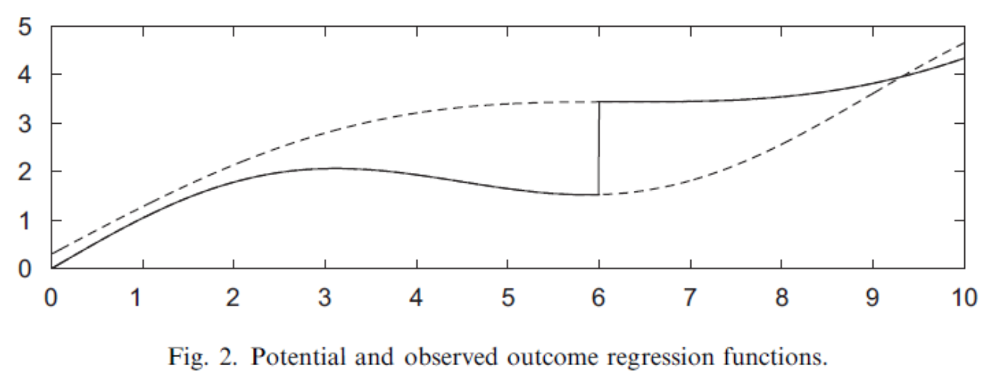
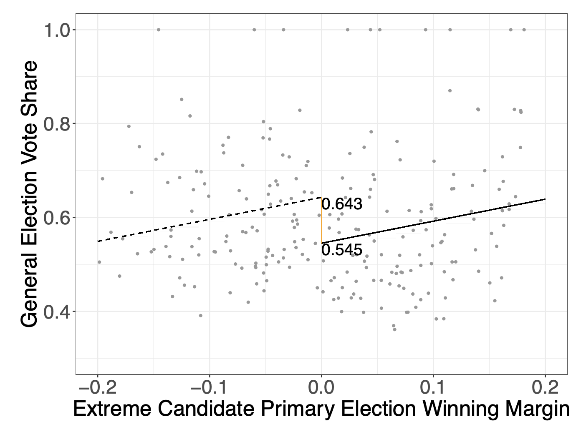

```{r setup, include=FALSE}
knitr::opts_chunk$set(echo = TRUE)
```

```{=html}
<style>
  body .main-container {
    max-width: 1100px;
    font-size: 12pt;
  }
</style>
```
[GV481 Homepage](https://kevinli03.github.io/notes/#GV481_Quantitative_Analysis)

**Week 8, GV481 Quantitative Analysis for Political Science**

-   Title: Regression Discontinuity

-   Topics:

-   Readings:

<br />

------------------------------------------------------------------------

[GV481 Homepage](https://kevinli03.github.io/notes/#GV481_Quantitative_Analysis)

# Key Points

<br />

------------------------------------------------------------------------

[GV481 Homepage](https://kevinli03.github.io/notes/#GV481_Quantitative_Analysis)

# **Introduction**

### Assignment Mechanism

Our goal of causal inference is to create comparable treatment and control groups

-   We can do this with random assignment

However, when this is not possible, we have to find cases, or a set up, where we can leverage one of our identification strategies.

-   For example, selection on observables is using observables to assign groups to treatment and control

<br />

If we have some observable covariate, where assignment is based on a threshold, we can use the regression discontinuity design (RDD).

-   For example, let us say treatment is scholarship. Scholarship is assigned only to people above the cutoff of 3.6 GPA. This is a cutoff

-   Or a need-based scholarship, which is only given to people less than \$30,000 income. That is a curuff

The RDD is commonly used in these rule-based settings, when it is clear how and when the treatment is assigned:

-   Election - someone wins, someone loses

-   Administrative programs - above a certain income, you might not get a welfare benefit

-   Geographic boundaries: if one country implements a policy, and a bordering country implements another policy, we can compare both sides of the border between the two.

The design is reliant on us knowing about, and having access, to a running variable that determines the treatment status.

<br />

### RDD Design

Each unit $i$ has a score on a running variable $X$, which determines treatment.

-   The cutoff $c$ is the value of the running variable at which treatment is assigned if above the cutoff $X=c$, and treatment is not assigned below the cutoff $X=c$.

There is some discontinuous change in probability of recieve the treatment above and below the cutoff:

-   Sharp Designs: All units above cutoff $X=c$ are assigned to treatment (100%)

-   Fuzzy Designs: Probability to be treated increases at cutoff $X=c$, but compliance with treatment is imperfect (not fully determined assignment). We analyse this by using running variable as an instrumental variable.

Today, we will only focus on Sharp Designs

<br />

Our **estimand** is the Average Causal Effect of the treatment at the cutoff

-   For example, let us say $X$ is GPA, and the cutoff $c = 3.0$ GPA. A scholarship is given to anyone above.

-   We want to compare those with $c = 2.9$ GPA (as control) and $c = 3.1$ GPA (as treatment)

Basically, close to the cutoff, we have a mini-experiment

-   People with 2.9 GPA and 3.1 GPA are basically the same - the difference likely is just down to luck.

-   So, we have a mini-experiment.

<br />

### Examples of RDD

Example 1: What is the effect of alcohol consumption on traffic-related deaths

-   We cannot compare people who drink alcohol and do not drink alcohol, since selection bias - people who drink alcohol might already be more likely to be reckless and die in traffic

-   Since drinkers and non-drinkers are not the same, we cannot be confident the differences after treatment are due to alcohol, not underlying differences.

-   To solve this, we can use a leverage the cutoff of age: in the US, you can only start drinking at age 21. This is a cutoff - the day before and after you turn 21, you are still the same person, same rough health

-   At 21, people can drive to the bar (could only sneakily drink before), so are far more likely to drunk drive. Thus, treatment of alcohol outside is applied above cutoff age 21.

-   If we see a sudden jump between 20 year + 300 day olds and 21 year + 1 day olds and automotive deaths, we can measure the difference.

<br />

Example 2: Effect of electoral system on turnout

-   In france, proportional voting happens in municipalities above 3,500 inhabitants, and a plurality system for smaller municipalities

-   So, there is a cutoff at 3,500 inhabitants.

-   So, we can measure the difference between municipalities at 3,499 inhabitants, and 3,500 inhabitants, and their turnouts.

<br />

Example 3: Effect of nominating an extremist candidate for a party, on the vote share in an general election.

-   Treatment is a party nominating an extremist candidate

-   Forcing variable will be extremist candidates vote-share winning margin in the primary in district $i$. If they win, they will win 50% of the votes, so cutoff is $c = 0.5$.

-   So basically, we are considering the outcome of the general election for the party, between when an extremist candidate wins 49% of the primary vote, and an extremist candidate wins 50% of the vote.

-   These districts should be very similar to each other - given 51% vs. 49% is basically down to luck.

-   Thus, we can compare the differences

<br />

------------------------------------------------------------------------

[GV481 Homepage](https://kevinli03.github.io/notes/#GV481_Quantitative_Analysis)

# **Identification in RDD**

### Sharp RDD

In the Sharp RDD design, the assignment to treatment $D_i = 1$, is completely determined by the value of the covariate $X_i$ being on either side of the threshold $c$:

-   So $D_i = 1$ if $X_i > c$

-   And $D_i = 0$ if $X_i < c$.

Where $X_i$ is known as the forcing or running variable. They can be correlated with the outcomes and potential outcomes.

-   The only requirement is that there is a fixed cutoff point $X_i=c$, when above, treatment is assigned, and when below, treatment is not assigned.

<br />

### Estimand and Identification

We want to estimate the average causal effect of the treatment at the cutoff, which is called the Local Average Treatment Effect (LATE)

$$
\tau_{LATE} = \mathbb{E} (Y_1 | X = c) - \mathbb{E} (Y_0 |X = c)
$$

The issue is that we do not observe both $\mathbb{E} (Y_1 | X = c)$ and $\mathbb{E} (Y_0 | X = c)$. These mean exactly at the cutoff. We only observe outcomes slightly above or below the cutoff.

<br />

We can get around this by using limits (with the assumption that $X$ is **continuous**).

Thus, we can identify the LATE:

$$
\begin{split}
\tau_{LATE} & = \mathbb{E} (Y_1 | X = c) - \mathbb{E} (Y_0 |X = c) \\
& = \lim\limits_{x \rightarrow c^+}\mathbb{E} (Y_1 | X = c) - \lim\limits_{x \rightarrow c^-}\mathbb{E} (Y_0 |X = c)
\end{split}
$$

This allows us to infer the potential outcomes at $c$.

NOTE: The LATE is only the ATE at $c$. Without further assumptions, we cannot conclude that the LATE is always equal to the ATE.

<br />

The idea is essentially this: The $X$ axis is the running variable $X$. The upper line in the figure below is the potential outcomes $Y_1$, and the lower line is the potential outcomes $Y_0$.

-   The solid line is the observed outcomes, and the dotted lines are the counterfactuals

-   The "jump" is the LATE.

{width="80%"}

<br />

### Estimation

This is how we will estimate the LATE:

First: Trim the sample to a reasonable window around the cutpoint $c$.

-   So $c-h ≤ x_i ≤ c+h$, where $h$ is some positive value that determins the size of the window.

-   Example, for the alcohol and traffic deaths, only focus on ages around the cutpoint 21, so maybe 19 through 23.

<br />

Second: Generate $\tilde{X}$, which is the distance of $X=x$ away from the threshold $X=c$.

-   So at $X=c$, $\tilde X = 0$

-   When $X < c$, $\tilde X < 0$.

-   When $X > c$, $\tilde X > 0$.

<br />

Finally: Decide on a model of $E[Y|X]$. We have a few options:

-   Linear model, with same slope for two potential outcomes graphs $E[Y_0 | X]$ and $E[Y_1 | X]$

-   Linear model, with different slopes for two potential outcomes graphs $E[Y_0 | X]$ and $E[Y_1 | X]$

-   Non-linear model.

We will describe these options in the following sections

<br />

### Linear with Same Slope

If we have the same slopes for both potential outcomes, we make a few assumptions:

-   First, $E[Y_0 | X]$ (control group below the cutoff) is linear: $E[Y_0 | X] = \mu + \beta X$

-   We also assume treatment effect $\tau$ does not depend on $X : E[Y_1 - Y_0 | X] = \tau$

Basically, the slope of both potential outcomes are the same, and the difference between them $\tau$ (the causal effect) is the vertical distance between the two lines.

Therefore: $E[Y_1 | X] = \tau + E[Y_0 |X] = \tau + \mu + \beta X$

<br />

Thus, we can rewrite $E[Y|X,D]$ as:

$$
\begin{split}
E[Y|X,D] & = D \times E[Y_1 | X] + (1-d) E [Y_0 | X] \\
& = D(\tau + \mu + \beta X) + (1-D)(\mu + \beta X) \\
& = D \tau + D \mu + D \beta X + \mu + \beta X - D \mu - D \beta X \\
& = \mu + \tau D + \beta X \\
& = \mu + \tau D + \beta X - \beta c + \beta c \\
& = (\mu + \beta c) + \tau D + \beta(X-c) \\
& = \gamma + \tau D + \beta \tilde{X}
\end{split}
$$

The end shows that we simply run a regression with outcome $Y$ and explanatory variables $D$ and $\tilde X = X-c$.

$\hat\tau$ is an estimate of the LATE, which is the average treatment effect at the cutoff $\tilde X = 0$. Thus, plugging that in, we get.

For example, the outcome should look something like this (with $\tau$ being the difference at 0):

{width="70%"}

<br />

### Alternative Functional Forms

Linear with different slopes:

$$
E[Y|X,D] = \gamma + \tau D + \beta_0 \tilde {X} + \beta_1(\tilde X D)
$$

-   $\gamma$ is average $Y$ when both $\tilde X$ and $D$ are 0.

-   $\beta_0$ is the effect of the running variable for the control group $D=0$.

-   $\beta_1$ is the effect of the running group for the treated group $D=1$

-   $\tau$ is the effect of the treatment at cutoff $\tilde X = 0$.

Non-Linear Quadratic:

$$
E[Y|X,D] = \gamma + \tau D + \beta_0 \tilde X + \beta_1 \tilde X^2 + \beta_2 \tilde X D + \beta_3 \tilde X^2 D
$$

<br />

Which model should we estimate?

-   All of them - you want your $\hat\tau$ to be robust

<br />

### Bandwidth Selection

The bandwidth is the neighbourhood around cutoff $X=c$ that we consider in our model.

With larger bandwidth, we sometimes get more model dependence - where quadratic terms and linear terms will get very different results. This results in higher bias.

For example, the figure below shows how different model selection get very different $\tau$ differences.

But with small bandwidth, the bias decreases, but the variance of $\tau$ increases. This is because by lowering the bandwidth, we are throwing out more data.

-   Why bias decreases? well, we are measuring $\tau$ as we infinitely closely approach $c$, so smaller bandwidth means more comparison between similar units.

<!-- -->

-   So each observation is more influential

<br />

So how do we select the optimal bandwidth that minimises bias and variance?

-   We can use algorithmic bandwidth selection methods. The most common is the Imbens-Kalyanaraman Procedure

-   In this algorithms, it finds the $h$ bandwidth that minimises the mean-square error of the RD estimator.

We can also run multiple bandwidths, and show how much our LATE changes with different bandwidths.

-   Similar to the model selection - do all of them

-   If LATE is consistent, that suggests that our finding is robust to model tinkering.

<br />

### Falsification Checks

We can do a few falsification checks to check if our assumptions are met: balance chekcs, sorting, and compound treatment.

Balance checks (just like balance tables), check if units on both sides of the cutoff $X=c$ are very similar in terms of key confounders

-   Naturally, we want them to be similar, since we are comparing them as treatment and control groups.

-   We can check this with RDD - just use the covariate as the outcome variable. If estimated $\tau =0$, then this is good.

<br />

Sorting: are units able to "sort" around the threshold.

-   For example: if there is an income threshold for a public benefit, people might intentionally reduce their income to be below the cutoff. That means there is selection bias.

-   For example: businesses might locate in different areas if benefits are allocated differently across localities.

-   Basically, we can't have people **intentionally** and **strategically** migrating across the threshold $X=c$.

You can check this with a histogram - plot the running variable:

-   Is there a significant drop or increase at or around the threshold?

-   If there is a big jump, this might mean they are sorting themselves.

McCrary Tests is a more formal way to test this.

<br />

Compound Treatment: are there multiple changes at the cutoff?

-   RDD assumes that the only thing that is changing at the cutoff $X=c$ is our treatment, nothing else.

-   If there are multiple changes at a threshold (maybe multiple public programmes at the same income threshold), we cannot isolate the impact of certain public programmes individually.

<br />
