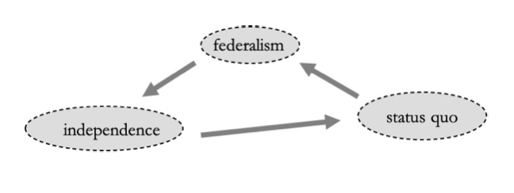

```{r setup, include=FALSE}
knitr::opts_chunk$set(echo = TRUE)
```

```{=html}
<style>
  body .main-container {
    max-width: 1100px;
    font-size: 12pt;
  }
</style>
```
[GV4C8 Homepage](https://kevinli03.github.io/notes/#GV4C8_Game_Theory)

**Week 1, GV4C8 Game Theory for Political Science**

-   Title: Political Economy, Game Theory, Aggregation of Preferences

-   Topics: Political Economy, Properties of Game Theory, Difficulty in Aggregating Preferences

-   Readings:

    1.  Chapter 1, Osborne, M. J. (2004) *An Introduction to Game Theory* (Oxford University Press)

<br />

------------------------------------------------------------------------

[GV4C8 Homepage](https://kevinli03.github.io/notes/#GV4C8_Game_Theory)

# Key Points

[**Game theory**]{.underline} is a collection of models

-   A model is an abstraction we use to understand our observations

-   A model's assumptions should be similar to reality - or else, it is not a reflective model of our observed world

-   At the same time, models should be simple - not containing irrelevant details (after all, the need for a model is due to the complexity of the world)

<br />

[**Key properties**]{.underline} of Game Theory:

-   Payoffs are interdependent - one person's actions affects another's payoffs

-   There is **common knowledge** of the rules of the game: everyone knows, that everyone knows, that everyone knows,.... and so on, the rules of the game

-   A player predicts what other players will do - and will react to that

-   Their optimal action, depends on the beliefs of what others will do

Players will take actions, and they will yield some outcomes

$$
\text{actions } \rightarrow \text{ outcomes}
$$

The path from actions to outcomes is the environment - other factors that affect your input to produce an output

-   Your beliefs on the environment, influence your choice of action

<br />

[**Arrow's Impossibility Theorem**]{.underline}: No reasonable (easy, obvious) way to aggregate preferences - to come to joint decisions

-   If you want to satisfy some basic criteria of preferences, the only way forward is dictatorship

<br />

[**Aggregating Preferences**]{.underline} is often influenced by:

-   Agenda power: who sets the way things are voted on

-   Strategic manipulation - deviating from one's preferences in order to manipulate the final result in aggregating preferences

<br />

------------------------------------------------------------------------

[GV4C8 Homepage](https://kevinli03.github.io/notes/#GV4C8_Game_Theory)

# Political Economy

### Introduction

Political Economy is:

1.  Study of non-market decision making
    -   Not supply and demand - prices and quantities
2.  Study of economic outcomes - when political processes matter
    -   Economics often avoids how politics interferes in who gets what
3.  Political science with economic tools and ideas
    -   Methodological individualism - aggregate outcomes arise from individual agent's behaviour
    -   Rational choice: individuals have consistent preferences and are goal oriented - and aim to maximise their payoffs
    -   Institutionalism: individuals interact within well-defined rules

<br />

Importantly:

-   We are interested in explaining the world, not judging what is right/wrong

-   We want to focus on what is feasible - the possible actions, rather than what is desirable

In order to study political economy, we build models

<br />

### Modelling Political Situations

Why should we build models to explain political situations?

-   The world is too complicated to think about everything at once

-   Models should simplify - only some features we care about

-   Models should teach us something we did not know

<br />

For example, a map is a model

-   A map with streets simplifies things - doesn't show every business, every building, etc.

-   Tube map - doesn't follow real geography - simplifies for ease of navigation

<br />

There are different approaches to modelling

-   Decision theory: one individual that takes actions to maximise his objective, given a certain environment and some beliefs of what might happen

-   Competitive equilibrium: price and quantities (unaffected by individual actions), such that a market clears

-   Game Theory: social interactions that are characterised by strategic interdependence. This is what we will focus on

<br />

------------------------------------------------------------------------

# Game Theory

### Introduction

Game theory is as follows:

-   The study of mathematical models of conflict and cooperation between rational decision makers

-   General mathematical techniques for analysing situations in which 2 or more individuals make decisions that influence another's welfare

-   Insights for scholars in social science and decision makers

<br />

### Properties of Game Theory

Key properties of Game Theory:

-   Payoffs are interdependent - one person's actions affects another's payoffs

-   There is **common knowledge** of the rules of the game: everyone knows, that everyone knows, that everyone knows,.... and so on, the rules of the game

-   A player predicts what other players will do - and will react to that

-   Their optimal action, depends on the beliefs of what others will do

<br />

### Game Theory is Everywhere

Game Theory is present in almost all situation:

Should you take steroids in cycling?

-   If I take them, and you don't, I will have an advantage. If I don't, but everyone else does, then I would be at a disadvantage
-   This is a prisoner's dilemma - you should always take steroids as it is a dominant strategy

<br />

Movie release dates - everyone wants to release near Christmas, but you don't want to release on the same week as your opponent

-   This is a game of chicken - you want to do the opposite of what I do

Government vs. Opposition - opposition wants to differentiate from government (or else, why elect them if they are the same as the government). Government, vice versa, wants to be the same as opposition

-   This is also a game of chicken, with multiple equilibria

<br />

Football penalty kicks

-   GK cannot wait to see which direction a penalty kicker is going - he need to predict and move at the same time

-   A taker loves to shoot right. So the GK will always go right - so, the player would be better off occasionally shooting to the left

-   So you need randomisation - but at a certain probability - since you are better kicker on the right

-   This is a zero sum game with a mixed strategy equilibria

------------------------------------------------------------------------

[GV4C8 Homepage](https://kevinli03.github.io/notes/#GV4C8_Game_Theory)

# Aggregating Preferences

### Preferences and Utility Theory

Players will take actions, and they will yield some outcomes

$$
\text{actions } \rightarrow \text{ outcomes}
$$

The path from actions to outcomes is the environment - other factors that affect your input to produce an output

-   Your beliefs on the environment, influence your choice of action

<br />

Key properties:

-   Preferences over the outcomes are rational - complete and transitive

    -   Complete: given any 2 outcomes, you can always compare them, and choose one over another. You will never be indifferent

    -   Transitive: Basically consistency - if you prefer £1000 over £500, and you prefer £500 over £100, you prefer £1000 over £100

-   Preferences over outcomes are ordinal or cardinal

    -   Ordinal: you can rank your preferences of outcomes, but not define a specific value

    -   Cardinal: you can assign a number to how much you like the outcomes

-   Once we give a cardinal number for every outcome, we have an "expected utility"

    -   So for every action, you will be able to compute the "expected utility"

    -   Expected utility is simply the mean/expected value - weighted average of all possible outcomes and their corresponding probability

<br />

### Aggregating Preferences

Let us say we have 3 individuals and 3 outcomes regarding an independence of a province

-   The 3 possible outcomes are federalism, independence, and status quo

Let us say the preferences of the 3 individuals are as follows:

-   Voter A: independence \> federalism \> status quo

-   Voter B: federalism \> status quo \> independence

-   Voter C: status quo \> independence \> federalism

These preferences are complete - no one is indifferent, and transitive.

<br />

What is the most likely outcome? Let us assume standard voting

-   Between federalism and status quo, federalism wins

-   Between federalism and independence, independence wins

-   Between independence and status quo, status quo wins

Note: between any 2 options, the group always has a preference. However, there is no transitivity. See the figure below:

-   No transitivity, because transitivity says if $a>b$ and $b>c$, then $a>c$

-   But here, $a<c$, so it is not transitive

{width="60%"}

<br />

### Arrow's Impossibility Theorem

Condorcet's Paradox: group preferences are usually not rational

-   Often, group preferences do not meet the require of transitivity
-   For example, the cyclical nature shows that $a>b$, $b>c$, yet $c>a$, which isn't transitive

Arrow's Impossibility Theorem: No reasonable (easy, obvious) way to aggregate preferences - to come to joint decisions

-   If you want to satisfy some basic criteria of preferences, the only way forward is dictatorship

This is in stark contrast to economics - where market equilibrium creates maximum welfare

<br />

### Institutional Features

Let us say individual A has agenda power - he can choose how the vote works

-   He decides first, status quo vs. federalism

-   Then, the winner of that vs. independence

-   Agenda power can be derived from a majority in a legislature, chair of a committee, older or more wise, etc.

<br />

Why does individual 1 do this? Well look at the figure above - federalism wins against status quo, and independence wins against federalism

-   So, this agenda gets individual A's personal preference, even when individuals vote for their preferences

<br />

Although interestingly, individual B is **pivotal** in the first round:

-   Note: pivotal means decides the outcome

-   If status quo wins the first vote, then independence will lose the second vote

-   What if B, instead of voting for his preference of federalism in the first round, strategically changes to status quo?

-   By manipulating their preferences, individual B strategically manipulated the answer

This shows the importance of recognising strategic manipulation - and how it complicates aggregation

<br />

------------------------------------------------------------------------

[GV4C8 Homepage](https://kevinli03.github.io/notes/#GV4C8_Game_Theory)

# Exercises

### Exercise 1

3 voters have the following preferences over outcomes:

1.  x \> y \> z
2.  y \> z \> x
3.  z \>y \> z

There is ranked voting (for all), submitted to a referee

-   Referee decides by applying majority rule by implementing the alternative that wins all other alternatives

-   Has any agent have an incentive and report non-truthful preferences

-   If no one wins, Z wins (status-quo)

<br />

**Solving the Issue**

1.  Let us assume people first vote truthfully - and compare them by majority vote
    -   X vs. Y - Y wins
    -   X vs Z - Z wins
    -   Y vs Z - Y wins
    -   Referee chooses Y - wins the most votes
2.  Who would like Z over Y?
    -   Not player 1, not player 2, but yes, player 3
3.  What could player 3 do?
    -   If he votes truthfully, we get Y
    -   But if he changes his preferences to z \> x \> y, then we have the infinite cycle we saw earlier.
4.  Thus, we know player 3 has an incentive to deviate

<br />

### Exercise 2

3 legislators need to decide how to distribute budgets among their constituencies - the final agreement needs to be approved by a majority

-   Show that given any budget allocation there is always another allocation that is preferred by a majority

-   Construct three budget allocations such that aggregate preferences over these budget allocations are cyclic

<br />

**Solution:**

No matter what budget allocation you have - as long as the 3rd person gets something, the other 2 (majority) will want to give 0 to that individual and give the rest to themselves

-   Ex. if we have a $(1/3, 1/3, 1/3)$ distribution, since we only need 2 to agree, the first 2 (majority) would steal the 3rd's distribution to get $(1/2, 1/2, 0)$

-   And if we have $(1/2, 1/2, 0)$, the 3rd guy may bargain with the 2nd, give him slightly more, but take away from player 1 $(0, 3/5, 2/5)$

<br />

We can construct a cyclic as following:

1.  (3, 2, 5)
2.  (5, 5, 0)
3.  (6, 1, 3)

<br />

------------------------------------------------------------------------

[GV4C8 Homepage](https://kevinli03.github.io/notes/#GV4C8_Game_Theory)

# Reading: Osborne

Chapter 1, Osborne, M. J. (2004) *An Introduction to Game Theory* (Oxford University Press)

<br />

### Key Points

Game theory is a collection of models

-   A model is an abstraction we use to understand our observations

-   A model's assumptions should be similar to reality - or else, it is not a reflective model of our observed world

-   At the same time, models should be simple - not containing irrelevant details (after all, the need for a model is due to the complexity of the world)

<br />

Decision-makers have **preferences** over the outcomes of their actions:

-   When presented with a pair of outcomes, they know that they either prefers one of them, or perceives both as equally desirable (indifferent)

-   Preferences should be consistent - if she prefers $a$ over $b$, and $b$ over $c$, she should prefer $a$ to $c$ (transitivity)

We can represent preferences in a **payoff function** as $u$ (utility), such that:

-   If $u(a) > u(b)$, then the decision maker prefers $a$ to $b$

<br />

The **theory of rational choice** is that - given any subset of possible actions, they will choose the one that is best according to their preferences

<br />

### What is Game Theory?

Game theory helps us understand situations in which decision makers interact

-   Games - in real life, are competitive activities with a set of rules

-   Many real world scenarios can be represented as games, such as firms competing, political candidates competing, jury members deciding on a verdict, bidders in an auction, etc.

<br />

Game theory is a collection of models

-   A model is an abstraction we use to understand our observations

-   A model's assumptions should be similar to reality - or else, it is not a reflective model of our observed world

-   At the same time, models should be simple - not containing irrelevant details (after all, the need for a model is due to the complexity of the world)

<br />

Models are neither "right" or "wrong"

-   Whether a model is useful, depends on what it is being used for

-   For example, finding a short driving route, you can use a flat map, even though the world is round

<br />

Game theory is useful for social, political, and economic arenas

-   Suggests ways which individual behaviours can be modified to improve welfare

-   Looking at incentives and likely outcomes, we can find advantages and disadvantages of policies and strategies

<br />

Models of game theory are precise

-   Verbal descriptions can be very very long and winded

-   For precision, many mathematical symbols are used

<br />

### Rational Choice Theory

Rational Choice theory is often used in many models in game theory

-   Essentially, the theory states that a decision maker will choose the best action according to their preferences

-   Preferences are expressed over potential outcomes - and it is assumed that individuals will choose the one that they favour the most

<br />

A decision-maker has a set $A$ of all the **actions** that are available to them

-   Essentially, set $A$ contains all possible actions they can do

In any situation, the decision maker will face a subset of $A$, which from, they must choose an action

-   The decision maker knows this subset of available choices - and this subset is not influeced by their preferences

For example, set $A$ could be the set of all possible goods a decision-maker can choose to consume

-   The subset of $A$ would be the goods a decision-maker could consume given their income

<br />

Decision-makers have **preferences** over the outcomes of their actions:

-   When presented with a pair of outcomes, they know that they either prefers one of them, or perceives both as equally desirable (indifferent)

-   Preferences should be consistent - if she prefers $a$ over $b$, and $b$ over $c$, she should prefer $a$ to $c$ (transitivity)

How do we describe a decision-makers preferences?

-   We could specify, for each possible pair of actions, the action the decision maker prefers

-   Or, we can represent the preferences by a payoff function - associating a number with each action, where higher numbers are preferred

We often label this **payoff function** as $u$ (utility), such that:

-   If $u(a) > u(b)$, then the decision maker prefers $a$ to $b$

<br />

It is important that utility is often ordinal - not cardinal

-   Ordinal in the sense that there is order in the preferences - the decision maker prefers higher values of the function $u$

-   However, not cardinal - utility of 2 is not necessarily twice of the utility of 1

<br />

The **theory of rational choice** is that - given any subset of possible actions, they will choose the one that is best according to their preferences

-   Essentially, if they prefer one action over another - they will always choose the action they prefer 100% of the time

-   If they are indifferent between two actions, they may sometimes choose one or the other

<br />

Rational Choice Theory is enormously successful:

-   They pretty much dominate economics as a field

-   However, it is important to note that humans make decisions with variance - i.e. they will not 100% of the time choose an action over another, even if they prefer the first action

-   No current general theory challenges rational choice theory - but it has limits

<br />

### Interacting Decision Makers

Previously, we discussed how one decision-maker chooses an action from set $A$, and only cares about this action

-   This is very unlikely in the real world - almost never does one control everything on their own

-   Often, other decision makers affect our outcomes

The study of interacting decision makers, who affect each other, is game theory

<br />

For example, firms competing for business

-   Each firm controls their price, but not the other firm's prices

-   However, the other firm's chosen price affects every other firm

For example, political candidate for office

-   Each candidate chooses their own policy, but not their opponent's policies

-   However, the opponents chosen policies affect all the other candidates

<br />

Game Theory has several different forms of games

-   Strategic game and an extensive game focus on the actions of individuals

-   Coalition games focus on the outcomes that can be achieved by groups of individuals

-   Strategic game and Coalition game consider situations which actions are chosen once and for all

-   Extensive games allow for the possibility that the plans may be revised as they are carried out

<br />

------------------------------------------------------------------------

[GV4C8 Homepage](https://kevinli03.github.io/notes/#GV4C8_Game_Theory)
