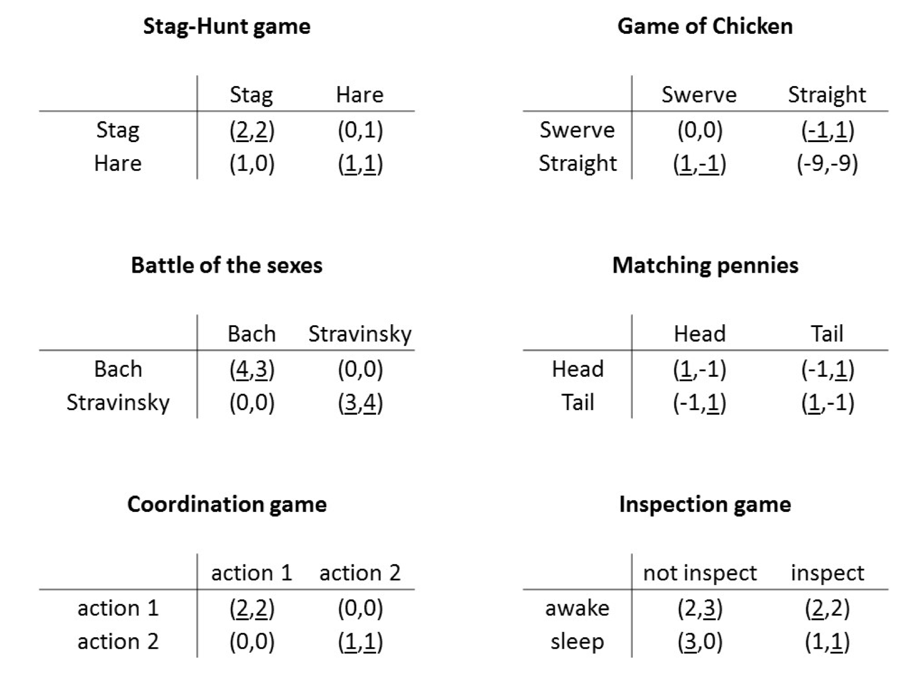

```{r setup, include=FALSE}
knitr::opts_chunk$set(echo = TRUE)
```

```{=html}
<style>
  body .main-container {
    max-width: 1100px;
    font-size: 12pt;
  }
</style>
```
[GV4C8 Homepage](https://kevinli03.github.io/notes/#GV4C8_Game_Theory)

Week 2, GV4C8 Game Theory for Political Science

-   Title: Nash Equilibrium, Static Games of Complete Information

-   Topics:

-   Readings:

    1.  Chapter 2, Osborne, M. J. (2004) *An Introduction to Game Theory* (Oxford University Press)
    2.  Chapter 5, McCarty, N. and Meirowitz, A. (2012) *Political Game Theory: An Introduction*
    3.  Chapter 3, Tadelis, S. (2013) *Game Theory: An Introduction*
    4.  Chapter 5, Tadelis, S. (2013) *Game Theory: An Introduction*

<br />

------------------------------------------------------------------------

[GV4C8 Homepage](https://kevinli03.github.io/notes/#GV4C8_Game_Theory)

# Key Points

A strategic game consists of:

-   A set of **players**

-   For each player, a set of **actions/strategies**

-   For each player, **preferences** over the action profiles (complete set of preferences)

<br />

Game Theory [**Notation**]{.underline}:

-   Players are denoted $i=1,2,...., N$

-   The actions of player $i$ is denoted $a_i$

-   Strategies of a player are denoted $s_i$

    -   A player's selected strategy is denoted with a star: $s_i^*$

    -   All other strategies are notated with a ' (like a set complement): $s_i'$

-   The action profile (all player's actions) is a vector $a = (a_1, a_2,... a_N)$

    -   Or, we could denote that actions of me (player $i$), and the actions of everyone else (players $-i$, so our action profile is $a= (a_i, a_{-1})$

-   Preferences are represented by a payoff function $u_i (a_i, a_{-i})$

    -   The inputs are player $i$'s actions $a_i$, and the actions of everyone else $a_{-1}$

<br />

If you want to always do a certain strategy/action, no matter how your opponent plays, then that is a [**dominant strategy**]{.underline}

Formally, the strategy $s_i^D$ is a dominant strategy, if it is player $i$'s best strategy, no matter any strategies the other players pick

-   i.e. no matter what the opponent does, the payoff is highest for player $i$ is $s_i^D$

More formally, $u_i(s_i^D, s_{-i}) > u_i (s_i, s_{-i})$ for all $s_{-i}$ and for all $s_i ≠ s_i^D$

-   This literally means, the utility of choosing the dominant strategy is always higher than any other strategy, no matter the strategies $s_{-i}$ that player $i$'s opponents play

<br />

A strategy profile is a [**dominant strategy equilibrium**]{.underline}, if every player is playing a dominant strategy profile.

Formally, a strategy profile $S^D = (s_1^D, s_2^D,...s_N^D)$ is a dominant strategy equilibrium if for all players $i$, $u_i(s_i^D, s_{-i}) > u_i (s_i, s_{-i})$ for all $s_{-i}$ and for all $s_i ≠ s_i^D$

-   The second part is just the definition of dominant strategy

<br />

The strategy $s_i$ is a [**best response**]{.underline} to the opponents strategy $s_{-i}$ if it yields maximum payoff to $i$.

-   Strategy profile $s_i$ is a best response to $s_{-i}$ if $u_i(s_i,s_{-i}) ≥ u_i(s_i', s_{-i})$, where $s_i'$ is the other strategy profiles not $s_i$

A strategy cannot be a best response, when there is a profitable deviation:

-   Basically, given the opponent plays a strategy, if you can switch to a strategy and obtain a better payoff, then that original strategy is not a best response

<br />

A [**Nash equilibrium**]{.underline} is a strategy profile, with a property that no player can do better by choosing a different strategy.

-   That is, all players are best responding to the other players' strategies.

More formally, $s^*$ is a nash equilibrium when $u_i(s_i^*, s_{-i}^*) ≥ u_i(s_i', s_{-i}^*)$ for all $s_i'$ and for all $i$

-   Basically, a strategy profile is a nash equilibrium, when the chosen strategy of player $i$, given an opponents strategies, if that chosen strategy yields a higher payoff than any other strategy that player $i$ could choose.

All dominant strategy equilibriums are nash equilibriums, but not all nash equilibriums are dominant strategy equilibriums.

<br />

------------------------------------------------------------------------

[GV4C8 Homepage](https://kevinli03.github.io/notes/#GV4C8_Game_Theory)

# Games

### Games and Notation

A strategic game consists of:

-   A set of **players**

-   For each player, a set of **actions/strategies**

-   For each player, **preferences** over the action profiles (complete set of preferences)

<br />

One of the key things about game theory is about transcribing situations into notations. Standard notations as follows:

-   Players are denoted $i=1,2,...., N$

-   The actions of player $i$ is denoted $a_i$

-   Strategies of a player are denoted $s_i$

    -   A player's selected strategy is denoted with a star: $s_i^*$

    -   All other strategies are notated with a ' (like a set complement): $s_i'$

-   The action profile (all player's actions) is a vector $a = (a_1, a_2,... a_N)$

    -   Or, we could denote that actions of me (player $i$), and the actions of everyone else (players $-i$, so our action profile is $a= (a_i, a_{-1})$

-   Preferences are represented by a payoff function $u_i (a_i, a_{-i})$

    -   The inputs are player $i$'s actions $a_i$, and the actions of everyone else $a_{-1}$

<br />

### Types of Games

There are two important characteristics of a game: timing and information

Timing:

-   A **static game** is when all players move simultaneously (normal form game)

    -   Like prisoner's dilemma - you can't observe what action the other player is playing

-   A **dynamic game** is when players move sequentially (also called extensive form games)

    -   Like chess - you can see the move the player before you plays

Information:

-   When all payoffs are known to all players, this is **complete information**

-   When some payoffs are not common knowledge, then this is **incomplete information**

<br />

We will start with static games with complete information - the simplest form and the best way to introduce core concepts

<br />

------------------------------------------------------------------------

[GV4C8 Homepage](https://kevinli03.github.io/notes/#GV4C8_Game_Theory)

# Dominant Strategies

### Prisoner's Dilemma

*Two suspects are arrested. The police holds the suspects in separate cells and explains the consequences of their actions. If they both remain quiet (cooperates) then both will be convicted for minor offences and sentenced to 1 month in jail. If both fink (defect) then both will be sentenced to jail for 8 months. Finally, if one finks but the other does not, then the confessor is immediately released and the other is sentenced to 10 months, 8 for the crime and 2 for obstructing justice.*

<br />

The two players in a prisoner's dilemma have two actions: cooperate or defect.

-   The two players' preferences is that they want to reduce their prison sentence

<br />

We can define the payoffs as follows, where $u_i$ is the utility of player $i$, the function $u_i(a_i, a_{-i})$

-   $u_1(D,D) = u_2(D,D) = -8$

-   $u_1(D,C) = u_2(C,D) = 0$

-   $u_1(C,D) = u_2(D,C) = -10$

-   $u_1(C,C) = u_2(C,C) = -1$

<br />

### Normal Form

We can represent these payoffs and actions in a matrix form. The first number in each cell is the payoff of player 1, and the second number in each cell is the payoff of player 2

|                   | Cooperate (2) | Defect (2) |
|-------------------|---------------|------------|
| **Cooperate (1)** | -1, -1        | -10, 0     |
| **Defect (1)**    | 0, -10        | -8, -8     |

<br />

A normal form game has the following characteristics:

-   The players are listed

-   The strategies of each player are listed

-   The payoffs (outcomes) are listed

<br />

### Dominant Strategy

Let us look at the prisoner's dilemma. What is player 1's best move?

-   Player 1 should play defect if player 2 plays cooperate, since $0>-1$

-   Player 1 should play defect if player 2 plays defect, since $-8>-10$

-   Thus, player 1 should always play defect

This applies to player 2 as well.

Thus, in this game, we see that both players, regardless of the other player, want to defect.

<br />

If you want to always do a certain strategy/action, no matter how your opponent plays, then that is a **dominant strategy**

Formally, the strategy $s_i^D$ is a **dominant strategy**, if it is player $i$'s best strategy, no matter any strategies the other players pick

-   i.e. no matter what the opponent does, the payoff is highest for player $i$ is $s_i^D$

More formally, $u_i(s_i^D, s_{-i}) > u_i (s_i, s_{-i})$ for all $s_{-i}$ and for all $s_i ≠ s_i^D$

-   This literally means, the utility of choosing the dominant strategy is always higher than any other strategy, no matter the strategies $s_{-i}$ that player $i$'s opponents play

<br />

### Solution Concepts

We want to either advise players on how to play, or try to predict how players will play

-   An equilibrium restricts the set of all possible strategies to the most reasonable one

<br />

Implicit assumptions in any equilibrium concept:

1.  Players are rational, that is, they choose actions to maximise payoffs
2.  Structure of the game and players' rationality is common knowledge
3.  Any predictions must be self-enforcing

<br />

To evaluate an equilibrium concept, we can evaluate 3 concepts:

-   Existence: how often does this equilibrium exist

-   Unique: If there are too many equilibriums in a game, then we can't really determine what the solution will be. A more unique equilibrium restricts behaviour to make more meaningful predictions

-   Robustness: how sensitive is our equilibrium, if we slightly change our model

<br />

### Dominant Strategy Equilibrium

A strategy profile is a dominant strategy equilibrium, if every player is playing a dominant strategy profile.

Formally, a strategy profile $S^D = (s_1^D, s_2^D,...s_N^D)$ is a dominant strategy equilibrium if for all players $i$, $u_i(s_i^D, s_{-i}) > u_i (s_i, s_{-i})$ for all $s_{-i}$ and for all $s_i ≠ s_i^D$

-   The second part is just the definition of dominant strategy

<br />

In the prisoner's dilemma, all players defecting is a dominant strategy equilibrium

-   So the outcome is both players defecting, with outcome $-8, -8$

-   Notice how this doesn't look like the optimal outcome on first glance, but when both players are rational, they will end up here.

<br />

Let us evaluate dominant strategy equilibrium:

-   Existence: it often does not exist, since dominant strategies are uncommon

-   Uniqueness: if it exists, dominant strategy must be the only equilibrium in the game

    -   Why? Everyone is playing a dominant strategy that maximises payoff, so there are no other equilibriums

-   Robustoness: it is not sensitive to small changes

<br />

### Public Good Contribution Game

Take this following game:

-   10 citizens need to decide how to invest £5 (per citizen) at the same time

-   Each £1 invested in the private account yields £1

-   Each £1 invested in the group account, yields £4 pounds to the group account (basically, increasing)

-   Everyone receives an equal share of the group account (no matter their contribution), and keeps their private account

<br />

Let us formalise the game:

-   10 players

-   Action is how much to invest in group account, thus actions of player $i$ is $a_i \in [0,5]$

-   Objective is to end up with as much money as possible

-   Group account is $G = 4 \times (a_1 + a_2+...a_{10})$

-   Utility of player $i$ is $u_i(a_i, a_{-i}) = \frac{G}{10}+(5 - a_i)$

    -   Why? $G/10$ is the group account shared equally. $5-a_i$ is your original £5, minus the money you put into the group account

<br />

Player $i$ has a dominant strategy, always invest £0

-   However, all players would be better of, if they had invested in the group account (since it is multiplied by 4)

-   This shows how individual rationality ≠ optimal group outcome

This is a prisoner's dilemma but for more than 2 players

<br />

------------------------------------------------------------------------

[GV4C8 Homepage](https://kevinli03.github.io/notes/#GV4C8_Game_Theory)

# Nash Equilibrium

### Best Response

Dominant strategy equilibrium has strong predictive power. However, it hardly ever exists.

-   So instead of choosing one action regardless of opponents action, we choose a action, that best responds to a opponent's chosen action

<br />

More formally, the strategy $s_i$ is a best response to the opponents strategy $s_{-i}$ if it yields maximum payoff to $i$.

-   Strategy profile $s_i$ is a best response to $s_{-i}$ if $u_i(s_i,s_{-i}) ≥ u_i(s_i', s_{-i})$, where $s_i'$ is the other strategy profiles not $s_i$

A strategy cannot be a best response, when there is a profitable deviation:

-   Basically, given the opponent plays a strategy, if you can switch to a strategy and obtain a better payoff, then that original strategy is not a best response

<br />

### Finding Best Responses

To find best responses for player 1, do the following:

1.  First, assume player 2 plays a certain strategy.
2.  Now, find which player 1 strategy maximises player 1's payoffs. Note this
3.  Now, assume player 2 plays another strategy
4.  Now, find which player 1 strategy maximises player 1's payoffs. Note this
5.  Keep doing with all the potential strategies player 2 can play, and choose the strategy which maximises player 1's outcome

Note: you can have 2 (or more) best responses to an opponents strategy, if the payoffs of the highest responses are the same.

<br />

Now, do the same for player 2

<br />

### Nash Equilibrium

Nash equilibrium is another solution concept

-   It does not always exist (but much more frequently than dominant strategy equilibrium)

-   Note: sometimes there are multiple ones

<br />

A Nash equilibrium is a strategy profile, with a property that no player can do better by choosing a different strategy.

-   That is, all players are best responding to the other players' strategies.

More formally, $s^*$ is a nash equilibrium when $u_i(s_i^*, s_{-i}^*) ≥ u_i(s_i', s_{-i}^*)$ for all $s_i'$ and for all $i$

-   Basically, a strategy profile is a nash equilibrium, when the chosen strategy of player $i$, given an opponents strategies, if that chosen strategy yields a higher payoff than any other strategy that player $i$ could choose.

All dominant strategy equilibriums are nash equilibriums, but not all nash equilibriums are dominant strategy equilibriums.

<br />

Justification of Nash Equilibriums as a Solution Concept:

-   Nash Equilibrium is self-enforcing - if I anticipate that everyone will play the NE, I will also play it

-   Players should be able to figure it out, since if I can figure out what is in my best interest, and there is no information hidden, I can figure out what other player's best interests are

-   Nash Equilibrium are stable points - if the other player does $X$, and I best respond to that, and she best responds to my best response, we should converge to NE

Caveats of Nash Equilibrium (downsides)

-   NE don't always make sense as sensible outcomes

-   Multiple equilibria makes it difficult

-   Does not really apply to dynamic processes (we will discuss expansions to NE for dynamic games later)

<br />

Evaluating equilibrium depends on existence, uniqueness, and robustness (as mentioned before)

-   Existence - it does exist, and decently frequently

-   Uniquness - there can be multiple Nash Equilibrium (we will expand on this)

-   Robustness - we will talk about this below

<br />

### Finding Nash Equilibriums

**Method 1:**

Method 1 is about finding all player's best responses, and see if there is a strategy profile where all players are best responding to each other.

To find a nash equilibrium, you should find both player 1 and player 2's best responses (as shown in the section above), and underline them.

-   Any set of strategies that has both player 1 and player 2's best responses highlighted is a nash equilibria.

<br />

**Method 2:**

Instead of computing all the best responses, we start with each outcome, and see if there is a profitable deviation.

-   If there is a profitable deviation for either player, then it is clearly not a nash equilibrium

<br />

### Classical Games

These are some classical games and their best responses. The ones with both player's payoffs underlined are nash equilibriums

{width="100%"}

<br />

### Multiple NE and Focal Points

There can be multiple nash equilibria in a game. So, this complicates our predictive power, since we don't know which equilibrium will be chosen

Schelling created the idea of a focal point to solve this issue:

-   His idea is that some Nash Equilibrium are more "notable" and likely

-   For example, take the game, where you meet in Paris - if you meet in the same place, you get money, if you don't, you don't get money.

    -   Every single location in Paris is a nash equilibria - since as long as both players are in the same place (no matter the place), you get the payoff

    -   However, there might be a more obvious nash equilibria - Eiffel Tower

<br />

There are several ways in which there can be a focal point:

-   Cultural: like the Eiffel Tower

-   Payoffs: perhaps one nash equilibrium is pareto efficient (see below) - basically, better payoffs than the other nash equilibria

<br />

### Robustness of Nash Equilibria

Idea of robustness is that, we would like to predict the outcome of a game. However, there is a lot of randomness in the world - will our predictions be the same, despite some changes in the model?

-   So, the model doesn't completely self-destruct if you modify/shake it slightly

<br />

Trembling hand equilibrium is the idea that, a player is nervous, and might choose the wrong action (with tiny probabilities)

-   Basically, players tremble, and have a tiny probability of picking the "wrong" action

```{=html}
<!-- -->
```
-   Does our Nash Equilibrium survive these shakes? Is it still our expected outcome?

Take this game:

|              | Left (2) | Right (2) |
|--------------|----------|-----------|
| **Up (1)**   | 1, 1     | 2, 0      |
| **Down (1)** | 0, 2     | 2, 2      |

There are two nash equilibria, (up, left), and (down, right)

<br />

Let us test the equilibrium (up, left)

-   Now, let us add some "trembling", a small percent $\epsilon>0$ that the player 1 might play Down with probability $\epsilon$

    -   Thus, probability player 1 plays "up" like expected is $1-\epsilon$, and accidentally picks "down" at probability $\epsilon$

-   What is player 2's utility when there is the shaking?

    -   When player 2 plays Left, the utility for them is $u_2(s_1^{\epsilon}, L) = 1 \times (1-\epsilon) + 2 \times \epsilon = 1 + \epsilon$, where $s_1^{\epsilon}$ is the strategy of player 1 with shaking, and $L$ is left.

        -   We get this answer since if player 2 players $L$, and player 1 plays **up**, player 2 gets a payoff of 1, but since there is a probability, we multiply by the probability of that $1-\epsilon$ to get the expected value of that payoff, $1 + \epsilon$

        -   Then, probability of player 1 playing **Down** is $\epsilon$, times the payoff of that outcome for player 2, which is $2 \epsilon$

    -   When player 2 plays right, the utility for them is$u_2(s_1^{\epsilon}, R) = 0 \times (1-\epsilon) + 2 \times \epsilon = 2 \epsilon$

        -   Same as above, but player 2 plays $R$

-   Since we know that $\epsilon$ is very close to 0 (small chance of trembling), player 2 should still select $L$ (since $1+\epsilon > 2 \epsilon$ and the nash equilibrium of (up, left) mantains. So it is robust!

<br />

We can do this for all nash equilibrium (and all equilibrium), to test which equilibriums are robust

<br />

### Multiplicity Issues

Take this game:

*A small town with 1,001 citizens is about to elect a mayor by majority rule (without abstention). There are two candidates, a Blue and a Red. Assume that 601 citizens prefer the Blue candidate and 400 prefer the Red candidate and that their payoff depend on who wins the election.*

What are the Nash Equilibria of this game?

-   Well, every combination where a candidate wins by more than 2 votes is a Nash Equilibrium (since no individual can actually change payoffs unless this is the case)

-   This shows that this Nash Equilibria doesn't really help with prediction

-   Furthermore, even if 400 red preferred individuals vote for blue, it is still a nash equilibrium (since there is no change in the result, there is no profitable deviation)

-   That is not a very "sensible" nash equilibrium

Key concept is that: is a voter pivotal?

-   Pivotal meaning they can change the outcome

<br />

### Weekly Dominated Strategy

Basically, the action that is weekly dominated is exactly the same as any other action, or worse

<br />

------------------------------------------------------------------------

[GV4C8 Homepage](https://kevinli03.github.io/notes/#GV4C8_Game_Theory)

# Problem Set

### Problem 1a

Find the Nash Equilibrium:

|            | Left   | Right  |
|------------|--------|--------|
| **Top**    | (1, 2) | (2, 0) |
| **Bottom** | (2, 1) | (0, 3) |

<br />

**Solution:**

First, what are player 1's best responses, given player 2's actions?

|            | Left                     | Right                    |
|------------|--------------------------|--------------------------|
| **Top**    | (1, 2)                   | ([**2**]{.underline}, 0) |
| **Bottom** | ([**2**]{.underline}, 1) | (0, 3)                   |

Next, what are player 2's best responses, given player 1's actions

|            | Left                     | Right                    |
|------------|--------------------------|--------------------------|
| **Top**    | (1, [**2**]{.underline}) | ([**2**]{.underline}, 0) |
| **Bottom** | ([**2**]{.underline}, 1) | (0, [**3**]{.underline}) |

<br />

### Problem 1b

Find the Nash Equilibrium:

|            | Left   | Right  |
|------------|--------|--------|
| **Top**    | (0, 1) | (3, 0) |
| **Middle** | (1, 4) | (0, 0) |
| **Bottom** | (2, 2) | (2, 2) |

<br />

**Solution:**

### Problem 1c

Find the Nash Equilibrium:

|       | W      | X      | Y      | Z      |
|-------|--------|--------|--------|--------|
| **A** | (0, 1) | (1, 0) | (3, 0) | (2, 2) |
| **B** | (1, 1) | (3, 2) | (4, 0) | (3, 0) |
| **C** | (0, 2) | (1, 0) | (2, 3) | (4, 0) |
| **D** | (1, 2) | (2, 3) | (4, 1) | (2, 1) |

<br />

**Solution:**

### Problem 1d

Find the Nash Equilibrium:

|       | W      | X      | Y      | Z      |
|-------|--------|--------|--------|--------|
| **A** | (3, 3) | (0, 1) | (7, 4) | (8, 0) |
| **B** | (1, 0) | (4, 4) | (3, 1) | (7, 3) |
| **C** | (0, 7) | (1, 3) | (2, 5) | (8, 2) |
| **D** | (0, 8) | (3, 7) | (2, 4) | (6, 6) |

<br />

**Solution:**

### Problem 1e

Find the Nash Equilibrium:

|       | W      | X      | Y      | Z      |
|-------|--------|--------|--------|--------|
| **A** | (3, 4) | (7, 6) | (4, 7) | (1, 8) |
| **B** | (6, 5) | (5, 2) | (2, 3) | (3, 1) |
| **C** | (4, 1) | (8, 3) | (5, 2) | (2, 0) |
| **D** | (8, 2) | (9, 0) | (1, 4) | (4, 3) |

<br />

**Solution:**

### Problem 1f

Find the Nash Equilibrium:

|            | Left   | Centre | Right  |
|------------|--------|--------|--------|
| **Top**    | (3, 1) | (2, 2) | (5, 3) |
| **Middle** | (4, 5) | (2, 3) | (3, 4) |
| **Bottom** | (2, 4) | (1, 3) | (4, 1) |

### Problem 1g

Find the Nash Equilibrium:

|            | Left   | Right  |
|------------|--------|--------|
| **Top**    | (0, 4) | (0, 0) |
| **Middle** | (4, 2) | (2, 4) |
| **Bottom** | (2, 2) | (4, 4) |

<br />

**Solution:**

### Problem 2

Contributing to a public good. Each of n people chooses whether to contribute a fixed amount toward the provision of a public good. The good is provided if and only if at least k people contribute where 2 ≤ k ≤ n; if it is not provided, contributions are not refunded. Each person ranks outcomes from best to worst as follows: (i) any outcome in which the good is provided and she does not contribute; (ii) any outcome in which the good is provided and she contributes; (iii) any outcome in which the good is not provided and she does not contribute; (iv) and outcome in which the good is not provided and she contributes. Formulate this situation as a strategic game and find its Nash equilibria (is there a NE in which more than k people contribute? One in which k people contribute? One in which fewer than k people contribute?)

<br />

**Solution:**

### Problem 3

Recall the Classical Games introduced in the lecture (e.g. slide 13). Can you think of any “political science” situation in which players’ strategic situation is captured by these games? When describing each situation tell us who are the players, which are their actions and explain the payoff achieved by each pair of actions.

<br />

**Solution:**

### Problem 4

Two animals are fighting over some prey. Each can be passive or aggressive. Each prefers to be aggressive if its opponent is passive, and passive if its opponent is aggressive; given its own stance, it prefers the outcome in which its opponent is passive to that in which its opponent is aggressive. Formulate this situation as a strategic game and find its Nash equilibria.

<br />

**Solution:**

### Problem 5

Voter Participation. Two candidates A and B, compete in an election. Of the n citizens, k support A and m (=n-k) support candidate B. Each citizen decides whether to vote, at a cost, for the candidate she supports, or to abstain. A citizen who abstains receives the payoff of 2 if the candidate she supports wins, 1 if this candidate ties for first place, and 0 if this candidate loses. A citizen who votes receives the payoffs 2-c, 1- c, and -c in these three cases, where 0 \< c \< 1.

a\. for k=m=1, is the game as any considered in the lecture?

b\. for k=m find the set of NE.

c\. what is the set of NE for k\<m

<br />

**Solution:**

<br />

------------------------------------------------------------------------

[GV4C8 Homepage](https://kevinli03.github.io/notes/#GV4C8_Game_Theory)

# Reading: Osborne

Chapter 2, Osborne, M. J. (2004) *An Introduction to Game Theory* (Oxford University Press)

<br />

------------------------------------------------------------------------

[GV4C8 Homepage](https://kevinli03.github.io/notes/#GV4C8_Game_Theory)

# Reading: McCarty & Meirowitz

Chapter 5, McCarty, N. and Meirowitz, A. (2012) *Political Game Theory: An Introduction*

<br />

------------------------------------------------------------------------

[GV4C8 Homepage](https://kevinli03.github.io/notes/#GV4C8_Game_Theory)

# Reading: Tadelis Ch. 3

Chapter 3, Tadelis, S. (2013) *Game Theory: An Introduction*

<br />

------------------------------------------------------------------------

[GV4C8 Homepage](https://kevinli03.github.io/notes/#GV4C8_Game_Theory)

# Reading: Tadelis Ch. 5

Chapter 5, Tadelis, S. (2013) *Game Theory: An Introduction*

<br />

------------------------------------------------------------------------
