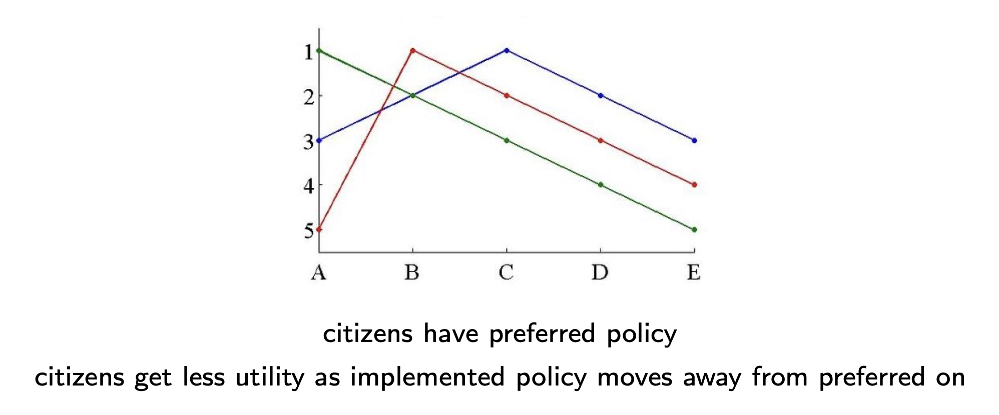

```{r setup, include=FALSE}
knitr::opts_chunk$set(echo = TRUE)
```

```{=html}
<style>
  body .main-container {
    max-width: 1100px;
    font-size: 12pt;
  }
</style>
```
[GV4C8 Homepage](https://kevinli03.github.io/notes/#GV4C8_Game_Theory)

**Week 3, GV4C8 Game Theory for Political Science**

-   Title: Downsian Models of Electoral Competition

-   Topics:

-   Readings:

    1.  Section 3.3, Osborne, M. J. (2004) *An Introduction to Game Theory* (Oxford University Press)

<br />

------------------------------------------------------------------------

[GV4C8 Homepage](https://kevinli03.github.io/notes/#GV4C8_Game_Theory)

# Key Points

The [**Downsian Model**]{.underline} is a model of electoral competition, with the following characteristics.

-   We have two political parties that want to win an election
-   The only "tool" at their disposal to win votes, is to chose where to position their party on the left-right spectrum (from -1 to 1)
-   There is a continuum of citizens, each with a favorite position on the left-right spectrum. Let us first assume that these positions are uniformly distributed on the left-right spectrum (from -1 to 1). The median voter is at position $m$
-   We assume that citizens vote for the party that offers the position on the spectrum closest to their preference.
-   The party that obtains the most votes win.
-   Indifferent votes vote for each party with equal probability, and when parties tie, then win the election with equal probability

The [**Nash Equilibrium**]{.underline} is strategy profile $(m, m)$ - both party converging to the median voter.

-   Why? If you need 50% or more of the votes, and the median voter (by definition) is the 50th percentile, winning the median voter makes you win the election.

<br />

When we analyse a model, we do not evaluate the results - just because you do not like the results, you cannot reject the model. [You have to look at the assumptions that are driving the model]{.underline}.

<br />

[**Relaxing Assumptions**]{.underline} of the Downsian Model to see how outcomes change:

1.  Assumption: Bounded [-1, 1] and unidimensional. When we unbound (preferences from negative infinity to infinity), the Nash Equilibrium is still at $(m, m)$. However, in multiple dimensions, there is no Nash Equilibria (due to divide the dollar game, see first lecture)
2.  Assumption: uniform distribution. We can relax this, and use any possible distribution of voters, and the Nash Equilibrium is still $(m, m)$, as by definition, the median voter is the 50th percentile, no matter the distribution.
3.  Assumption: Voter preferences are symmetric - only the distance matters. When we relax this assumption, and get asymmetric preferences, as long as they are single peaked, the Nash Equilibrium is still $(m, m)$
4.  Assumption: No cost of voting and no abstaining. When we relax this assumption, the Nash Equilibrium no longer is at $(m, m)$, since that means both parties offer the same policies, so no rational voter would endure the cost of voting if they could not impact anything. There will be some Nash Equilibrium, with a force pushing parties towards the median, but still far enough out to be distinct enough to encourage people to vote.
5.  Assumption: only 2 parties. When we add another party, the Nash Equilibrium is no longer at $(m, m)$. However, there is still a Nash Equilibrium, just not at the median voter.
6.  Assumption: Parties only care about winning. If we add a parameter for parties caring about the actual policies, we still find the Nash Equilibrium is $(m, m)$, since if you care about your policies, you would hate your opponents, so you would still want to win the election.

<br />

Final assumption is that parties can make any promises that they keep, and the public believes they will keep. This is essential, since if a party will not keep a promise, then the actual positioning of the party in Median Voter Theory doesn't mean anything.

There is a new strategic game going on here ([**Citizen-Candidate Game**]{.underline}):

-   Players: Continuum of citizens, that are both potential candidates and voters

-   Preferences: utility of a player is how close the preferences of the candidate is from their own preferences.

-   Actions: Citizens simultaneously decide who will run for office. Citizens vote for candidate closest to their preferences, and the candidate who wins implements preferred policy

-   When no candidate enters the race, policy $\hat{p}$ is implemented

-   We assume there is a cost $\delta > 0$ of participating in the election

-   We assume preferred policy of median citizen is at $m=0$

Nash Equilibrium of this game:

-   If the median voter runs as a candidate (there needs to be some conditions for this to happen), then the model does indeed converge at $m$

-   However, if 2 candidates run (there needs to be some conditions for this to happen), then the model no longer converges at $(m, m)$. This is because candidates will only run, if they hate their opponents policies more than the cost of participating $\delta$. If both candidates are too close/similar, like at $(m, m)$, there is no incentive to take the cost of participating $\delta$.

<br />

------------------------------------------------------------------------

[GV4C8 Homepage](https://kevinli03.github.io/notes/#GV4C8_Game_Theory)

# Median Voter Theory

### Hotelling: Stability in Competition

We often notice that shops are clustered together on a single row or intersection

-   Such as Chinese stores in Chinatown

-   Gas stations on major intersections

-   Fast food restaurants nearby to each other.

Hotelling shows that in competitive activity, there are incentives to locate in similar places

-   He applied this to politics - each party wants to be as similar to the others, as departures would lose many votes

<br />

### Downsian Model

The Downsian model is a model of electoral competition, with the following characteristics.

-   We have two political parties that want to win an election
-   The only "tool" at their disposal to win votes, is to chose where to position their party on the left-right spectrum (from -1 to 1)
-   There is a continuum of citizens, each with a favorite position on the left-right spectrum. Let us first assume that these positions are uniformly distributed on the left-right spectrum (from -1 to 1). The median voter is at position $m$
-   We assume that citizens vote for the party that offers the position on the spectrum closest to their preference.
-   The party that obtains the most votes win.
-   Indifferent votes vote for each party with equal probability, and when parties tie, then win the election with equal probability

<br />

We can formalise this scenario into a strategic game:

-   2 players (political parties)

-   The actions is simultaneously choosing policy position between -1 and 1: $p_i \in [-1, 1]$

-   Objective is to attract more votes than the opponent (at least 50%)

<br />

### Deriving Nash Equilibrium

The first method to find Nash Equilibrium is to find all the best responses. Let us assume the preferred policy of the median voter is $m = 0$

-   In order to get 50% of the votes, you want to attract the median voter (since that is the final for 50%. Thus, you want to be closer to the median voter than your opponent

Let us look at a few scenarios

1.  When one party is to the right of the median $p_R > m$, the best response of $p_L$ is anything closer to the median voter, so between $-p_R < p_L < p_R$
2.  Same as a the other way, if one party is to the left of the median $p_R<m$, the best response of $p_L$ is anything closer to the median voter, so between $p_R < p_L < -p_R$

Essentially, every party wants to be closer to the median than the other player.

-   What is one party $p_R$ locates at the median voter - that is the closest you can get to the median? The best response of $p_L$ is to also locate at the median voter

[Since you always want to be closer to the median, the only Nash Equilibrium of the game is both parties positioning at $m$]{.underline}

<br />

We can more formally write the best responses $B_i$ of each player $i$ to the opponent $j$:

-   If $p_j < 0$, then $B_i(p_j) = p_i \in (p_j, -p_j)$

-   If $p_j = 0$, then $B_i(p_j) = 0$

-   If $p_j > 0$, then $B_i(p_j) = p_i \in (-p_j, p_j)$

<br />

A second method to find the Nash Equilibrium is to look for profitable deviations:

-   At strategy profile $(m, m)$, there are no profitable deviations - as soon as you choose another point, you lose the election instead of tying

-   What about if the strategy profile is not $(m, m)$?

    -   If the candidate is losing, it can move to $m$, and either win or tie, thus a profitable deviation

    -   If a candidate is tying, it can move to $m$ and win, thus a profitable deviation.

Thus, the Nash Equilibrium is strategy profile $(m, m)$ - both party converging to the median voter.

<br />

### Real-World Implications

The unique Nash Equilibrium of the Downsian Model is both parties converging to the preferred policy of the median voter. Is this a useful position?

-   For example, Blair (third way) and Cameron (progressive conservative) were quite similar.

-   In US elections, candidates spend most of their money in swing states - they are focusing/targeting the swing voters (which are generally in the middle).

However, let us more analyse the model in more detail.

<br />

------------------------------------------------------------------------

[GV4C8 Homepage](https://kevinli03.github.io/notes/#GV4C8_Game_Theory)

# Downsian Model Extensions

### Downsian Model Assumptions

When we analyse a model, we do not evaluate the results - just because you do not like the results, you cannot reject the model. You have to look at the assumptions that are driving the model.

Let us look at the assumptions of the Downsian Model

1.  We assume policy space is one dimensional (-1 to 1), yet in the real world, we have economic policy, social policy, foreign policy, etc.
2.  Citizens are assumed to be uniformly distributed on [-1, 1]. What if they are polarised?
3.  Citizens only vote for the party closest to their position - no other reason for making a voting decision
4.  Citizens do not abstain and have no cost of voting
5.  There are only two parties
6.  Parties want to win election and obtain a majority of votes
7.  Parties can propose any policy, and can commit to implement announced policy (basically, no path dependency).

Let us look at every assumption, and check if our model still converges at the median voter.

<br />

### Unidimensional Policy Space

In the Downsian Model, we assume policy belongs in the interval [-1, 1], in one dimension.

First, let us tackle the [-1, 1] assumption. We could assume policy takes any number on the real line (unbounded)

-   Condercet Winner: by majority rule, Median citizen's ideal policy is preferred by a majority of citizens to any other alternative.

-   So, this relaxation of assumption still produces the same Nash Equilibrium

<br />

Now, let us discuss the one-dimension assumption

-   This is because politicians need to take different positions on social policy, economic policy, environmental policy, immigration policy, etc., each being a dimension

-   The Downsian Equilibrium does not generally withstand the weakening of this assumption

Let us think of a simple multidimensional setting: Budget Allocation or Divide the Dollar Game:

-   Politicians adopt a platform to distribute budget amongst 3 citizens or reasons: $q_1 + q_2 + q_3 = 1$

-   Citizens prefer to get more, than less.

-   Two candidates offer different budget allocations: distribute the budget between citizens/regions 1 and 2.

-   There is always a profitable deviation: If a candidate loses, the losing candidate can copy the winning candidate policy. Then, if there is a tie, profitable deviation by distributing the pie to the 3rd citizen and raising the pay to citizen 2.

-   This is a copy of the topic we covered in the first lecture - divide the dollar game. There is a cyclic pattern, and no equilibrium where convergence will occur.

-   Thus, the Downside Equilibrium does not withstand the weakening of this assumption.

<br />

### Distribution of Citizen Preferences

We assumed in the Downsian Model that preferred policies are uniformly distributed between [-1, 1]

However, preferences can have different distributions:

1.  People could mostly have centrist preferences
2.  People could be polarised - a lot of preferences for far left and far right
3.  Voters could be concentrated on one side of the spectrum

<br />

The Downsian Model survives the relaxation of this assumption

-   The position of the median $m$ may be different in different distributions

-   However, the median, by definition, is the 50th percentile. You need 50% to win, so you still need to win the median voter

Thus, any distribution of voters' preferences still has parties converging to the median voter $m$

<br />

### Voters Preferences

We assumed that the citizens vote for the party closest to them. These preferences are symmetric

-   Essentially, a citizen doesn't care which direction the party's platform is in, only how close that platform is to their preference.

However, this isn't always the case. For example, a right wing voter may be more comfortable voting for a more moderate platform than a far-right platform, despite the similar differences

This is called assymetric preferences - they like one direction change over another, despite a similar difference in distance between the platforms.

The Downsian Equilibrium is robust to this, as long as preferences are single peaked - the median voter is still the Nash Equilibrium.

{width="100%"}

<br />

### Cost of Voting and Abstention

We made two assumptions in the Downsian Model: there is no cost of voting and no one abstains.

There is **no convergence** at the median if this is the case.

-   Well, if both parties converge at the median $m$, there is no reason for citizens to vote - after all, they are the same parties

-   This is especially the case if there is a cost to voting - why take the cost if there is no change to the outcome (not pivotal)?

-   Thus, if the two parties were to converge in the middle, 0 people would vote.

-   Thus, only parties that differ somewhat will encourage citizens to vote.

There is still a converging force towards the median with the relaxation of these two parties, but there will be no full convergence.

-   Parties will converge, but also stay far enough apart to incentivise voters to vote

<br />

### More than 2 Parties

In the Downsian Model, we assume that there are only two parties/candidates.

What would happen if there are three parties? Is the Downsian Equilibrium at $m$ robust?

-   Imagine we have 3 parties at $m$. Does any have a profitable deviation?

-   That means a 3 way tie, so $1/3$ chance of winning

-   What would happen if a party deviates, and moves a little to the side (for example, the right side)?

-   That party will get the right side (49% of the votes). While the other 2 parties still have a majority (51%), they have to split it. So, the party that deviates will win.

Thus, there is a profitable deviation, and thus, the Downsian Model equilibrium at $m$ does not hold

<br />

### Party's Goals

The Downsian Model assumes parties want to win elections (rent-seeking). However, some politicians also want to do the right thing and affect policy (policy-seeking)

Wittman (1973) proposed this:

-   Let us say the Right party $R$ wants policy 1 (they feel very strong about right wing policy), and the left party $L$ wants policy -1.

-   Essentially, $u_R(p) = -(p-1)^2$, and $u_L(p) = -(p+1)^2$

    -   This basically means the max utility is 0 (at there preferred sides), and further away you go from your preferred side, your utility becomes negative.

-   $\pi(p_L, p_R)$ is the probability party $L$ wins the election.

<br />

The utility of party $L$ is as follows:

$$
\pi(p_L, p_R) \times(-(p_L + 1)^2) + (1 - \pi(p_L, p_R)) \times (-(p_R + 1)^2)
$$

Essentially, this means:

-   $\pi(p_L, p_R)$ is the probability left wins the election, multiplied by the utility of party left, for implementing the left's policy $u_L(p_L) = -(p_L + 1)^2$

-   $1-\pi(p_L, p_R)$ is the probability right wins the election, multiplied by the utility of party left, of the implementation of the right's policy $u_L(p_R) = -(p_R + 1)^2$

<br />

Despite this policy-seeking, the median voter is still the Nash Equilibrium:

-   Let us say both parties are at -0.5 and 0.5.

-   The election is a tossup, so 50% chance of getting left policy, or right policy

-   But if one party moves slightly in from -0.5 to -0.49, they sacrifice a little on their preferred policy, but now win the election 100% of the time. This is a higher payoff

-   Thus, there is still an incentive to win the election - if you win, you implement your policy, and deny the opponent their chance of implementing their policy that you disagree with.

<br />

------------------------------------------------------------------------

[GV4C8 Homepage](https://kevinli03.github.io/notes/#GV4C8_Game_Theory)

# Citizen-Candidate Model

### Parties and Promises

The Downsian Model assumes that parties, with their announced policies, will implement these policies.

-   However, what if politicians don't vote for what they promise

-   Then, the party's chosen position on the policy spectrum does not matter at all - since they could just ignore them

Now, the election is about the politician's identity, not the politician's policy promises. This is Citizen-Candidate model.

-   Idea that politician's own personal preferences will be their political policy goals.

-   For example, you wouldn't believe Liz Truss proposing left wing policies, since she personally prefers right wing policies

This is a completely new strategic game.

<br />

### Citizen-Candidate Game

There is a new strategic game going on here:

-   Players: Continuum of citizens, that are both potential candidates and voters

-   Preferences: utility of a player is how close the preferences of the candidate is from their own preferences.

-   Actions: Citizens simultaneously decide who will run for office. Citizens vote for candidate closest to their preferences, and the candidate who wins implements preferred policy

-   When no candidate enters the race, policy $\hat{p}$ is implemented

-   We assume there is a cost $\delta > 0$ of participating in the election

-   We assume preferred policy of median citizen is at $m=0$

<br />

### Finding Nash Equilibria

When are we going to have a median, when only the median voter enters the election, and is the only one who enters the election. Is this a Nash Equilibrium?

-   Median citizen has only an incentive to enter when the utility of entering is greater than the utility of not entering

    -   Essentially depends on the cost of entry $\delta$, relative to how much the median voter dislikes the status quo policy $\hat{p}$

    -   Or in other words, $\delta ≤ \hat{p}^2$

-   Given that the median voter runs, no one else enters the race.

    -   Median voter wins the election against anyone else not at the median (median voter theory). So, others will incur a cost of $\delta$ without any chance of winning

    -   Another voter at the median does not run, since they will need to incur a cost of $\delta$, when the policy outcome will be the same as if the median voter ran.

Can there be an equilibrium with 2 candidates?

-   No one will enter the race, if they do not have a good chance of winning the race - after all, you have to pay the cost of running $\delta$, with no benefit of implementing policy

-   Let us say these candidates are candidate $R$, and candidate $L$, whose positions are equidistant from the median: $p_R = \Delta, p_L = - \Delta$

    -   Must be equidistant from the median for any chance of winning the election

-   If $L$ doesn't enter the race, $R$ will win the race and implement their policy. However, this dislike of policy of $R$ is relative to the cost of entry $\delta$.

    -   Essentially, $L$ or $R$ will only enter if $\delta ≤ 2 \Delta^2$

-   No other candidates want to enter: people closer to the median don't want to incur costs of $\delta$, and people further from the median will not win the election

Thus, convergence to the median voter is not robust to no-commitment and policy-seeking candidates

<br />

------------------------------------------------------------------------

[GV4C8 Homepage](https://kevinli03.github.io/notes/#GV4C8_Game_Theory)
