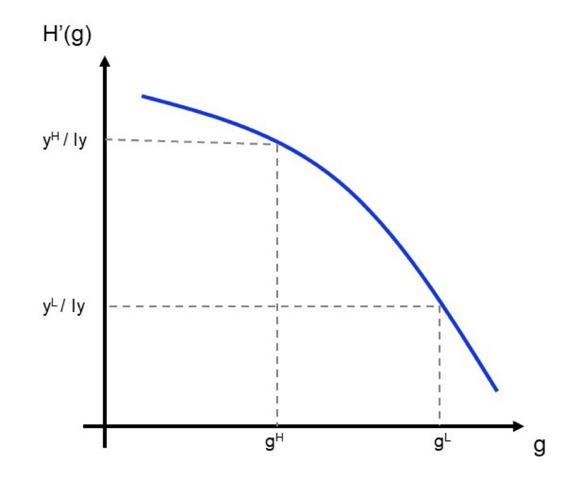

```{r setup, include=FALSE}
knitr::opts_chunk$set(echo = TRUE)
```

```{=html}
<style>
  body .main-container {
    max-width: 1100px;
    font-size: 12pt;
  }
</style>
```
[GV4C8 Homepage](https://kevinli03.github.io/notes/#GV4C8_Game_Theory)

**Week 3, GV4C8 Game Theory for Political Science**

-   Title: Redistributive Politics, Mixed Strategies, Valence Politics

-   Topics:

-   Readings:

<br />

------------------------------------------------------------------------

[GV4C8 Homepage](https://kevinli03.github.io/notes/#GV4C8_Game_Theory)

# **Public Finance Model**

### Simple Public Finance Model

When political parties run, they talk about how much tax to raise to provide public goods.

The model takes the following form:

-   Citizens are heterogenous, with varying incomes $y_i$ (marginal productivity of individuals - some are talented and earn a lot, some do not).

-   Citizens will care about how much they consume privately $c_i$ and enjoy public good $g$

-   We will have a government that provide the public good $g$, and pay for this public good through only taxes $t$ (no borrowing, only taxes)

Meltzer and Richards (1981) consider the citizen's decision to work given this game. Individuals will decide how much to work, given the tax rate $t$ and provision of public good $g$

-   For example, if $t=0$, then there are no public goods, and there is no interference with individuals and how much they want to work.

-   But if $t>0$, then the government interferes with your incentives to work

-   If $t = 100\%$, then the income will also be 0, since if all your work is given to the government, why work? (Laffer curve)

<br />

### Parameters of the Model

The game/model is as follows

-   Government provides a public good $g≥0$, financed by taxes $t = [0,1]$

-   Budget balance criteria: $ty_1 + ty_2 +.... + ty_l = lty = g$. We can solve for $t$ to get $t=\frac{g}{ly}$

-   Income differs across individuals: $E[y_i] = y$, $F(y_m) = 0.5$, and $y_m < y$, where $y_m$ is the median individual income.

<br />

What is utility of player $i$: $u_i = c_i + H(g)$, where $H(g)$ is the utility derived from the public good, but with decreasing marginal utility.

-   Consumption $c_i$ is what individual have after taxes: $c_i = (1-t)y_i$

Individual utility function is as follows (taking original utility function, but substituting $c_i$ in and then substituting $g$ in:

$$
u_i = c_i + H(g)
$$

$$
u_i = (1-t)y_i + H(g)
$$

$$
W_i(g) = (1 - \frac{g}{ly}) y_i + H(g)
$$

$$
W_i(g) = y_i - \frac{gy_i}{ly} + H(g)
$$

$$
W_i(g) = (ly - g) \frac{y_i}{ly} + H(g)
$$

Where $W_i(g)$ is strictly concave (since $H(g)$ is), which means citizens have single peak preferences.

-   Why? Negative parabola opens down.

<br />

### Solving the Nash Equilibrium

What is the optimal $g$ for each player?

Well, we already have the utility function:

$$
W_i(g) = (ly - g) \frac{y_i}{ly} + H(g)
$$

We know that the maximum of utility is when the derivative is equal to 0 (and since we know it is already concave, we do not need to check the second order condition):

$$
W_i(g) = ly(\frac{y_i}{ly}) - g(\frac{y_i}{ly}) + H(g)
$$

$$
W'_i(g) = 0 - \frac{y_i}{ly} + H'(g)
$$

$$
W'_i(g) = -\frac{y_i}{ly} + H'(g)
$$

Now, solve for $H'(g)$ when $W'_i(g) = 0$:

$$
0 = -\frac{y_i}{ly} + H'(g)
$$

$$
H'(g) = \frac{y_i}{ly}
$$

We can graph $H'(g)$, with $g$ on the $x$ axis, and $H'(g)$ on the $y$ axis:

{width="60%"}

We can see that richer individuals want smaller government and poorer individuals want bigger government.

<br />

### Spatial Model

Now, we can model this game as a downsian game:

-   Two parties compete on the size of government: $g_L$ and $g_R$

-   These parties can either be rent-seeking or policy seeking

-   The party who obtains a majority of the votes implements the announced policy during election:

Of course, we know the median voter will win the election. Thus, the outcome is:

$$
H'(g) = \frac{y_m}{ly}
$$

This model makes a few predictions:

-   More skewed income distribution (smaller $y_m$ ) should mean larger government.

-   Richer society (larger $y$ ) means larger government.

We can then empirically test these predictions.

<br />

------------------------------------------------------------------------

[GV4C8 Homepage](https://kevinli03.github.io/notes/#GV4C8_Game_Theory)

# **Mixed Strategies**

### Introduction to Mixed Strategies

So far, we have only allowed individuals to select specific strategies, like $(s_i, s_{-i})$, also called pure strategies.

-   We noted that some games did not have a pure strategy Nash Equilibria of this sort.

However, we can also introduce mixed strategies: players who play multiple strategies at certain probabilities

-   This also ensures that Nash Equilibria exist!

<br />

### Definition of Mixed Strategies

A mixed strategy for player $i$, is a probability distribution over her set of strategies.

-   Given a set of strategies $\{s_1, ..., s_m\}$, a mixed strategy is a vector $\sigma_i = (\sigma_i(s_1), ..., \sigma_i(s_m))$, such that all elements $\sigma_i(s_k) ≥ 0$, and the sum of all elements $\sum \sigma_i (s_k) = 1$.

-   Each element $\sigma_i (s_k)$ is the probability of playing specific strategy $k$ within the set of strategies $\{s_1, ..., s_m\}$.

Note: a pure strategy is a special mixed strategy where all elements of the mixed strategy are equal to 0 (no probability) except one strategy with value 1 (always play that strategy).

<br />

### Expected Payoff

The expected payoff of playing some strategy $s_i$, given my opponents play a mixed strategy $\sigma_{-i}$ is:

$$
u_i (s_i, \sigma_{-i}) = \sum\limits_{s_{-i}} \sigma_{-i}(s_{-i}) \times u_i (s_i, s_{-i})
$$

Basically, the probability of the opponent playing some strategy multiplied with my payoff of that strategy with my fixed strategy.

The expected payoff of a player $i$ when them and their opponents all play mixed strategy.

[ page 9]

<br />

### Mixed Strategy Nash Equilibrium

Some mixed strategy profile $\sigma^*$ is a Nash Equilibrium in mixed strategies, if $\sigma_i^*$ is a best response to $\sigma_{-i}^*$, for all players $i \in N$

-   Same definition as Nash Equilibrium, just with mixed strategy profiles instead of best responses.

Important proposition: In a mixed strategies, all players are indifferent between their strategies played in a mixed strategy equilibrium.

-   For example, if you are mixing between strategy $A$ and $B$ with some probability, you should be indifferent between them.

-   Why? if you are not indifferent and instead prefer $A$ over $B$, then you should just choose $B$ instead of mixing!

<br />

### Example: Matching Pennies Game

|              | Head (2) | Tail (2) |
|--------------|----------|----------|
| **Head (1)** | 1, -1    | -1, 1    |
| **Tail (1)** | -1, 1    | 1, -1    |

<br />

Let us define $p$ as the probability that player 1 plays heads, and $1-p$ as probability that player 2 plays heads.

What is player 2's best responses:

-   Let us say player 2 plays heads given player 1 plays heads at probability $p$. Expected utility is: $u_2(p, H) = (p)(-1) + (1-p)(1)$

-   Let us say player 2 plays tails given player 1 plays heads at probability $p$. Expected utility of player 2 is: $u_2(p, T) = (p)(1) + (1-p)(-1)$

What strategy should player 2 play? They should choose heads if the following is true:

$$
u_2(p,H) > u_2(p,T)
$$

$$
(p)(-1) + (1-p)(1) > (p)(1) + (1-p)(-1)
$$

$$
-p + 1 - p > p -1 + p
$$

$$
-2p + 1 > 2p - 1
$$

$$
-4p > -2
$$

$$
p < \frac{1}{2}
$$

Thus, player 2's best responses are, assuming $q$ is the probability player 2 plays heads:

-   Always play heads ( $q = 1$ ) if $p < \frac{1}{2}$ (why? see the above math)

-   Always play tails ( $q = 0$ ) if $p > \frac{1}{2}$

-   Sometimes play heads and sometimes play tails $q \in [0,1]$, if $p = \frac{1}{2}$

<br />

Now, let us assume that player 2 plays heads at probability $q$, and plays tails at probability $1-q$. What are player 1's best responses?

-   Let us say player 1 plays heads given player 2 plays heads at probability $q$. Expected utility is: $u_1(H, q) = (q)(1) + (1-q)(-1)$

-   Let us say player 1 plays tails given player 2 plays heads at probability $q$. Expected utility of player 2 is: $u_1(T, q) = (q)(-1) + (1-q)(1)$

What strategy should player 1 play? They should choose heads if the following is true:

$$
u_1(H, q) > u_1(T, q)
$$

$$
(q)(1) + (1-q)(-1) > (q)(-1) + (1-q)(1)
$$

$$
q -1 + q > -q + 1 - q
$$

$$
2q - 1 > -2q + 1
$$

$$
4q > 2
$$

$$
q > \frac{1}{2}
$$

Thus, player 1's best responses are, assuming $p$ is the probability player 2 plays heads:

-   Always play heads ( $p = 1$ ) if $q > \frac{1}{2}$ (why? see the above math)

-   Always play tails ( $p = 0$ ) if $q < \frac{1}{2}$

-   Sometimes play heads and sometimes play tails $p \in [0,1]$, if $q = \frac{1}{2}$

<br />

Now, to find the Nash Equilibria, find where both players are playing best responses.

For a refresher, player 1 wants:

1.  Always play heads ( $p = 1$ ) if $q > \frac{1}{2}$ (why? see the above math)
2.  Always play tails ( $p = 0$ ) if $q < \frac{1}{2}$
3.  Sometimes play heads and sometimes play tails $p \in [0,1]$, if $q = \frac{1}{2}$

Player 2 wants:

1.  Always play heads ( $q = 1$ ) if $p < \frac{1}{2}$ (why? see the above math)
2.  Always play tails ( $q = 0$ ) if $p > \frac{1}{2}$
3.  Sometimes play heads and sometimes play tails $q \in [0,1]$, if $p = \frac{1}{2}$

Where are both playing best responses?

1.  The first option is not possible. Player 1 only wants $p=1$ when $q>\frac{1}{2}$. But player to will only play $q=1$ (the only scenario where $q>1/2$ ) if $p < 1/2>$
2.  Similar thing for the second
3.  For the third option, both players are playing best responses.

Thus, the mixed strategy equilibrium is $\left( (\frac{1}{2}, \frac{1}{2}), (\frac{1}{2}, \frac{1}{2})\right)$

<br />

### Finding All Nash Equilibria

How do we find All nash equilibria (both pure and mixed strategy)?

We do the following:

1.  First, let us find all pure strategy Nash Equilibria (see lecture 2)
2.  If there are none, or there are 2 or more, we know there will be a mixed strategy equilibrium.
    -   Why? Well, we established earlier that mixed strategies can only exist if you are indifferent. If you weren't indifferent between strategies, you would just play that pure strategy.

Below is an example.

<br />

|           | C (2) | R (2) |
|-----------|-------|-------|
| **M (1)** | 0, 0  | 3, 5  |
| **D (1)** | 4, 4  | 0, 3  |

Are there any pure strategy Nash Equilibria?

|           | C (2)            | R (2)            |
|-----------|------------------|------------------|
| **M (1)** | 0, 0             | **3\***, **5\*** |
| **D (1)** | **4\***, **4\*** | 0, 3             |

2 Pure strategy Nash Equilibria: $(D, C)$ and $(M, R)$.

<br />

Now, let us find mixed strategy nash equilibria:

Player 1 choosing strategy, assume $q$ is probability player 2 plays $C$

-   $u_1(M, q) = 0(q) + 3(1-q)$

-   $u_1(D, q) = 4(q) + 0(1-q)$

Mixed strategy occurs when they are indifferent, thus:

$$
u_1(M, q) = u_1(D, q)
$$

$$
0(q) + 3(1-q) = 4(q) + 0(1-q)
$$

$$
3 - 3q = 4q
$$

$$
7q = 3
$$

$$
q = 3/7
$$

<br />

Now, player 2 choosing strategy, assume $p$ is probability player 1 plays $M$

-   $u_2(p, C) = 0(p) + 4(1-p)$

-   $u_2(p, R) = 5(p) + 3(1-p)$

Mixed strategy occurs when player 2 is indifferent between $C$ and $R$, thus:

$$
u_2(p, C) = u_2(p, R)
$$

$$
0(p) + 4(1-p) = 5(p) + 3(1-p)
$$

$$
4 - 4p = 5p + 3 - 3p
$$

$$
4 - 4p = 2p + 3
$$

$$
1 = 6p
$$

$$
p = 1/6
$$

<br />

Thus, the mixed strategy equilibrium is when $p=1/6$ and $q = 3/7$, which means $1-p =5/6$, and $1-q = 3/7$.

Thus, there are three Nash Equilibrium in this game:

-   2 Pure strategy NE: $(D, C), (M, R)$

-   1 Mixed strategy NE: $\left( (\frac{1}{6}, \frac{5}{6}), (\frac{3}{7}, \frac{4}{7}) \right)$

<br />

### Mixed Strategies in the Real World

Are mixed strategies realistic? Do real people really flip coins to make decisions?

-   Harnsany argues that mixed strategies illustrate unobserved aspects of decision making of people.

-   Large population games also means that we can capture the percent/fraction of players doing each action.

<br />

The beauty of mixed strategies is existence:

-   Any simultaneous game, where all players have a finite set of strategies to choose from, has a mixed Nash Equilibrium.

<br />

### Penalty-Goalkeeping Game

[add this section]

<br />

------------------------------------------------------------------------

[GV4C8 Homepage](https://kevinli03.github.io/notes/#GV4C8_Game_Theory)

# **Valence Politics**

### Voting on Competence

So far, we have talked about voting as selecting a particular policy.

-   But, we know that many voters also vote on competence.

How can we model this? How would our previous models change when we introduce candidate quality?

-   For example, you might have one candidate slightly closer to your preferences, but they are an idiot compared to the other person slightly further away. How does this affect you?

-   Valence is a term for characteristics that are liked by all voters, such as charisma, intelligence, experience, lack of scandals, lack of U-turns

<br />

### Downsian Model with Valence

Now, consider a Downsian model with valence.

Let us assume one party is advantaged - i.e. when they win, voters get a boost $\delta > 0$ in their utility.

-   Now, if both candidates go to the median, that candidate with boost $\delta$ is advantaged, and will automatically win the election.

-   However, that is still an equilibria - this is because the disadvantaged candidate has no deviation from the median where they will win the election. The advantaged candidate is already winning, so no equilibrium.

This model basically says that the more competent candidates always win.

-   However, this is not very realistic. So let us adapt this model to get closer to real-world situations.

<br />

### Model of Valence

First, let us simplify our policy space to three positions: $\{-1, 0, 1 \}$

-   Only 3 policies are possible - left wing, centrist, right wing.

-   Voters preferred policies are also located in these 3 positions.

There are two candidates, and they want to win the election.

-   Party $L$ is advantaged by $0 < \delta < 1$

-   Voters utility is thus: $u_i(p) = -|p - p_i| + i(p) \times \delta$, where $i(p_R, p_L)$ is a function when $p_L$ wins, the function equals 1, and other scenarios is 0.

-   Candidates do not know hte exact location of the median voter. They only know that the median is at -1 with probability $\alpha$, located at 1 with probability $\alpha$, and 0 with probability $1-2\alpha$. Essentially, $\alpha \in (0, 1/2)$ captures the polarisation of the electorate.

Given the parameters, valence does not supersede policy. But valence is critical when voters equally value the policies of the candidates.

<br />

### Nash Equilibrium

In this model, party $L$ wants to copy $R's$ platform, since party $L$ is advantaged by $\delta$, so if they end up at the same policy, $L$ will win.

We can represent this in a payoff matrix:

|        | -1                   | 0                    | 1                    |
|--------|----------------------|----------------------|----------------------|
| **-1** | $1, 0$               | $\alpha, 1 - \alpha$ | $1- \alpha, \alpha$  |
| 0      | $1 - \alpha, \alpha$ | $1, 0$               | $1 - \alpha, \alpha$ |
| **1**  | $1- \alpha, \alpha$  | $\alpha, 1 - \alpha$ | $1, 0$               |

We can derive the Nash Equilibrium:

[ do later ]

<br />

### Outcomes of the Game

What we see is that the following:

-   The favoured candidate will tend to go to the median

-   The unfavoured candidate will tend to become more extreme. This is because if they are the same as the favoured candidate, they will lose. So they need to differentiate, and hope the electorate is polarised.
