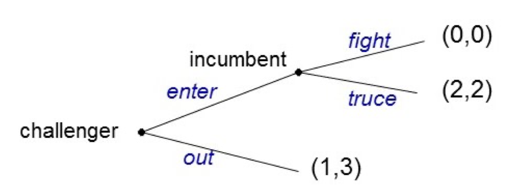
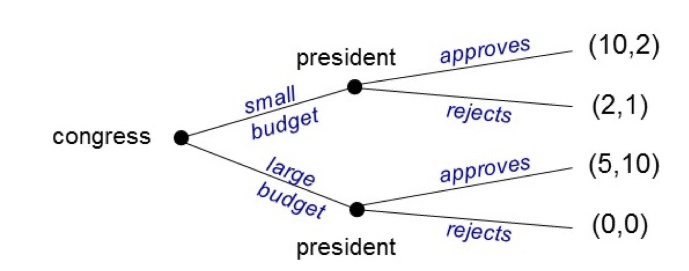
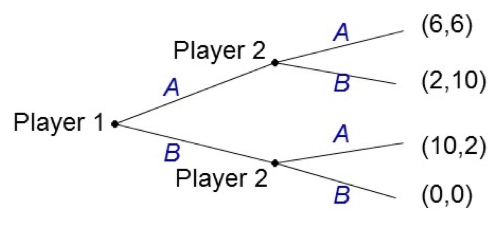
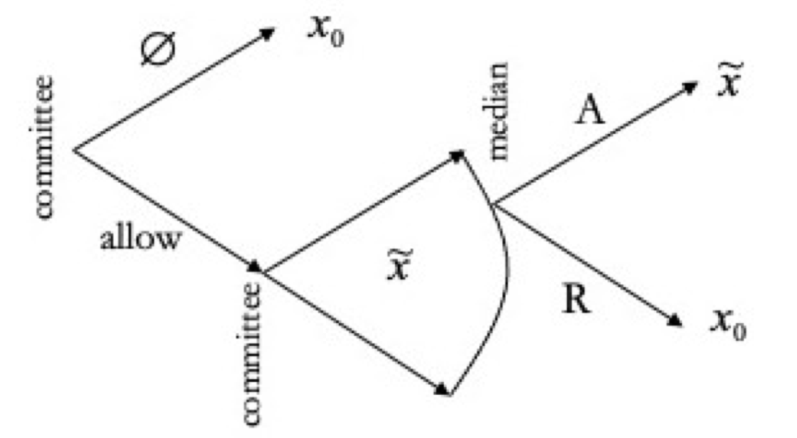
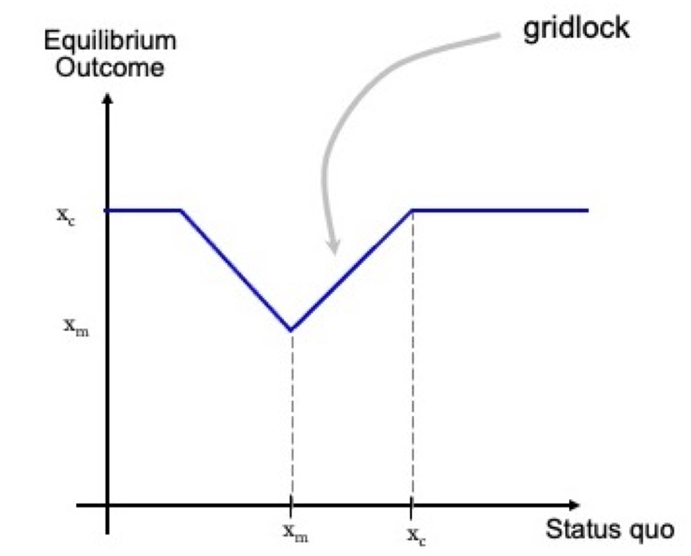
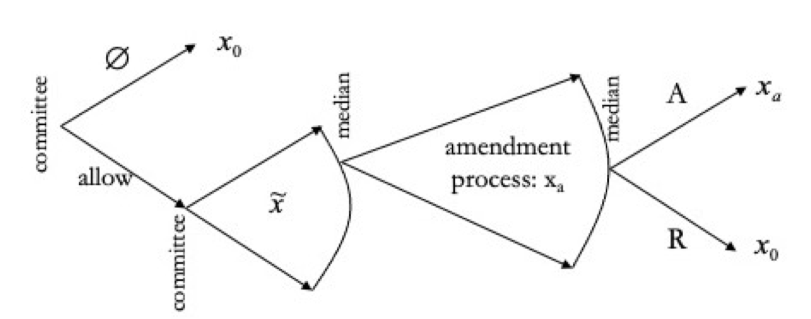
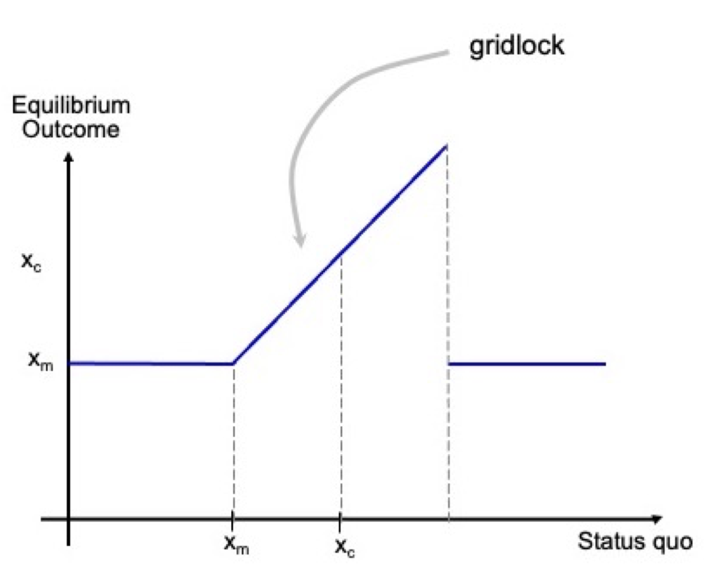

```{r setup, include=FALSE}
knitr::opts_chunk$set(echo = TRUE)
```

```{=html}
<style>
  body .main-container {
    max-width: 1100px;
    font-size: 12pt;
  }
</style>
```
[GV4C8 Homepage](https://kevinli03.github.io/notes/#GV4C8_Game_Theory)

**Week 5, GV4C8 Game Theory for Political Science**

-   Title: Redistributive Politics, Mixed Strategies, Valence Politics

-   Topics:

-   Readings:

<br />

------------------------------------------------------------------------

[GV4C8 Homepage](https://kevinli03.github.io/notes/#GV4C8_Game_Theory)

# Dynamic Games

### Strategic Foresight

So far, we have modelled games where players move at the same time.

However, in many scenarios, players move in sequence.

-   Many social interactions include contingent strategies - doing something, given someone else has already done something else.

-   For example, if you do this now, i'll do this later (promise, or threat).

Dynamic interactions develop elements of trust, reputation, reciprocity.

-   Some actions today, will be because of hypothetical future actions (or expectations on future actions). This is strategic foresight - anticipating future actions, and reacting to them now.

<br />

Examples of dynamic games where players move in sequence include:

-   Passing bills in parliament - process goes through different stages, not at the same time.

-   Decision making with balance of powers (think US, EU, etc.)

<br />

### Introduction to the Entry Game

Entry game refers to either competition in the market, or any similar scenario (such as new candidates and new political parties/movements entering).

*An incumbent faces the possibility of entry by a challenger. When the challenger enters, incumbent might acquiesce or fight.*

-   *Incumbent prefers not to be challenged.*

-   *Challenger prefers to enter when the incumbent calls a truce.*

-   *Both’s worst outcome is when they fight with each other*

<br />

We can model this game as a simultaneous game:

|                  | Fight (2) | Truce (2) |
|------------------|-----------|-----------|
| **Stay Out (1)** | 1, 3      | 1, 3      |
| **Enter (1)**    | 0, 0      | 2, 2      |

There are two pure strategy Nash Equilibria: (enter, truce) and (out, fight).

However, this is a simultaneous game, not a dynamic game. What if the players move in sequence - the challenger moves first, the incumbent moves second?

<br />

### Extensive Form Games

Now, let us take the Entry Game, but the challenger decides first, then the incumbent can make a decision.

We can represent dynamic games as game trees (extensive form).

-   The circles are decision nodes - where players make decisions

-   Each decision node has a specific player making decisions

-   The branches from a decision node are possible specific strategies a player can take.

-   The payoffs are listed at the ends of the tree.

<br />

Then entry game would be modelled as:

{width="60%"}

<br />

A strategy is a comprehensive plan of action

-   What to do at each node the player has in the tree (basically, a plan for every possible scenario).

-   This is even the true for unlikely decision nodes that are unlikely to be met.

<br />

Alternative way to describe extensive form games.

<br />

### Issues of Nash Equilibrium

The extensive form of the entry game is:

{width="60%"}

Consider the following strategy profile: Incumbent fights, challenger stays out.

-   Is this a Nash Equilibrium? Yes - no profitable deviation.

-   Incumbent does not have a profitable deviation to truce, since they both get (1,3) outcome given the challenger sticks to his strategy out.

-   Challenger does not have a profitable deviation either - since if he defects to enter, the outcome will become (enter, fight), reducing his payoff from 1 to 0.

<br />

However, there is an issue with this nash equilibrium

-   Challenger only does not have a profitable deviation to enter, if incumbent sticks with fight.

-   However, that "threat" is not credible - after all, if the challenger plays enter, the incumbent gets a higher payoff with truce. Since players are rational, they will go for truce here.

-   Thus, if the challenger plays enter and the incumbent will rationally play truce, then the payoff of the challenger is 2, thus there is a profitable deviation to enter!

We will illustrate this issue with Nash Equilibria in a later section.

<br />

### Finding Nash Equilibrium

Let us take the following game: Conservative congress proposes a budget, progressive president needs to approve or veto a budget.

{width="60%"}

<br />

To find the Nash Equilibrium of this dynamic game, we can write this in matrix form.

-   However, things are a little more complicated?

-   What are the strategies for each player in the matrix?

Strategies of the players are as follows:

-   Congress has two strategies: S and L

-   However, the president has 4 strategies in the form (Strategy when player 1 plays small, strategy when player 1 plays large): (A, A), (A, R), (R, A), (R, R).

-   Why is this? Remember, a strategy is a full plan of action. The president has two decision nodes - when congress plays small, and when congress plays large. Thus, each strategy profile needs a plan of action for each node - thus why each strategy has two actions.

<br />

Thus, our normal form is:

|               | A, A  | A, R  | R, A  | R, R |
|---------------|-------|-------|-------|------|
| **Small (1)** | 10, 2 | 10, 2 | 2, 1  | 2, 1 |
| **Large (1)** | 5, 10 | 0, 0  | 5, 10 | 0, 0 |

And thus, Nash Equilibrium (calculated normally) are:

|               | A, A          | A, R          | R, A          | R, R     |
|---------------|---------------|---------------|---------------|----------|
| **Small (1)** | **10**, **2** | **10**, **2** | 2, 1          | **2**, 1 |
| **Large (1)** | 5, **10**     | 0, 0          | **5**, **10** | 0, 0     |

<br />

Thus, the Nash Equilibrium are:

-   (Small, [A,A]): Which essentially means if congress plays small, president plays approve, so payoff (10, 2)

-   (Small, [A, R]): Which essentially means if congress plays small, president plays approve, so payoff (10, 2)

-   (Large, [R, A]: Which essentially means if congress plays large, president plays approve, so payoff (5, 10)

<br />

------------------------------------------------------------------------

[GV4C8 Homepage](https://kevinli03.github.io/notes/#GV4C8_Game_Theory)

# Subgame Perfect Nash Equilibrium

### Problems of Nash Equilibrium

The Nash Equilibrium of the congress/president game is:

-   (Small, [A,A]): Which essentially means if congress plays small, president plays approve, so payoff (10, 2)

-   (Small, [A, R]): Which essentially means if congress plays small, president plays approve, so payoff (10, 2)

-   (Large, [R, A]: Which essentially means if congress plays large, president plays approve, so payoff (5, 10)

<br />

If we look at the 1st and 2nd nash equilibrium, the president will reject a small budget.

-   However, the president would be better off approving a small budget than rejecting it.

-   Thus, this is an incredible threat (as we introduced earlier), since the president is rational and would not ever choose reject given the congress chooses small budget.

Thus, the first two Nash Equilibrium may not be actually feasible if players are rational.

<br />

As shown above, some Nash Equilibrium in Dynamic games are not plausible due to incredible threats.

This is because actions at nodes not reached by equilibrium play do not affect payoffs.

-   However, clearly, as we have shown, they affect best responses.

<br />

### Subgame Perfect Nash Equilibrium

A Subgame Perfect Nash Equilibrium of an extensive game, is a strategy profile, such that players act optimally in all nodes of the game, regardless if the nodes are reached in equilibrium.

-   Basically, players should act optimally everywhere, even on nodes not on the equilibrium path.

All subgame perfect Nash equilibrium are Nash Equilibrium, but, not all Nash Equilibrium are subgame perfect.

We can find Subgame Perfect Nash Equilibrium with Backwards Induction.

<br />

### Backwards Induction

In a extensive game, the last player determines the final outcome (since no one moves after them).

-   So the last player to move just looks at the strategies available to them, and chooses the highest payoff.

-   Then, we can move one stage forwards to the second to last player. This player can anticipate the optimal action of the last player, so they know what plausible outcomes are still possible, and can choose to maximise their payoff.

-   And so on, until we reach the first player.

<br />

Take this following game:

{width="60%"}

Let us start with the last player (player 2), who will determine the outcome:

-   In the top node for player 2, playing B gives them a higher payoff of 10 compared to 6. So, they will play B for the top node

-   In the bottom node for player 2, playing A gives them a higher payoff of 2 compared to 0. So, they will play A for the bottom node.

-   The other strategies (A for the top node, B for the bottom node), can be eliminated, since we know player 2 will never play them.

<br />

Now, let us move forwards to player 1:

-   We know that if player 1 plays A, player 2 will play B (as we established in the last stage). That is a payoff of 2

-   We know that if player 1 plays B, player A plays A. That is a payoff of 10.

-   Thus, player 1 playing B (since we know player 2 will play A in this scenario), has a higher payoff of 10 than when player 1 plays A (outcome payoff 2).

<br />

------------------------------------------------------------------------

[GV4C8 Homepage](https://kevinli03.github.io/notes/#GV4C8_Game_Theory)

# Legislative Bargaining

### Introduction

Riker argues that the outcomes of politics are not just institutions and tastes, but also political skills and artistry of those who manipulate agendas, generate false issues, etc.

-   Ex. wedge issues pushed by one party to try to split another party.

For example, adding amendments to bills depends on what you believe what people who progress with the bill will do with this (such as president to veto).

<br />

### Legislative Bargaining Game

There will be 3 parts of this game:

-   Gatekeeper: a player who has monopoly power on proposing legislation to the legislature (such as prime minister, committee, speaker, seniority, etc.).

    -   Gatekeeper will have a single-peaked preferences, with ideal policy at position $x_c$.

-   Status quo policy is at position $x_0$. If the new policy is not passed, then this policy is implemented (reversion point)

-   Legislators: with single peaked preferences, and decide by majority rule. We only need to worry about the preferred policy of the median voter $x_m$ (because of the downsian model).

<br />

We will analyse four scenarios:

1.  No change to status quo $x_0$.
2.  Majority rule in legislative prevails $x_m$.
3.  Gatekeeper with proposal power, no amendments allows (closed rule)
4.  Gatekeeper with proposal power, amendments allowed (open rule)

<br />

### No Change to Status Quo

The status quo will be $x_0$. If we keep the status quo, then the outcome will still be $x_0$.

-   Let us define status quo as $x$, outcome policy position is $y$

Thus, we can graph this on a graph with the function $y=x$, since the outcome is the same as the outcome.

<br />

### Majority Rule in Legislature

The status quo will be $x_0$. If we just go by majority rule (no gatekeeper), the outcome will always be the median voter position $x_m$.

Thus, we can graph this on a graph with the function $y=x_m$, as the outcome is always the median voter, no matter the status quo.

<br />

### Committee with Closed Rule

The game will be as follows:

1.  Committee allows legislation or not. If they do not, outcome is status quo $x_0$. If they do allow, they can propose any policy position $\tilde{x}$ on the specturm.
2.  Committee makes a 'take it or leave it offer' to the legislative chamber - no amendments.
3.  Legislative chamber votes accept or reject. Let us assume if they are indifferent, they will accept. Since the median voter is pivotal, we focus on the median voter's decision to accept or reject. If they accept, we get the committee's proposed $\tilde{x}$, and if they reject, we get the status quo $x_0$

<br />

We can model the extensive form of the game as follows:

{width="60%"}

Let us do backwards induction:

-   Median voter only accepts proposals that she prefers $\tilde{x}$ over status quo $x_0$. We can define all $\tilde{x}$ which she prefers over $x_0$ with the set $P_m (X_0) = \forall \tilde{x}, \space s.t. \space \tilde{x} \succsim x_0$. By common sense and given $x_m < x_c$ (since policy has to be closer to $x_m$ than $x_0$, $P_m(X_0) = \{\tilde{x} \in \mathbb{R}: x_0 ≤ \tilde{x} ≤ x*\}$, where $x^* = x_m + (x_m - x_0)$. Reverse signs for the opposite condition.

-   Committee chooses $\tilde{x}$ in the set of $\tilde{x}$ that will be accepted (in set $P_m (X_0)$ ).

-   Committee only allows legislation, if it prefers any $\tilde{x} \in P_m(X_0)$ over the status quo $x_0$.

<br />

There outcomes can be modelled as:

{width="50%"}

Why?

-   Gridlock is because the status quo is between $x_m$ and $x_c$. That means the median voter will always $x_0 \succ x_c$. Thus, the committee cannot get their preferred policy, and will refuse to allow legislation.

-   If the status quo is higher than $x_c$, the median voter will $x_c \succ x_0$ , so the legislator can propose their preferred policy and it will be accepted.

-   If the status quo is less than $x_m$, the median voter will accept anything between $x_0$ and $x_m + (x_m - x_0)$. Thus, the committee will choose $x_m + (x_m - x_0)$, which is closest to $x_c$.

-   If status quo is significantly less than $x_m$ such that it is further from $x_m$ than $x_c$, then the median voter would $x_c \succ x_0$, so $x_c$ will be adopted.

<br />

### Committee with Open Rule

Now, the game is as follows:

1.  Committee allows legislation or not
2.  Committee offers a proposal that can be amended.
3.  Legislative amends proposal
4.  Legislative accepts or rejects (if indifferent, accept)

The game is as diagrammed:

{width="70%"}

<br />

We know that the amendment proposal will always result in $x_m$, since the median voter is the 50th percentile vote.

Thus, the committee will only allow legislation when they $x_m \succsim x_0$

It seems that this benefits the median voter. But actually, this is worse - because the committee will be much more selective in allowing legislation.

<br />

The outcomes are as follows:

{width="50%"}

Why?

-   In the middle, between $x_m$ and the right side, are the scenarios when the committee $x_0 \succsim x_m$. Thus, gridlock, not allowing legislation, maintaining $x_0$.

-   If $x_0$ is further left than $x_m$, the committee $x_m \succsim x_0$. Thus, the committee allows legislation and $x_m$ is adopted.

-   If the status quo $x_0$ is too far right, $x_c$ will $x_m \succsim x_0$, thus the committee allows legislation and $x_m$ is adopted.

Thus, only two possible outcomes: $x_0$ and $x_m$, which means open rule actually reduces "legislative freedom" compared to closed rule.

<br />

### Expanding the Game

We can expand this game by adding many features.

For example, take this game:

1.  Congress votes on a bill (median voter pivotal)
2.  Filibuster occurs (3/5th percentile voter pivotal to end filibuster).
3.  President can veto (president is pivotal voter)
4.  Congress can override veto (2/3rd percentile voter pivotal).

<br />
