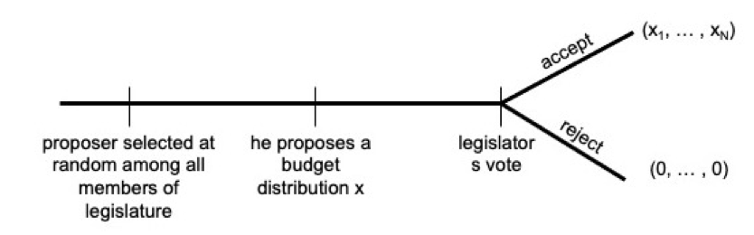
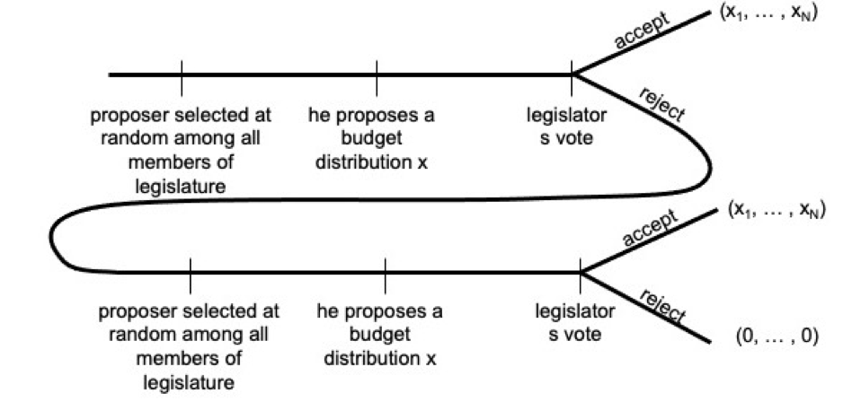

```{r setup, include=FALSE}
knitr::opts_chunk$set(echo = TRUE)
```

```{=html}
<style>
  body .main-container {
    max-width: 1100px;
    font-size: 12pt;
  }
</style>
```
[GV4C8 Homepage](https://kevinli03.github.io/notes/#GV4C8_Game_Theory)

**Week 7, GV4C8 Game Theory for Political Science**

-   Title: Applied Dynamic Games and Repeated Games

-   Topics:

-   Readings:

<br />

------------------------------------------------------------------------

[GV4C8 Homepage](https://kevinli03.github.io/notes/#GV4C8_Game_Theory)

# **Budget Allocation**

### Game

The game takes the following form:

-   $N$ number of legislators, each representing a constituency

-   Legislators decide how to distribute a budget $B$ among their constituency

-   Any proposal requires majority support to be implemented

-   Legislator utility is derived from increasing their constituency's budget allocation

<br />

Notation:

-   a budget proposal vector $x  = (x_1, ..., x_n)$, s.t. $x_1 + ... + x_N = B$

-   Utility of legislator $i$ comes from increasing in own share of budget: $u_i(x_1, ..., x_N) = x_i$

<br />

Assumptions

-   Any legislator $i$ is equally likely to become proposer of budget

-   Legislators act as if they are pivotal (eliminate weakly dominated strategies)

-   If indifferent, legislators will vote in favour of proposal

-   Proposer treats all other legislators equally (doesn't favour others over others)

-   When all proposals are rejected, everyone gets payoff 0.

<br />

### Single Proposal Game

Let us start with a single budget proposal - if that is rejected, everyone gets 0, and the game ends:

{width="70%"}

By backwards induction, you can solve the game:

-   If they accept, they get payoff $x_i$. If they reject, they get payoff 0.

-   Thus, they accept if $x_i ≥ 0$.

What is the Nash Equilibria? The proposer should give all of the budget $B$ to themselves, and give 0 to every other legislator

-   Every other legislator gets $x_i = 0$, and $0≥0$, so they accept.

<br />

The expected value of the game is $\frac{B}{N}$. Why?

-   You have $\frac{1}{N}$ chance of being selected proposer. Then, if you are selected, you get payoff $B$. If you are not selected, your payoff is 0.

-   Thus, $\frac{1}{N} \times B$ is expected payoff.

<br />

### Double Proposal Game

Obviously, the first game is quite unrealistic - you won't just give up distributing the budget after one round. Now, we have a game where if the first proposal is rejected, a second proposal can occur.

{width="70%"}

What is the difference in this game:

-   In the original game, if you reject the first proposal, you get payoff 0.

-   But, now, you still have a chance to become the second proposer. So your expected value of rejecting is $\frac{B}{N}$.

-   Thus, player $i$ will only choose accept in the first round if $x_i ≥ \frac{B}{N}$.

Thus, the first proposer needs to build a minimum winning coalition:

-   You need majority to vote with you, so $\frac{N-1}{2}$ legislators (-1 because the proposer is not voting).

-   Then, you need to offer $x_i = \frac{B}{N}$ to $\frac{N-1}{2}$ legislators.

<br />

The expected payoff of each legislator? Let us look at the probabilities and payoffs:

-   Probability of $\frac{1}{N}$ If you are the first legislator. You will get $(B - \frac{n-1}{2} \times \frac{B}{N})$ (since you need to build the minimum winning colation.

-   Probability of $\frac{N-1}{2N}$ to be not the proposer, and not in the minimum winning coalition. You get payoff 0.

-   Probability of $\frac{N-1}{2N}$ to be not the proposer, and be in the minimum winning coalition. You get payoff $\frac{B}{N}$

Thus, expected payoff is:

$$
\begin{split}
\mathbb{E}[u_i] & = \frac{1}{N} \left( B - \frac{n-1}{2} \times \frac{B}{N} \right) + \frac{N-1}{2N}(0) + \frac{N-1}{2N} \left( \frac{B}{N} \right) \\
& = \frac{B}{N}
\end{split}
$$

<br />

### Triple Proposal Process

Let us say we have 3 proposals now.

You will only accept the first proposal if it gives you more than the expected value of the next 2 proposal rounds.

-   From before, we calculated the expected utility as $\frac{B}{N}$

-   This is the same expected utility as the second proposal in the 2 proposal game.

Thus, 2 proposals is strategically equivalent to 3 proposals.

<br />

### Status Quo as Equivalent

Let us go back to a one proposal model.

What if instead of getting 0, when a proposal is rejected, what if the budget is just divided equally between legislators?

-   Thus, if rejected, all players $i$ get $x_i = \frac{B}{N}$

-   This is the same expected utility as the 2nd proposal in a 2-proposal game!

Thus, the first proposer must make a minimum winning coalition (just like a 2 person game)

-   You need majority to vote with you, so $\frac{N-1}{2}$ legislators (-1 because the proposer is not voting).

-   Then, you need to offer $x_i = \frac{B}{N}$ to $\frac{N-1}{2}$ legislators.

<br />

------------------------------------------------------------------------

[GV4C8 Homepage](https://kevinli03.github.io/notes/#GV4C8_Game_Theory)

# **Counter-Terrorism Game**

### Counter-Terrorist Situation

The game is as follows:

-   A country is trying to defend 2 targets/locations that are vulnerable to terrorist attacks

-   It has limited resources to defend the sites. $r_1$ is how much resources for site 1, and $r_2$ is how much resources for site 2, and $r_1 + r_2 = R = 1$.

-   If site $i$ (one of the 2 sites) is successfully attacked, cost is $L_i$

-   Vulnerability: success probability of an attack is $v_i(r_i) = 1 - r_i$.

-   The threat of an attack at either site is $a_i$

Risk is threat times vulnerability times loss:

$$
\text{risk} = a_1(1-r_1)L_1 + a_2 r_2 L_2
$$

What is the optimal allocation of resources when minimising risk?

-   You want to invest all resources in the most important and threatened target: the site where $a_iL_i$ is higher (threat times loss cost).

<br />

### Dynamic Game

However, what if terrorists are also strategic? Timing of the game:

1.  Country decides investment of counterterrorist resources $r_1 \in [0, 1]$, with $r_2 = 1-r_1$.
2.  Terrorists decide target location $a_1 \in [0,1]$ (the attack probability on location 1, location 2 being $1 - a_1$).

Payoffs:

-   Country minimises risk: $a_1(1-r_1)L_1 + a_2 r_2 L_2$

-   Terrorist maximises risk: $a_1(1-r_1)L_1 + a_2 r_2 L_2$

<br />

Let us solve by backwards induction? What will the terrorist do?

-   If $L_1(1-r_1) > L_2r_2$ terrorists attack 1, since location 1 maximises risk. We can rewrite this to $r_1 < \frac{L_1}{L_1 + L_2}$.

-   If $L_1(1-r_1) < L_2r_2$ terrorists attack 2, since location 2 maximises risk. We can rewrite this to $r_1 > \frac{L_1}{L_1 + L_2}$.

-   If $L_1(1-r_1) = L_2r_2$ terrorists flip a coin.

More simply, when loads of resources protect one site, terrorists attack other site.

<br />

We go backwards. We know the best response of the terrorists, so we can compute the action of the state when anticipating the terrorists actions.

-   When terrorists attack 1 (condition $r_1 < \frac{L_1}{L_1+L_2}$), loss to the country is $L_1(1-r_1)$.

-   So we want to protect site 1 as much as possible, without making site 1 so protected that the terrorists decide to attack site 2.

-   Thus, we maximise $r_1$ within the constraint $r_1 ≤ \frac{L_1}{L_1+L_2}$, as this minimises risk for site 1, without making the terrorists want to attack site 2.

-   The same things applies to site 2. We want to maximise $r_1 ≥ \frac{L_1}{L_1+L_2}$ to best protect site 2 without making them attack site 1.

The optimal positioning of the country is $r_1 = \frac{L_1}{L_1 + L_2}$

<br />

This is like a matching game: making the opponent indifferent.

<br />

------------------------------------------------------------------------

[GV4C8 Homepage](https://kevinli03.github.io/notes/#GV4C8_Game_Theory)

# **Accountability in Elections**

### Elections as Incentivising Devices

So far, we have looked at elections as a way to aggregate preferences.

However, elections could also have other roles, specifically, if they motivate politicians to exert effort

-   Effort as in improve performance, lower corruption, doing the right thing, etc.

-   Elections in the role of holding politicians accountable

We move away from policy preferences and ideology, and focus on performance, and ask: is the presence of an election sufficient to make politicians work?

<br />

### Game

The game is as follows:

-   Players: Incumbent $I$, Challenger $C$, and Voter $V$

-   Two time periods: $t=1, 2$.

Timing of the game:

-   The incumbent exerts effort $e_1 ≥ 0$.

-   After one period of effort is realised, voter re-elect incumbent or not re-elect the incumbent: $\alpha(e_1) = 0, 1$.

-   Politician in office in period 2 exerts effort $e_2 ≥ 0$.

-   Politicians are rent-seeking, and dislike effort. Utility is $U_i =R - e$ for $i = I, C$. ( $R$ being the rents from the office).

-   Voter wants maximum effort: $U_V = e_1, e_2$.

<br />

Let us do backwards induction.

Incumbent in period 2 has no reason to exert effort, since there is no election.

-   Hence $e_2 = 0$.

Reelection: voter will re-elect or not, depending on the voting rule.

Period 1: Incumbent exerts effort depending on re-election rule.

<br />

### Natural Re-election Rule

A very natural re-election rule is when incumbent effort $e_1 ≥ \bar{e}$, where $\bar{e}$ is some threshold. How do different $\bar{e}$ affect this?

-   If $\bar{e} = 0$, then $e_1 ≥ \bar{e}$ is always true (very lenient voters), thus the 1st incumbent will put 0 effort.

-   If voters demand too much, such as $\bar{e} = ∞$, then $e_1 < \bar{e}$, thus, the incumbent will always lose re-election, so they will also put 0 effort.

<br />

So, if voters are too lenient or too strict, then 1st incumbent has no effort put in. But what if there are more reasonable voter demands.

-   If $e_1 = 0$, they will yield payoff $R$ (given utility function $U_i =R - e_1$

-   If $e_1 = \bar{e}$, then they will yield payoff $R - \bar{e} + R$ (given utility function for 1st period, plus utility for 2nd period after re-election with 0 effort).

Which gives a higher utility? $e_1 = 0$ or $e_1 = \bar{e}$?

-   Indifference point: $R = R - \bar{e} + R$ when $\bar{e} = R$.

-   Thus, there is a SPNE where $e_1 = R$, voter re-elects when $e_1 ≥ R$, and $e_2 = 0$.

<br />

------------------------------------------------------------------------

[GV4C8 Homepage](https://kevinli03.github.io/notes/#GV4C8_Game_Theory)

# **Repeated Games**

### Introduction

Strategic game is a simultaneous game that is repeated a few times (possibly infinitely)

-   Players can observe actions in previous stages

-   This is a mixture between simultaneous and sequential move games

We normally assume that:

-   Future is discounted by $\delta \in [0, 1]$

-   Players can condition strategies on past play

-   Players anticipate how future actions of others respond to current action.

<br />

Examples of repeated games include:

-   Citizens repeatedly choosing contribution to public good

-   Firms choosing output for particular market

-   Party factions choosing candidates over a series of elections

-   Political parties announcing policies over a series of elections

<br />

### Finitely Repeated Prisoner's Dilemma

Imagine prisoner's dilemma repeated twice? What are the subgame perfect nash equilibria?

-   Start from the final game - that is just a normal prisoner's dilemma, so you will play defect

-   Since you will defect in the final game, you will defect in the first game as well

Thus, cooperation cannot be sustained if players are rational

-   However, in real world experiments, this is not the case.

<br />

### Discounting and Infinite Sums

Let us say you discount the future payoffs by $\delta \in (0, 1)$.

-   That means current payoff $X$, means 1 year later, $\delta X$, 2 years later, $\delta^2X$, and so on to T years later $\delta^T X$.

Imagine that player $i$ received $X$ for $T$ periods, with future discounted by $\delta \in (0, 1)$:

$$
\begin{split}
& S_t = X + \delta X + \delta^2 X+ ... + \delta^TX \\
& \delta \times S_t = \delta X + \delta^2X + \delta^3 X+ ... + \delta^{T+1} X \\
& S_t - \delta S_t = X - \delta^{T+1}X \\
& \text{thus, } S_t = \frac{1-\delta^{T+1}}{1-\delta}X \\
& \lim\limits_{t \rightarrow ∞}\left( \frac{1-\delta^{T+1}}{1-\delta}X\right)  = \frac{1}{1-\delta}X
\end{split}
$$

### Infinitely Repeated Prisoner's Dilemma
