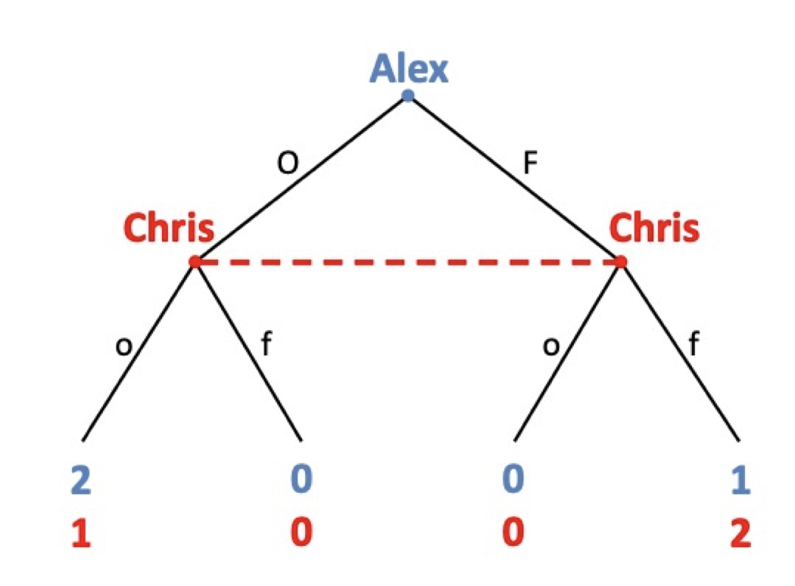
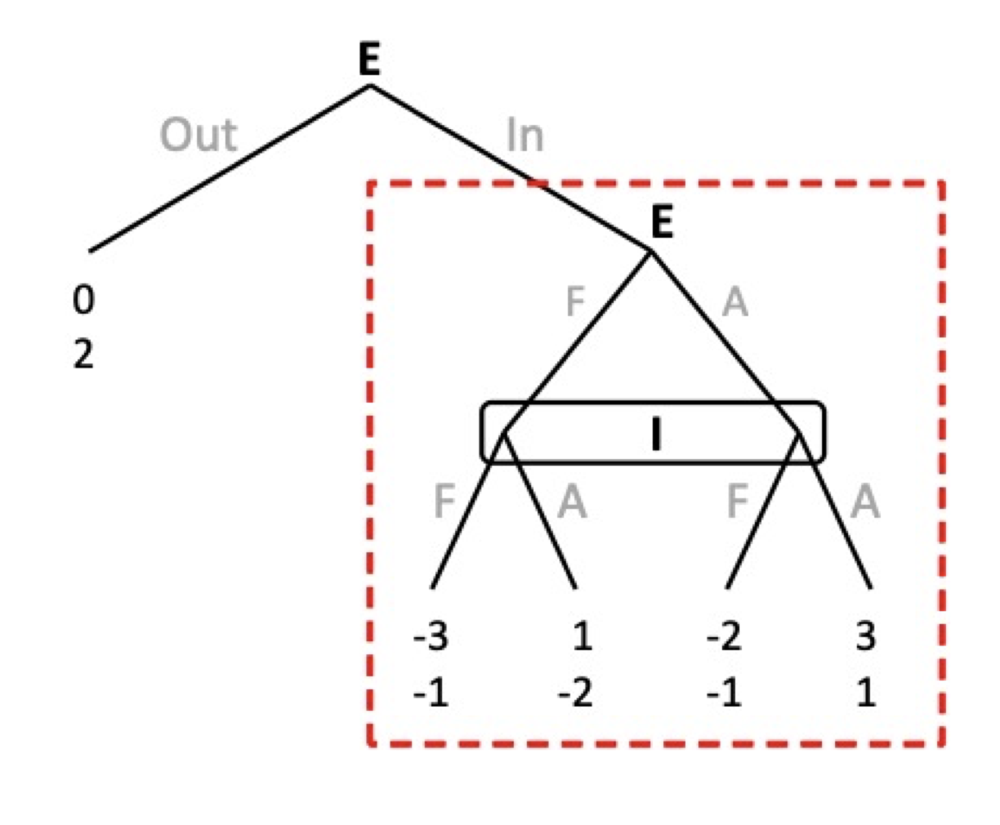
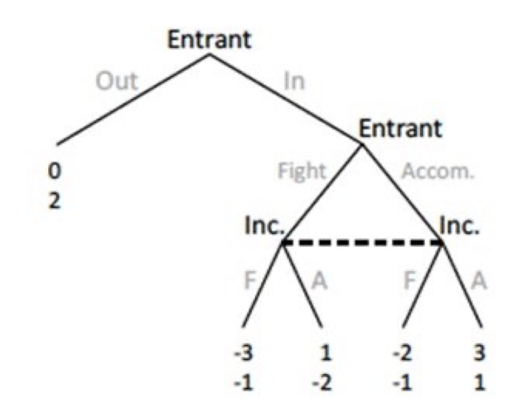
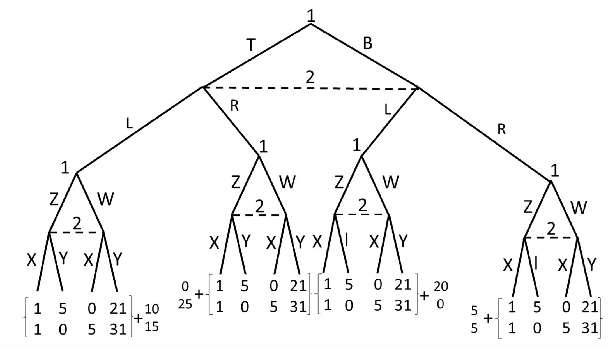
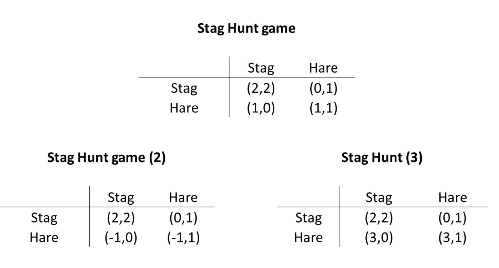
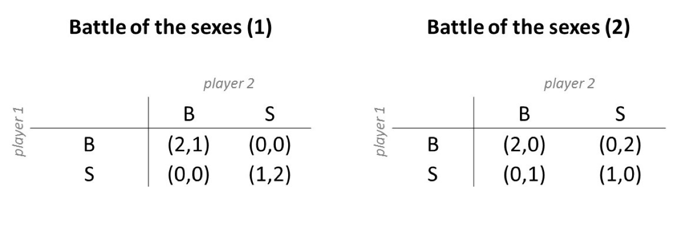
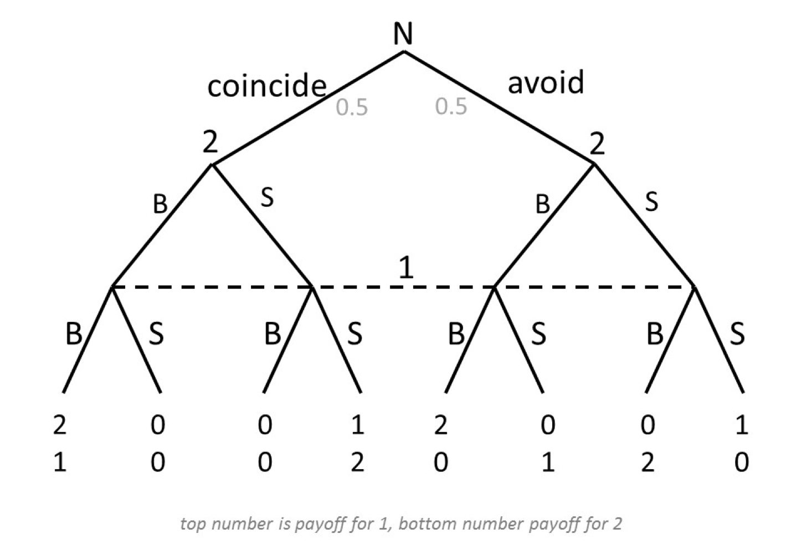

```{r setup, include=FALSE}
knitr::opts_chunk$set(echo = TRUE)
```

```{=html}
<style>
  body .main-container {
    max-width: 1100px;
    font-size: 12pt;
  }
</style>
```
[GV4C8 Homepage](https://kevinli03.github.io/notes/#GV4C8_Game_Theory)

**Week 8, GV4C8 Game Theory for Political Science**

-   Title: Introduction to Incomplete Information

-   Topics:

-   Readings: 21:08

<br />

------------------------------------------------------------------------

[GV4C8 Homepage](https://kevinli03.github.io/notes/#GV4C8_Game_Theory)

# **Imperfect Information**

### Introduction

We will introduce the possibility of not observing what other players have done in past rounds

-   And the possibility of not knowing opponents' motivations or preferences

Thus, this is incomplete information:

-   Players will have an initial belief on information (prior)

<!-- -->

-   We will need to introduce a way to update beliefs when new information is available.

<br />

For example, in an extensive form game, so far, all players know which node the game is at.

-   But in incomplete information, you might not know which action your player took. Let us say they had 2 possible actions in the round prior. That means you could be at either one of the 2 nodes.

-   Thus, players need to form beliefs on what node that are at.

<br />

### Extensive Form

An extensive game with incomplete information consists of:

1.  A set of players
2.  An order of play (which player moves when, timing)
3.  Nodes are partitioned into information sets (defined later)
4.  At each information set, you will have a set of action
5.  For each player, preferences over complete sequences of actions.

<br />

Previous to this point, information sets were just one node - we knew which node we were at.

-   Now, players cannot distinguish between nodes within each set

-   For example, if you are unsure of which node you are at between A and B, that means nodes A and B are part of an information set

Strategies now specify action at each information set (not each node)

-   Why? You don't know which node you are at within an information set, so you cannot choose different actions for each node within the information set.

-   Set of actions available at each node within an information set should coincide (same actions at each node within an information set, or else, if the actions differ between the nodes, you will know which node you are at).

<br />

### Battle of the Sexes

Recall the battle of the sexes - two individuals, trying to decide on where to go on a date. They want to be together, but they have different preferences on where to go.

1.  Let us assume Alex (female) moves first, and decides to either go to the opera or football
2.  Chris (male) moves second, but he is unaware of what Alex has chosen.

We can model the game as follows:

{width="50%"}

The red line represents both nodes are part of one information set.

<br />

------------------------------------------------------------------------

[GV4C8 Homepage](https://kevinli03.github.io/notes/#GV4C8_Game_Theory)

# **SPNE with Incomplete Info**

### Subgames

Remember, a subgame perfect nash equilibria requires all players to act optimally in all nodes.

A subgame of an extensive game, is a game consisting of any information set containing a single node, and its subsequent actions and nodes.

-   Thus, this means if node $x$ is in a subgame, all other nodes in the same info set as $x$ are also in the subgame.

For example: this below is a subgame:

{width="50%"}

We can restate SPNE using the notion of subgames:

-   A SPNE is a strategy profile, with the property that in no subgame, can any player do better by choosing a different strategy

-   So basically, players must play NE in a subgame.

We will also know that backwards induction may not work, since we do not know what node we are on.

-   For example, in information set $I$, we have to take the same action on both nodes in the set, since we don't actually know what node we are at.

<br />

### Modified Entry Game and NE

Consider an entry game, where after an entrant decides to enter the market, both entrant and incumbent play a simultaneous move game with payoffs as specified below:

{width="40%"}

We can see the subgame on the right after then Entrant Moves:

-   WIth incomplete information, the incumbent cannot see which node they are one and what choice the entrant made

-   So this is basically a simultaneous game (since they cannot observe each other's actions).

-   Also note: incumbent only has 2 strategy profiles. In the past extensive games, he would have 4 (because of each node). But here, incumbent does not know which node he is on, so can only choose the same strategy for both nodes (both F or both A).

<br />

The complete strategy profiles of each player are (always do this!!!):

-   Entrant: OF, OA, IF, IA.

-   Incumbet: F, A

We can create normal form a matrix:

|     |                                            |                                            |
|-----|--------------------------------------------|--------------------------------------------|
|     | F                                          | A                                          |
| OF  | ([**0**]{.underline}, [**2**]{.underline}) | (0, [**2**]{.underline})                   |
| OA  | ([**0**]{.underline}, [**2**]{.underline}) | (0, [**2**]{.underline})                   |
| IF  | (-3, [**-1**]{.underline})                 | (1, -2)                                    |
| IA  | (-2, -1)                                   | ([**3**]{.underline}, [**1**]{.underline}) |

Thus, Nash Equilibria are (OF, F), (OA, F), (IA, A).

-   The first 2 NE both correspond to the same outcome of entrant chooses out.

<br />

### Modified Entry Game SPNE

So now we have 3 NE: (OF, F), (OA, F), (IA, A). Which are subgame perfect?

-   Remember, subgame perfect means they are playing optimally at all subgames.

There are two subgames in this game:

-   The one starting at entrant choosing fight/accom

-   The one starting at the beginning

<br />

Let us look at the subgame of the entrant choosing fight/accom, as it is the latest in timing in the game (backwards induction). What is NE of this?

-   This is just a simultaneous game! We can find nash:

|     |                            |                                            |
|-----|----------------------------|--------------------------------------------|
|     | F                          | A                                          |
| F   | (-3, [**-1**]{.underline}) | (1, -2)                                    |
| A   | (-2, -1)                   | ([**3**]{.underline}, [**1**]{.underline}) |

-   Nash equilibria of this game is (A, A) with outcome payoffs (3, 1)

<br />

Now move to the subgame that starts at the beginning. What should entrant decide.

-   We know that if he chooses out, he gets payoff 0.

-   We know that if he chooses entrant, the game enters into the subgame we solved already for - (A,A) with payoff (3, 1).

Since 3\>0, entrant should chose in.

-   Thus, (IA, A) is only SPNE.

<br />

### Repeated Cooperation Game

Consider a two period game with two players. In period 1, they play a prisoner's dilemma, and in period 2, they play a coordination game with two NE:

|          |                           |                                            |
|----------|---------------------------|--------------------------------------------|
| Period 1 | L                         | R                                          |
| T        | (10, 15)                  | (0, [**25**]{.underline})                  |
| B        | ([**20**]{.underline}, 0) | ([**5**]{.underline}, [**5**]{.underline}) |

|          |                                            |                                              |
|----------|--------------------------------------------|----------------------------------------------|
| Period 2 | X                                          | Y                                            |
| Z        | ([**1**]{.underline}, [**1**]{.underline}) | (5, 0)                                       |
| W        | (0, 5)                                     | ([**21**]{.underline}, [**31**]{.underline}) |

<br />

Now in extensive form:

{width="60%"}

The subgames are the 4 nodes player 1 moves in period 2 and onward, and the whole game.

Thus, we can do backwards induction on all 4 second period subgames, then move to the first node for the whole game subgame.

<br />

Period 2 subgames:

|                  |                                            |                                            |
|------------------|--------------------------------------------|--------------------------------------------|
| Far Left Subgame | X                                          | Y                                          |
| Z                | [**11**]{.underline}, [**16**]{.underline} | 15, 15                                     |
| W                | 10, 20                                     | [**31**]{.underline}, [**46**]{.underline} |

|                     |                                           |                                            |
|---------------------|-------------------------------------------|--------------------------------------------|
| Centre-Left Subgame | X                                         | Y                                          |
| Z                   | [**1**]{.underline}, [**26**]{.underline} | 5, 25                                      |
| W                   | 0, 30                                     | [**21**]{.underline}, [**56**]{.underline} |

|                      |                                           |                                            |
|----------------------|-------------------------------------------|--------------------------------------------|
| Centre-Right Subgame | X                                         | Y                                          |
| Z                    | [**21**]{.underline}, [**1**]{.underline} | 25, 0                                      |
| W                    | 20, 5                                     | [**41**]{.underline}, [**31**]{.underline} |

|                   |                                          |                                            |
|-------------------|------------------------------------------|--------------------------------------------|
| Far Right Subgame | X                                        | Y                                          |
| Z                 | [**6**]{.underline}, [**6**]{.underline} | 10, 5                                      |
| W                 | 5, 10                                    | [**26**]{.underline}, [**36**]{.underline} |

<br />

Now period 1 (considering future payoffs), let us force cooperation. So give TL the highest payoff, rest lowest payoff from the two NE.

-   Why? Because question is asking if we can find one NE that enables cooperation in round 1 prisoner's dilemma

|          |                                              |                                            |
|----------|----------------------------------------------|--------------------------------------------|
| Period 1 | L                                            | R                                          |
| T        | ([**31**]{.underline}, [**46**]{.underline}) | (1, 26)                                    |
| B        | (21, 1)                                      | ([**6**]{.underline}, [**6**]{.underline}) |

Yes, there is a SPNE in the first round where the two players and cooperate and play (T,L):

-   Period 1: Player 1 plays T, player 2 plays L

-   Period 2:

    -   If they see TL result, player 1 plays W, player 2 plays Y

    -   If they see any other result of first round, player 1 plays Z, player 2 plays X

<br />

------------------------------------------------------------------------

[GV4C8 Homepage](https://kevinli03.github.io/notes/#GV4C8_Game_Theory)

# **Incomplete Information**

### Common Knowledge

So far, we have assumed common knowledge of players' preferences.

However, this might not hold in many circumstances:

-   Bargainers might not know each other's valuations

-   Firms might have better information on their marginal costs than the regulators

-   Voters might not know politician's motivations

-   Jurors might not know how others have interpreted evidence

-   Government might not know the strength of terrorist cells.

<br />

Basically, it is very common that players do not know for sure the characteristics/preferences of their opponents.

-   Players privately hold information about themselves

-   Players will strategically use privately held information.

<br />

### Player's Beliefs

Since player's do not know each other's preferences, they will instead hold **beliefs** about another player's preferences.

-   And also hold beliefs on other's beliefs, and so on...

<br />

Harsanyi argues that we don't have to consider beliefs of beliefs of beliefs...

-   Why? Because players' preferences are determined by the realisation of a random variable.

-   Realisation of this random variable (the actual prefernces of a player) may be private information, HOWEVER, the probability distribution is common knowledge of all players

-   For example, my preferences might be A or B with 50% chance. Only I know what actual preferences I got. But, the opponents know that there is a 50% chance I get A or B, so they can plan around knowing that probability distribution.

<br />

### Example: Stag-Hunt Game

Stag-Hunt game with two equilibria:

-   Societies can coordinate on reaching a big goal (hunting the stag)

-   Or, they can instead pursue smaller safer goals (hunting the hare)

But, let us assume that some parts of society are not certain: The row player has 3 scenarios - 1 where he slightly prefers stag over hare, 1 where he always prefers stag, and 1 where he always prefers hare.

{width="50%"}

Here, we can see the row player changes their preferences in these 3 possible worlds.

-   The actual preferences of the row player are only known to them (is it scenario 1, 2, or 3?) Only the row player himself knows.

-   However, the probability of the row player having scenario 1, 2, or 3 preferences are common knowledge (so column player knows these probabilities)

-   Column player thus has incomplete information on the row player's preferences.

<br />

**Solving this game:**

The column player's preferences are fixed. So, the row player knows what the column player's preferences are.

-   Thus, the row player can compute best responses. In world 1, row player wants to have the same strategy as column player. In world 2, row player wants stag always (dominant strategy). In world 3, the row player wants hare always (dominant strategy).

What about the column player? He does not know which world we are in, but the probabilities. Thus, he can calculate the expected utilities (given we know what row player would do - best responses we just calculated):

-   Expected utility of playing stag are: probability of world 1 \* 2 + probability of world 2 \* 2 + probability of world 3 \* 0

-   Expected utility of playing hare are: probability of world 1 \* 1 + probability of world 2 \* 1 + probability of world 3 \* 1.

More formally, where $p_i$ is the probability of world $i$ occurring, so $p_1 + p_2 + p_3 = 1$:

-   $\mathbb{E}[U_2(S)] = 2p_1 + 2p_2 + 0p_3 = 2 - 2p_3$

-   $\mathbb{E}[U_2(H)] = 1p_1 + 1p_2 + 1p_3 = 1$

So, compare the two strategies with inequality, and solve. If $p_3 < 0.5$, play stag, else play hare.

<br />

### Example: Battle of the Sexes

Take this game:

{width="60%"}

Player 1's payoffs are fixed. Let us say player 2 prefers scenario 1 50% of the time, and prefers scenario 2 50% of the time.

<br />

Question is: is $(B, (B,S))$ a NE? Player 2 basically means play $B$ in world 1, and play $S$ in world 2.

-   For player 2, this is clearly best response. They want to be the same with player 1 in world 1, and different from player 1 in world 2. Thus, they choose $(B, S)$.

For player 1, is this a best response? Calculate expected utilities assuming player 1 plays $B$ in scenario 1 (50% chance of happening) and player 1 plays $S$ in second scenario

-   $\mathbb{E}[u_1(B)] = 0.5(2) + 0.5(0) = 1$

-   $\mathbb{E}[u_1(S)] = 0.5(0) + 0.5(1) = 0.5$

So yes, $B$ is a best response of player 1 to player 2's strategy $(B, S)$. Thus, no player has incentive to deviate, and $(B, (B,S))$ is a nash equilibria.

<br />

### Incomplete vs. Imperfect Info

A game of incomplete information can be transformed into a game of imperfect information.

-   Note: incomplete information is what we just did - different possible games/preferences for a player.

-   Imperfect information is what we did earlier - extensive form game but you do not know what node you are on.

<br />

Incomplete information game can be transformed into a imperfect information game by having nature move first

-   Nature assigns types to players (their private information). In more intuitive terms - nature decides which scenario/world we will be in.

-   But, the actual decision of nature is only available to one player. The other player will know the probability of nature choosing a certain type, but not the actual chosen type.

<br />

For example, take the battle of sexes game previously:

{width="60%"}

<br />

Now, nature (N) decides which node we end up in:

{width="60%"}

Nature moves first, 50% probability of each world. Then player 2 (with private info) knows where they are. But player 1 (with incomplete info) does not know where they are on the tree anywhere.

<br />

Finding SPNE? There is only one subgame in this game. Complete strategy profiles of players:

-   Player 1: 4 strategy profiles (2 nodes, 2 decisions, so $2 \times 2$): BB, BS, SB, SS

-   Player 2: only 2 strategy profiles (since only one information set). B, S

If there is only one subgame, then any NE (in normal form) is SPNE.

-   So put the 4 player 1 strateiges and 2 player 2 strategies into a matrix

-   Calculate expected utilities. For example, for (BS, B), you would do 0.5 times outcome (B, B) in world 1, and 0.5 times outcome (S, B) in world 2.

<br />

------------------------------------------------------------------------

[GV4C8 Homepage](https://kevinli03.github.io/notes/#GV4C8_Game_Theory)

# **Bayes' Rule**

### Updating Beliefs with Bayes' Rule

Beliefs are the probability a player believes they are at a certain node.

-   With incomplete information, sometimes, you can update beliefs.

-   Bayes' rule allows us to update beliefs.

For example, let us say the probability of a candidate winning the presidential election is 30% when primaries are still going on.

-   But let us say the candidate wins the primary and now is the party's nominee

-   We can update the probability of them winning the election with this new information.

<br />

### Monty Hall Probelm

You are on a game show, and you need to choose one amongst three doors. Behind one door is a car, behind the other doors goats. You pick a door, say No. 1, and the host, who knows what’s behind the doors, opens another door, say No. 3, which has a goat. He then says to you, Do you want to pick door No. 2? Is it to your advantage to switch your choice?

<br />

Initially, your chance of winning is $1/3$.

Let us say you choose door 1. Monty hall opens one of door 2 or 3 that does not contain the goat (this provides information to us).

-   Car in door 1: stay, you win, switch you lose (assuming monty opened either 2 or 3)

-   Car in door 2: stay you lose, switch you win (assuming monty opened door 3)

-   Car in door 3: stay you lose, switch you win (assuming monty opened door 2)

We can see here, each scenario above has a $1/3$ chance of happening. $2/3$ scenarios you win if you switch. Only $1/3$ scenarios you win if you don't switch.

<br />

### Bayes' Rule

Conditional Probability - Probability of an event, is the desired event probability divided by probability of all events. Thus:

$$
Pr(A|B) = \frac{Pr(A \cap B)}{Pr(B)} \quad \text{and} \quad Pr(B|A) = \frac{Pr(B \cap A)}{Pr(A)}
$$

Bayes' rule forms a relationship between the two conditional probabilities:

$$
Pr(A|B) = \frac{Pr(B|A) Pr(A)}{Pr(B)} \qquad \text{posterior} = \frac{\text{likelihood} \times \text{prior}}{\text{marginal}}
$$

We can also arrange the bottom as:

$$
Pr(A|B) = \frac{Pr(B|A) Pr(A)}{Pr(B \cap A) + Pr(B \cap A^C)} =  \frac{Pr(B|A) Pr(A)}{Pr(B|A) \times Pr(A) + Pr(B|A^C) + Pr(A^C)}
$$

Where $A^C$ is the complement of $A$ (so not $A$).

<br />

### Monty Hall with Bayes' Rule

Let us say player 1 chooses door 1. $Pr(A)$ is car behind door 1, $Pr(B)$ is host opens door 3 (just an example)

We want to find $Pr(A|B)$ (probability of car behind door 1 when host opens door 3).

We know:

-   $Pr(A) = 1/3$

-   $Pr(B|\text{car in door 3}) = 0$, since if car in door 3, monty will never open door 3 (which is event $B$)

-   $Pr(B|\text{car in door 2}) = 1$, since if car is in door 2, and you choose door 1, monty can only open door 3 (100% chance of event $B$).

-   $Pr(B|\text{car in door 1}) = Pr(B|A) = 1/2$, since if car is in door 1 and you choose door 1, monty can either open door 2 or 3, so opening 3 (event $B$) occurs 50% time. It is equal to $Pr(B|A)$ since event $A$ is the chance car is in door 1.

<br />

Thus, using bayes' rule, we know:

$$
Pr(A|B) = \frac{Pr(B|A) Pr(A)}{Pr(B|\text{car in door 3})Pr(A) + Pr(B|\text{car in door 2})Pr(A) + Pr(B|\text{car in door 1})Pr(A)}
$$

$$
Pr(A|B) = \frac{\frac{1}{2} \times \frac{1}{3}}{0(\frac{1}{3}) + 1(\frac{1}{3}) + \frac{1}{2} (\frac{1}{3})} =
\frac{\frac{1}{6}}{\frac{1}{3}+\frac{1}{6}} = \frac{1}{6} \times \frac{6}{3} = \frac{1}{3}
$$

Thus, when player chooses door 1, and monty opens door 3, the probability of the car being in door 1 is $1/3$. Thus, switching will give you a probability of 2/3 to get the car.
