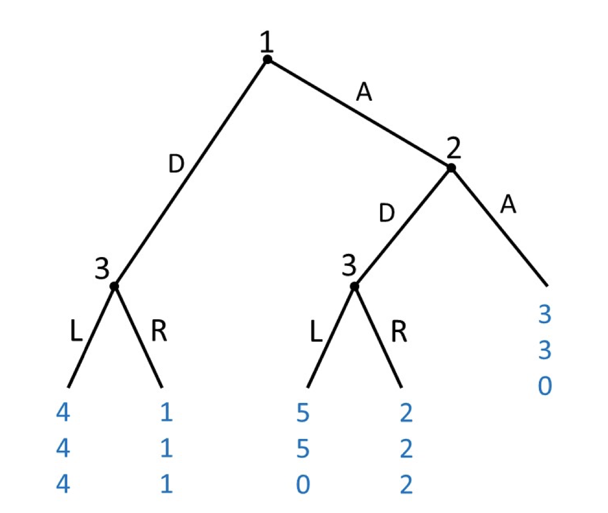
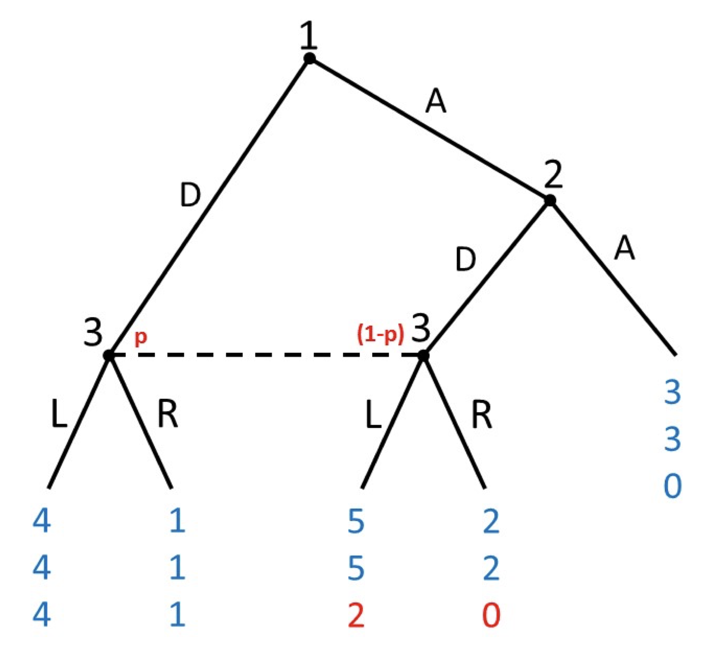
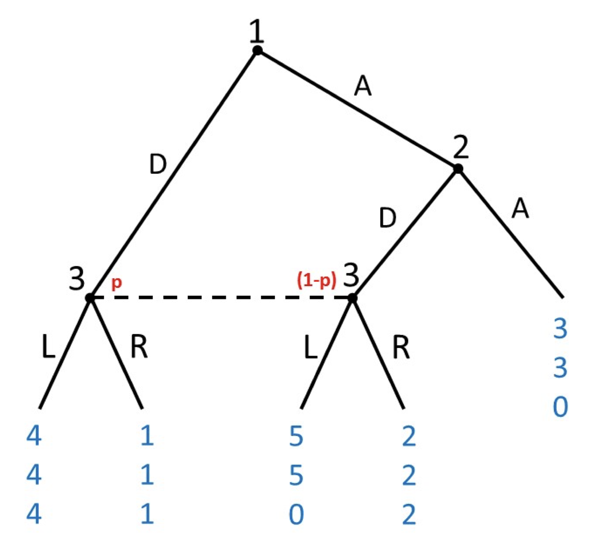
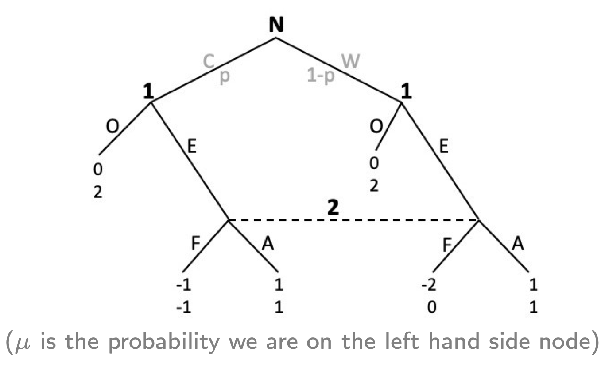
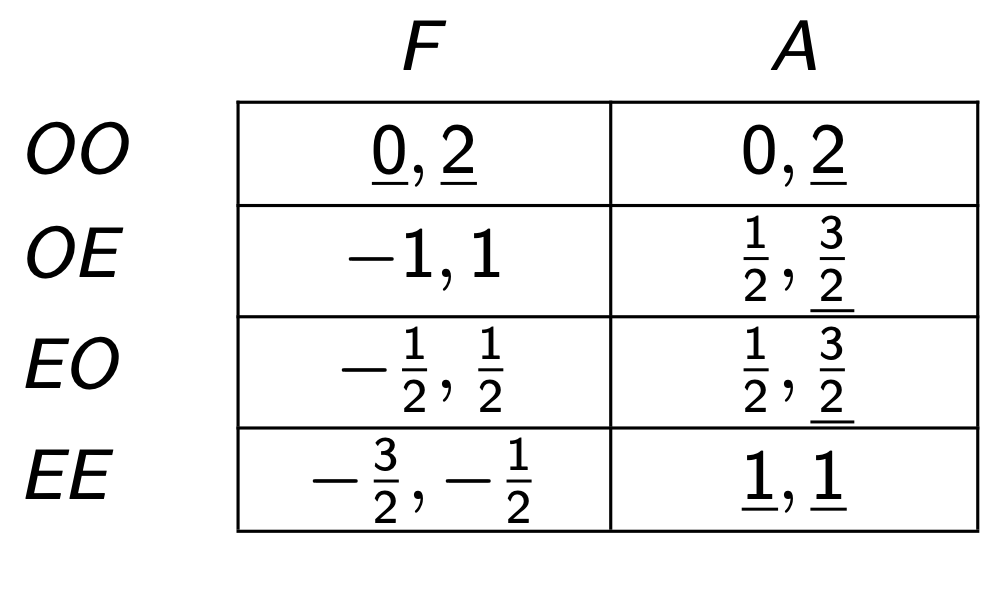
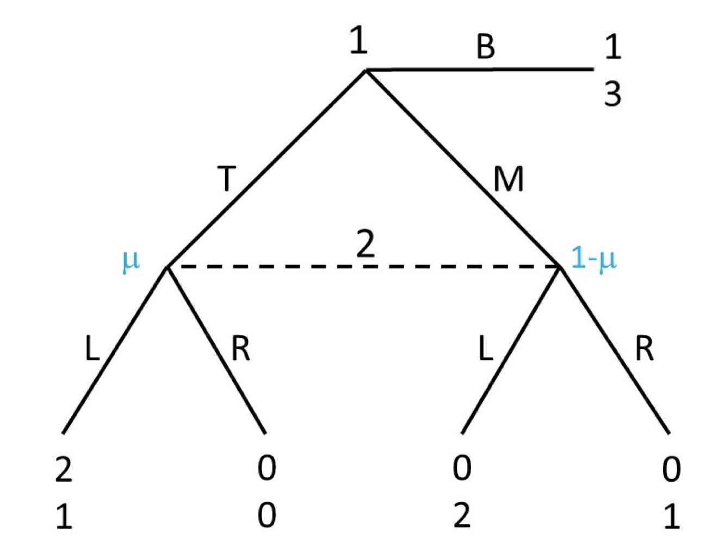

```{r setup, include=FALSE}
knitr::opts_chunk$set(echo = TRUE)
```

```{=html}
<style>
  body .main-container {
    max-width: 1100px;
    font-size: 12pt;
  }
</style>
```
[GV4C8 Homepage](https://kevinli03.github.io/notes/#GV4C8_Game_Theory)

**Week 9, GV4C8 Game Theory for Political Science**

-   Title: Perfect Bayesian Equilibrium

-   Topics:

-   Readings:

<br />

------------------------------------------------------------------------

[GV4C8 Homepage](https://kevinli03.github.io/notes/#GV4C8_Game_Theory)

# **Perfect Bayesian Equilibrium**

### Issues with SPNE

Last week, we introduced imperfect information in extensive form games.

-   However, these imperfect information games often have very few subgames

-   Thus, SPNE is often equal to NE, since there are usually one subgame, so that subgame's NE is also SPNE.

<br />

For example, take this game, called Selten's Horse:

{width="60%"}

This is a compelte information game. The SPNE is quite easy to find:

1.  Player 3 will play L on the left node, and R on the right node
2.  Player 2 will play A.
3.  Player 1 will play D.

Thus, SPNE outcome is player 1 plays D, player 3 plays L, outcome (4, 4, 4).

<br />

Now, let us consider if player 3 didn't node which node they were playing at.

-   Now, SPNE does not work, because we only have one subgame

-   Thus NE = SPNE in this case.

Thus, we need a refinement: Perfect Bayesian Equilibrium (PBE).

<br />

### Formal Definition of PBE

To understand incomplete information games, player beliefs are important.

-   Players form beliefs at each information set (what is the probability they are at each node within a information set).

-   Players act optimally given their own beliefs, and other's anticipated play

-   We will [restrict beliefs]{.underline} to be consistent with equilibrium play

This restriction leads to Perfect Bayesian Equilibrium.

<br />

A **perfect bayesian equilibrium** consists of:

1.  A strategy profile: mapping from information sets to actions (what a player does at each information set)
2.  A belief profile: a probability distribution over each node, within each information set, of what node they believe they are at within the information set

For every player:

-   Players are sequentially rational (act optimally at each information set, given their belief profiles)

-   Beliefs are consistent with the strategy profiles

<br />

### Simple Example: Selten's Horse

Take the modified Selten's Horse game with imperfect information:

{width="60%"}

Now, player 3 has incomplete information, with one information set with two nodes.

-   Player 3 has beliefs over what node they are in: $p$ probability they are on the left node, and $1-p$ they are on the right node.

Player 3 has a dominant strategy here: why?

-   Expected utility of playing left is $4(p) + 2 (1-p)$

-   Expected utility of playing right is $1(p) + 0(1-p)$.

-   Clearly, playing left is greater.

Knowing this, player 3 will play L (and everyone anticipates this).

-   Thus, player 2 will play D (since 5 \> 3)

-   And thus, player 1 will play A.

<br />

### Checking Consistency of Beliefs

Now, go back to the original game:

{width="60%"}

What should player 3 play?

-   Expected utility of playing left: $4(p) + 0(1-p) = 4p$

-   Expected utility of playing right: $1(p) + 2(1-p) = p + 2 - 2p = -p + 2$.

-   When is $E[u_3(L)] > E[u_3(R)]$? $4p > -p + 2 \Longrightarrow 5p > 2 \Longrightarrow p > \frac{2}{5}$

Thus, Player 3 will:

-   Player 3 will play $L$ when $p>\frac{2}{5}$.

-   Player 3 is indiffernt between $L$ and $R$ when $p = \frac{2}{5}$

-   Player 3 will play $R$ when $p < \frac{2}{5}$.

<br />

Let us start with scenario $p > \frac{2}{5}$.

-   That means player 3 will play $L$.

-   Player 2 will play D

-   Player 1 will play A.

Does that belief make sense? We are saying that ending up at the left node $p> \frac{2}{5}$ proportion of the time.

-   NO! It does not make sense. As we saw with our equilibrium play of action, player 1 always prefers A and player 2 always prefers D, so we always end up at the right node.

-   Thus, $p = 0$! That is not compatible with $p > \frac{2}{5}$

-   So, we are contradicting our original assumption. Thus, this is not a PBE.

<br />

Now, let us check scenario $p< \frac{2}{5}$

-   Player 3 plays $R$

-   Player 2 plays A

-   Player 1 plays A

Does this belief make sense?

-   Yes. Why? Well the game never ends up in information set.

-   Equilibrium play tells us nothing about the information set. But that also means it tells us nothing contradictory about our belief $p< \frac{2}{5}$.

-   [**Beleifs can be anything if information set never reached (but player of informational set still has to behave rationally - play the strategy that maximises payoff).**]{.underline}

So basically, a PBE is when the beliefs are consistent (do not contradict) the optimal strategies.

<br />

Thus, PBE is: $(A, D, R, p \in [0, \frac{2}{5}])$, with outcome player 1 plays A, player 2 plays D, outcome (3,3,0).

<br />

### Example: Entry Game

Game is as follows:

-   Nature decides with probability if player 1 (entering firm) is Competitive (probability $p$) or Weak (probability $1-p$).

-   Entrant, after knowing what type, chooses Enter (E) or Out (O)

-   Player 2 (incumbent firm) does not know what type entrant is. Their belief is $\mu$ on the left node, and $1 - \mu$ on the right node. They can Fight (F) or Acquiesce (A)

Modelled as follows:

{width="70%"}

Let us assume p = 0.5

-   Player 2 has 2 strategies (F, A)

-   Player 1 has 4 strategies (OO, OE, EO, EE).

Thus, the normal form is:

{width="60%"}

-   How did we get these numbers? Expected utility - assuming p = 0.5, we can find the outcome.

Nash Equilibria: (OO, F), and (EE, A). (Also SPNE, since only one sub game).

<br />

However, are these both rational with beliefs? Let us look at (OO, F).

-   If we look at the extensive form, player 2 is always better accommodating, no matter the probability of $\mu$.

-   Thus, only (EE, A) is perfect bayesian.

Now, let us look at (EE, A).

-   Player 2 we know will always play A (dominant, no matter beliefs)

-   Player 1 will always be better entering, no matter which state.

-   Thus, since player 1 will always choose E, that means with probabiltiy $p$ (world C), they choose E, and probability $1-p$ (world W), they choose E.

-   That means player 2 will expect to be on the left node $\mu = p$, and on the right node $1 - \mu = 1 - p$.

-   Thus, these are the beliefs that make PBE.

<br />

This is an example of Pooling equilibrium - since player 1 (no matter type C or W) will play the same strategy, player 2 does not update their prior beliefs of nature.

-   Only when player 1 behaves differently given type C or W, does player 2 update their prior beliefs.

<br />

------------------------------------------------------------------------

[GV4C8 Homepage](https://kevinli03.github.io/notes/#GV4C8_Game_Theory)

# **Details on PBE**

### Parts of PBE

PBE contains the following parts:

1.  Equilibrium Path
2.  Beliefs
3.  Sequential Rationality
4.  Consistency of Beliefs

We will explore each in detail below

<br />

### Equilibrium Path

An equilibrium path is the path reached on the PBE.

<br />

An information set $\sigma^*$ is:

-   on the equilibrium path if the information set is reached with positive probability (included in the equilibrium path)

-   Off the equilibrium path if the information set is never reached. If it is never reached, we cannot say much about it.

<br />

### System of Beliefs

A system of beliefs assigns a probability distribution to each decision nodes in every informatino set

-   So given any information set $h$, each decision node in that set $x \in h$, a player will have a belief probability $\mu (x)$ of being on that node within than information set.

-   So if there are two nodes $x_1$ and $x_2$ within an information set $h$, $\mu(x_1)$ denotes the probability that we are on node $x_1$ within information set $h$.

Since beliefs are about nodes within sets, the sum of all chances of being at each node within an information set should equal 1.

-   $\sum_{x \in h} \mu(x) = 1$

-   So, if you only have one node, your belief is 1 (duh, you know which node you are in if there is only one possible node in your information set).

<br />

### Sequential Rationality

Given a system of beliefs $\mu$, a strategy profile $\sigma$ is sequentially rational at an information set $h$, if player $i$ acts optimally at that information set.

Mathematically:

$$
E[u_i(\sigma_i, \sigma_{-i})| h, \mu] ≥ E[u_i(\sigma_i', \sigma_{-i})| h, \mu], \forall \sigma_i'
$$

Basically, you are rational if you are playing the strategy that gives the most expected utility (based on the beliefs $\mu$).

Or in other words, no profitable deviation based on the expected utilities.

<br />

### Consistency of Beliefs

A system of beliefs $\mu$ (all beliefs we have in the game) are consistent with a strategy profile $\sigma^*$, if the beliefs in the information sets are consistent with Bayes' Rule.

-   Basically, we need that the beliefs are compatiable (do not contradict) the strategies in our equilibrium outcome.

-   That also means that information sets not reached in the equilibrium path will have unrestricted beliefs (since if they are not reached, they cannot contradict the equilibrium outcome). NOT COMPLETELY RESTRICTED - need to imply that the equilibrium outcome will occur (if that is required).

<br />

### PBE and How to Find PBE

A strategy profile $\sigma^*$, with a belief system $\mu$, is a perfect bayesian equilibrium if:

-   The strategy profile $\sigma^*$ is rational given the beliefs $\mu$.

-   And the $\mu$ is consistent (does not contradict) strategy profile $\sigma^*$.

How do we find PBE?

1.  Find all Nash Equilibria
2.  Find the system of beliefs consistent with each Nash Equilibria (if there are no systems of beliefs consistent, then that NE is not a PBE).

This is basically what we did in the prior examples.

<br />

------------------------------------------------------------------------

[GV4C8 Homepage](https://kevinli03.github.io/notes/#GV4C8_Game_Theory)

# **More Examples of PBE**

### Example 1:

{width="60%"}

We want to find all NE, then find which are consistent.

Backwards induction, what does player 2 play?

-   Expected utility of L is: $1 (\mu) + 2 (1-\mu) \Longrightarrow \mu + 2 - 2\mu \Longrightarrow -\mu + 2$

-   Expected utility of R is: $0 (\mu) + 1 (1 - \mu) \Longrightarrow1 - \mu$

-   When is L better? $-\mu + 2 > 1 - \mu \Longrightarrow 2 > 1$ so always.

With player 2 playing L, what does player 1 play?

-   He plays T

So NE of the game is (T, L).

<br />

What beliefs are consistent with this?

-   We established before, $\mu$ can be any number. BUT NO!!!

-   No because we know that if player 2 plays L, player 1 will always play T

-   Thus, the left node is always reached. Thus, $\mu = 1$.

Thus, PBE is $(T, L, \mu = 1)$.

<br />
