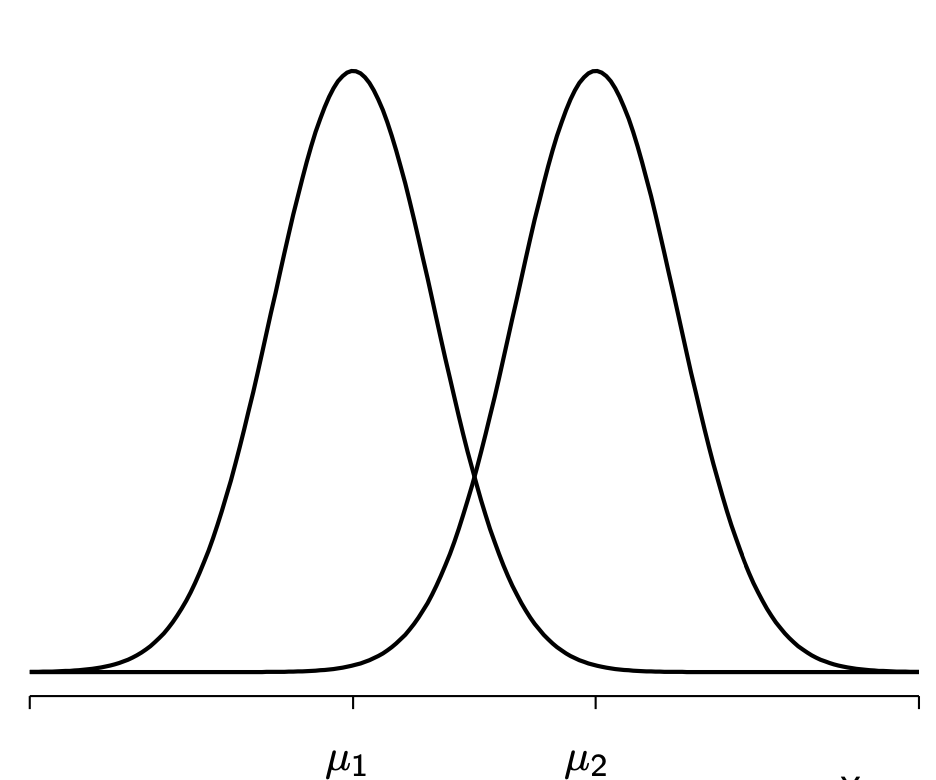

```{r setup, include=FALSE}
knitr::opts_chunk$set(echo = TRUE)
```

```{=html}
<style>
  body .main-container {
    max-width: 1100px;
    font-size: 12pt;
  }
</style>
```
[MY452A Homepage](https://kevinli03.github.io/notes/#MY452A_Regression_Analysis)

Week 0, Applied Regression Analysis

-   Title: Statistical Inference Review

-   Topics: Sampling, Central Limit Theorem, Difference in Means, Hypothesis Testing

-   Readings:

    1.  Chapter 2, Kuha, J., and Lauderdale, B. (No date) *Applied Regression Analysis: Coursepack*

    2.  Chapters 2-4, Gelman et al (2022) *Regression and Other Stories*

-   Note: This lesson draws from both the Review Material provided in MY452A, and Session 1 of DV494 Fundamentals of Applied Econometrics for Economic Development Policy

<br />

------------------------------------------------------------------------

[MY452A Homepage](https://kevinli03.github.io/notes/#MY452A_Regression_Analysis)

# Key Points

[**Sampling**]{.underline} is the process by which we select a portion of observations from a population

What makes a good sample?

-   Sampling Procedure - how we choose to sample

-   Luck - which we cannot control

Because we cannot control for luck, we need tools like hypothesis testing that account for uncertainty (see later)

<br />

[**Central Limit Theorem**]{.underline} says that the distribution of sample means is normally distributed

-   Even if the original distribution is not normally distributed.

-   Thus, we can apply the 68-95-99.7 rule to find out the probability of a certain sample mean

<br />

A [**difference of means**]{.underline} test is when we try to find if there is a significant difference between two populations, given one sample.

First, we find the difference between our sample means:

$$
\Delta = \bar{Y}_2 - \bar{Y}_1
$$

Then, create a 95% confidence interval

-   Since we know the distribution of sample means of both populations is normal (central limit theorem), their difference is also normal

-   So we use the $\sigma$ of the difference-sample-means distribution multiplied by 1.96:

$$
\Delta ± 1.96 \times \sqrt{\frac{\sigma_1^2}{n_1} + \frac{\sigma_2^2}{n_2}}
$$

<br />

[**Hypothesis Testing**]{.underline} allows us to reject a null hypothesis (no relationship/difference), and conclude a alternative hypothesis (there is a relationship/difference)

We need to calculate a t-statistic

$$
t = \frac{\hat{\Delta}}{\hat{se}(\hat{\Delta})} = \frac{ \bar{Y}_2 - \bar{Y}_1}{\hat{\sigma} \sqrt{1/n_2 + 1/n_1}}
$$

Where $\hat{\sigma}$ in the final section is defined as:

$$
\hat{\sigma} = \sqrt{\frac{(n_2-1)\sigma_2^2 + (n_1 - 1) \sigma_1^2}{n_1+n_2-2} }
$$

Larger (both positive and negative) values of $t$ indicate evidence against $H_0$

Then using the t-statistic, we calculate a p-value

-   P-value is is the probability of obtaining a test statistic, as or more extreme, as the one we observed in our sample

-   If the p-value is low enough, that means the probability that our null is true is extremely unlikely, and thus, at a certain level ( $<0.05$ ), we can reject the null and accept the alternative hypothesis

<br />

------------------------------------------------------------------------

[MY452A Homepage](https://kevinli03.github.io/notes/#MY452A_Regression_Analysis)

# Statistical Foundations

### Probability Distributions

Probability distributions are a function that tells us, from each individual possible outcome, what is the likelihood that outcome will happen

-   Basically, observe data, and plot a frequency plot (histogram), where the $x$ axis is possible outcomes, and $y$ is frequency

-   Then, divide each outcome $x$'s frequency $y$ by the total number of observations

-   That gives you the probability of getting outcome $x$

-   A probability distribution is the probability of getting each outcome $x$

<br />

The probability distribution allows us to guess an outcome, that is more accurate than any other form of blind guessing.

<br />

Discrete Probability Distirbution is when there are seperate categories of outcomes:

-   Ex. Yes or No

-   Ex. Heads or Tails

-   Ex. Which side of a dice

<br />

Continuous Probability Distributions are continuous:

-   Ex. What is the temperature? This can be any value between -273 C and $∞$ C.

-   However, we cannot know the probability of a specific value - why? Well, what is the probability of getting exactly 27.343249324898 C? This is meaningless

-   Instead, we use ranged (ex. what is the probability of getting between 20C and 30C)

-   This is the integral of the probability density function between the range we are interested in

<br />

For both, the total probability (of all possible outcomes) is always $1$ - something has to happen.

<br />

### Types of Distributions

Creating a probability distribution for every event we are interested is very time consuming

-   Luckily, many events share similar probability distributions

-   Thus, we can simplify the process by using a "off-the-shelf" probability distributions

<br />

Normal Distributions

-   Most Frequent type of distribution

-   Is bell-shaped and symmetrical

-   Around 68% of data is within $\mu ± \sigma$, 95% data is $\mu ± 2 \sigma$, and 99.7% of data is between $\mu ± 3 \sigma$

-   This will be very useful for Central Limit Theorem and Hypothesis Tests (see below)

<br />

Uniform Distributions

-   A distribution where all outcomes have the same probability (a straight line)

-   Ex. Rolling a dice - all sides have an equal chance of being rolled

<br />

Poisson Distribution

-   Used to measure uncommon count events

-   Basically, the output is how many times something occurs in a specific time period

-   They are characterised by their mean number of occurences in a set period of time - knowing this, we can find the probability of any possible outcome

<br />

### Sampling

Sampling is the process by which we select a portion of observations from a population

-   Without actually gathering every observation in the population (because that is often impractical)

-   Sampling allows us to learn about the larger population, without going through all the work of collecting all individual observations in a population

<br />

What makes a good sample?

-   Sampling Procedure - how we choose to sample

-   Luck - which we cannot control

Because we cannot control for luck, we need tools like hypothesis testing that account for uncertainty (see later)

<br />

With a good procedure, we can have a sample that does a relatively good job of mimicking the population (of course, there is still luck/randomisation involved)

-   We want to avoid bias. For example, if you are trying to collect a sample of students to see what causes good grades, you probably don't want to do your survey in front of the library - since the good students will be overrepresented

-   To do this, we want to do a Random Sample

<br />

### Central Limit Theorem

Let us go back to the point of luck in a good sample

-   What if we somehow, by terrible luck, select all the tallest people randomly in a sample. Clearly, this is not representative

Well, we don't have to worry. Central Limit Theorem states that there is a systematic relationship between a particular sample, and how far that is from the true population average

-   CLT gives an idea of how much values of the mean, would vary from sample to sample

<!-- -->

-   Basically, we can know the probability of obtaining a certain mean of a particular sample, given the true mean of the population

How?

-   If we take random sample after random sample from the same population, and plot the means on a histogram...

-   The more sample means we have, the more the histogram distribution of sample means converges into a **normal distribution**

    -   With a mean that is equal to the true population mean.

    -   Note: a distribution of sample means, is basically, taking many samples, finding their means, and plotting that into a probability distribution. Now take another sample, and another, and keep adding to the probability distribution

-   **Central Limit Theorem says that the distribution of sample means is normally distributed**

    -   Even if the original distribution is not normally distributed).

    -   Thus, we can apply the 68-95-99.7 rule to find out the probability of a certain sample mean

<br />

Central Limit Theorem states that the distribution of sample means is normally distributed, given the following conditions:

-   Data must be sampled at random from the population

-   Samples should be independent - one sample should not impact the other samples

-   When sampling without replacement, sample size should not exceed 10% of the population

-   Sample size generally needs to be 30 or higher

<br />

------------------------------------------------------------------------

[MY452A Homepage](https://kevinli03.github.io/notes/#MY452A_Regression_Analysis)

# Significance Testing

### Difference in Means

Let us say we want to find if two different sample's means are significantly different

-   i.e., the samples come from different populations

-   For example: Do people in the UK and France work different average weekly working hours?

<br />

First, we can find the difference between the sample means of France and the UK's average weekly working hours. For example:

$$
\bar{Y}_{FR} - \bar{Y}_{UK} = 40.35-38.74 = 1.61
$$

So we can see, there is a difference of $1.61$ between the two sample means

<br />

HOWEVER, we are interested in the difference between the UK and France, not just between the samples we have (\~ 4000 observations), but the entire population

-   We want to use the sample information to draw conclusions about the population

More mathematically, we are interested in the true population's difference of means:

$$
\Delta = \mu_2 - \mu_1
$$

If there is a significant difference, the two should be different, and thus, $\Delta ≠ 0$

<br />

But what is the true means of the populations?

-   Our sample mean is not enough

-   Why? If we collected another sample from the population, we are unlikely to get the same exact sample means as the ones we have - so the answer might be slightly different

<br />

So how do we do this? With Sampling Distributions covered earlier in the Central Limit Theorem

-   We know that the distribution of sample means from multiple samples taken from the same population, will take the form of a normal distribution

-   This distribution gives an idea of how much values of the estimate, would vary from sample to sample

<br />

Our above sampling for the UK and France fits the criteria for central limit theorem. Thus, we know that the sample means are normally distributed.

Using the sample means $\bar{Y}_{FR}, \bar{Y}_{UK}$ as the centre of these sampling distributions, we can draw these two sampling distributions:

{width="60%"}

<br />

If we do $\bar{Y}_2 - \bar{Y}_1$ for the sampling distributions, we get the sampling distribution of $\hat{\Delta}$.

-   This again, is a normal distribution, with a mean that is equal to our original sample's $\Delta$.

The standard error (standard deviation) of this distribution is calculated with the following formula:

$$
se(\hat{\Delta}) = \sqrt{\frac{\sigma_1^2}{n_1} + \frac{\sigma_2^2}{n_2}}
$$

<br />

Using this distribution and the standard error, we can calculate a **confidence interval** around the mean $\Delta$ that contains 95% of the area under the normal distribution

-   Remember, 95% is around 2 standard deviations from the mean (actually 1.96)

So, the 95% confidence interval estimate of the difference between sample means is:

$$
\Delta ± 1.96 \times \sqrt{\frac{\sigma_1^2}{n_1} + \frac{\sigma_2^2}{n_2}}
$$

That means, we are **95% confident that the true difference in means lies within the interval**.

-   See below for hypothesis testing

<br />

### Hypothesis Testing

Hypothesis testing is a tool for examining the plausibility of a claim

In a difference of means example (like above), we first start with the null hypothesis $H_0$:

-   The null hypothesis $H_0$ **always assumes that there is no relationship**

-   Thus, a null hypothesis in a difference of means test, would be that there is no difference

Or mathematically speaking, the null hypothesis is:

$$
H_0:\Delta = 0
$$

<br />

The alternative hypothesis, is, well the alternative - that there is some relationship

-   Thus, an alternative hypothesis in a difference of means test, would be that there is a significant difference between the means

Mathematically speaking, the alternative hypothesis is:

$$
H_a=H_1 : \Delta ≠ 0
$$

<br />

The basic idea of hypothesis testing is as follows:

1.  We observe the difference between our two samples $\hat{\Delta}$
2.  We want to know where this observed difference $\hat{\Delta}$ lies in our sampling distribution of difference in means (the normal distribution we found previously)
3.  We note this location with a **test statistic**
4.  Then, we calculate the **p-value**: the probability of observing our difference between two samples, if the null hypothesis is true
    -   If that probability is very low, then we know that it is unlikely that the null hypothesis is true

<br />

We have already done the first two steps in the previous section. Now, let us note the location of the t-test statistic.

Mathematically speaking, the t-test statistic is as follows:

$$
t = \frac{\hat{\Delta}}{\hat{se}(\hat{\Delta})} = \frac{ \bar{Y}_2 - \bar{Y}_1}{\hat{\sigma} \sqrt{1/n_2 + 1/n_1}}
$$

Where $\hat{\sigma}$ is defined as:

$$
\hat{\sigma} = \sqrt{\frac{(n_2-1)\sigma_2^2 + (n_1 - 1) \sigma_1^2}{n_1+n_2-2} }
$$

Larger (both positive and negative) values of $t$ indicate evidence against $H_0$

<br />

Now, let us find the p-value: the plausibility of the null hypothesis given our observed sample

-   It is the probability of obtaining a test statistic, as or more extreme, as the one we observed in our sample

-   To find this, we generally have a chart of t-statistics and p-values

The p-value tells us the following:

-   A small p-value is evidence against the null hypothesis, which means that there is likely a difference between the means

-   We typically select **significance levels** $\alpha$ - where if the p-value falls below them, we reject the null and accept the alternative hypothesis

    -   In social sciences, it is generally 0.05 or 5%

<br />

Hypothesis testing and confidence intervals get the same results when they use the same significance/confidence level:

-   The significance level $\alpha$ is equal to the $(1-\alpha)$% confidence interval

------------------------------------------------------------------------

[MY452A Homepage](https://kevinli03.github.io/notes/#MY452A_Regression_Analysis)

# Reading: Coursepack Ch. 2

Chapter 2, Kuha, J., and Lauderdale, B. (No date) *Applied Regression Analysis: Coursepack*

<br />

### Key Points

<br />

### Samples and Populations

Statistical inference is used when the observations in the data are a sample from some larger population

-   But, while we only have the sample, we want to draw conclusions regarding the population

-   We can do this if the sample is representative of the population

-   For example, we might have a sample of average weekly working hours from people in the UK and France. There is also some true value of average weekly working hours for all the people in the UK and France (the population)

<br />

We can also have some more "hypothetical" populations

-   For example, let us sample the interview lengths from UK and France

-   The variable has a value for those respondents who were interviewed

-   However, some people don't get an interview

-   So, interview length is a "potential variable", whose value is only realised when an interview actually takes place

-   So, our population is some infinite, hypothetical, conceptual population, where our samples are realisations of this event

<br />

### Models for the Data

Statistical inference is based on a set of assumptions about the distributions of the variables of interest in the population, and the observed samples drawn from them

Let us model our scenario for the weekly working hours in France and the UK example, we have 2 samples:

-   1st sample of the UK: $n_1$ observations of $Y$ (weekly working hours), are a random sample of the population where $Y$ has a normal distribution with mean $\mu_1$ and variance $\sigma ^2$

-   2nd sample of France: $n_2$ observations of $Y$, where the population of $Y$ is normally distributed with mean $\mu_2$ and variance $\sigma^2$

-   We assume that all $Y$ within and between samples are statistically independent - one observation does not affect the value of another

<br />

In the model above, we have 2 parameters for both France and the UK populations: mean $\mu$ and variance $\sigma^2$

-   We have 2 different means, one for the UK $\mu_1$, and one for France $\mu_2$. We could be interested in how these are different

-   In the model above, both UK and France populations have the same variance $\sigma^2$, but this doesn't have to be the case

<br />

### Population Parameters and Estimates

Let us say we are interested in the mean parameters, and how they might differ between the UK and France

-   Mean in UK: $\mu_1$

-   Mean in France: $\mu_2$

    -   but since $\mu_2 = \mu_1 + (\mu_2 - \mu_1)$

    -   We can define $(\mu_2 - \mu_1) = \Delta$ the difference/change between the two means

    -   Thus, we can rewrite $\mu_2 = \mu_1 + \Delta$

The important thing here is $\Delta$, which is the difference between the two means

-   If $\Delta ≠ 0$, then we know that the difference between the means of the two groups is not 0, and thus, there must be a difference between the means

-   If $\Delta = 0$, then there is no difference, and the two group means are the same

<br />

That is cool and all, but how do we get estimates of $\mu_1, \mu_2$? After all, these are from the population

-   Well, we can get them from the samples we took!

The sample means $\bar{Y}_1$ and $\bar{Y}_2$ can be used as a "point estimate" of our true population means

-   Thus, we can estimate $\Delta = \bar{Y}_2 - \bar{Y}_1$

------------------------------------------------------------------------

[MY452A Homepage](https://kevinli03.github.io/notes/#MY452A_Regression_Analysis)

# Reading: Gelman Ch. 4

Chapter 4, Gelman et al (2022) *Regression and Other Stories*

<br />

### Key Points
