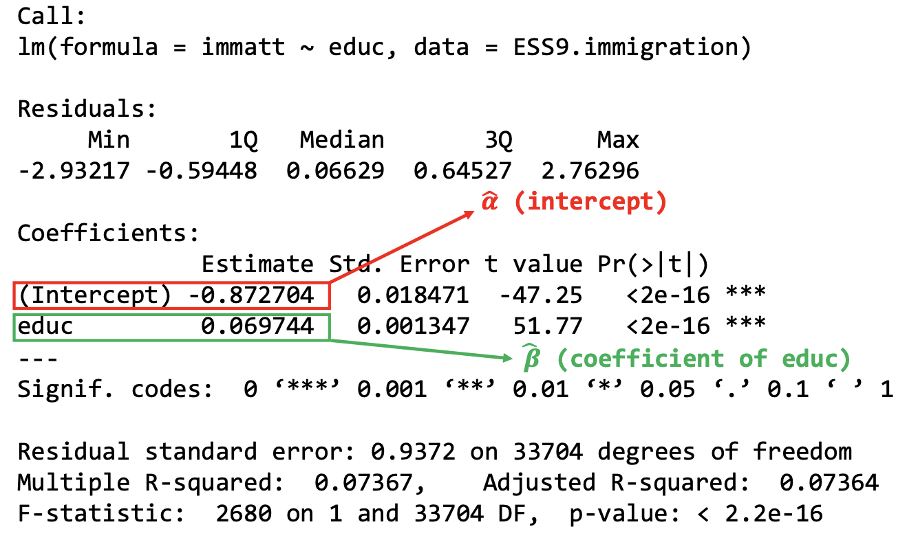
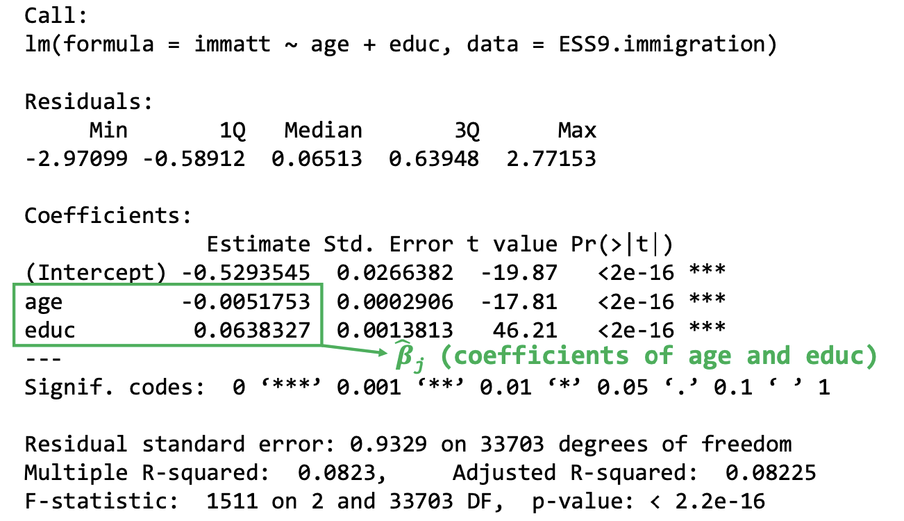
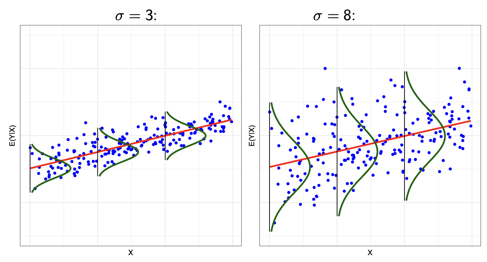
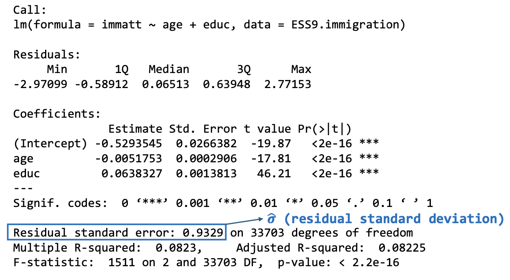
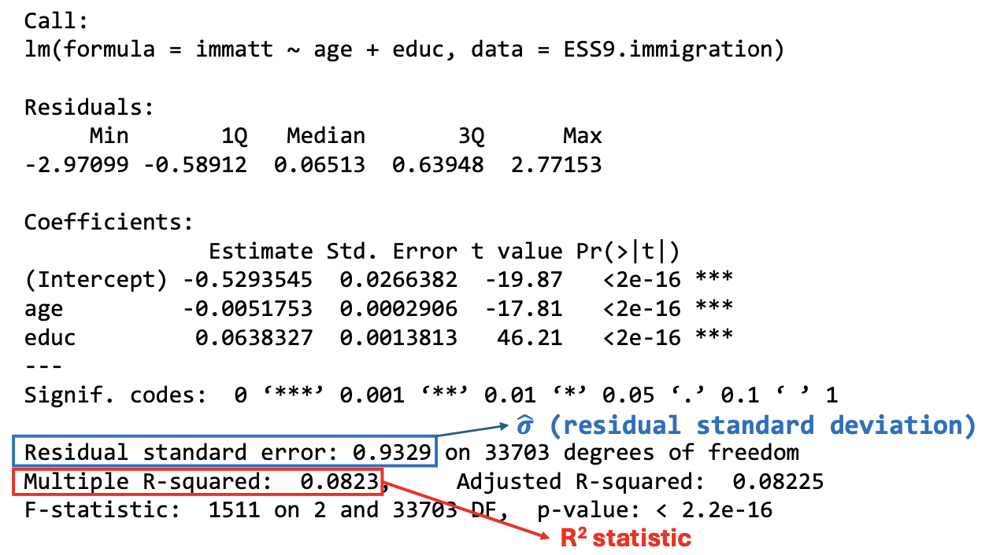
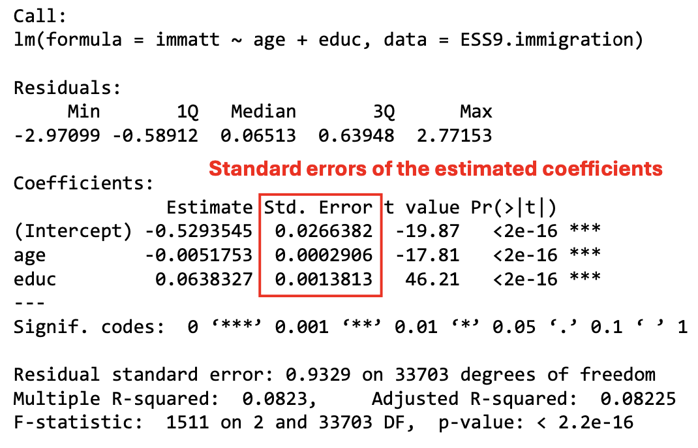
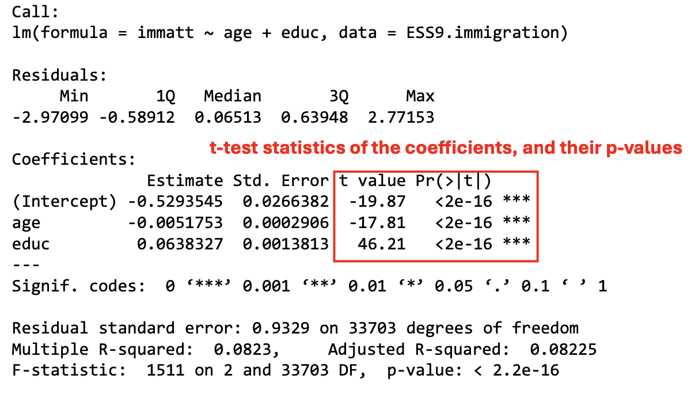

```{r setup, include=FALSE}
knitr::opts_chunk$set(echo = TRUE)
```

```{=html}
<style>
  body .main-container {
    max-width: 1100px;
    font-size: 12pt;
  }
</style>
```
[MY452A Homepage](https://kevinli03.github.io/notes/#MY452A_Regression_Analysis)

Week 2, MY452A Applied Regression Analysis

-   Title: Linear Regression I: Basic Elements

-   Topics:

-   Readings:

    1.  Section 3.4, 4.1-4.5, Kuha, J., and Lauderdale, B. (No date) *Applied Regression Analysis: Coursepack*

    2.  Chapters 6-7, Gelman et al (2022) *Regression and Other Stories*

    3.  Section 8.1, 10.1-10.2, Gelman et al (2022) *Regression and Other Stories*

<br />

------------------------------------------------------------------------

[MY452A Homepage](https://kevinli03.github.io/notes/#MY452A_Regression_Analysis)

# Key Points

The [**linear regression model**]{.underline} shows the process that generated the values of $Y$ - or more specifically, the conditional distribution of $Y_i$ given $X_i$

The expected value (mean) of the conditional distribution is our model:

$$
E(Y_i | X_i) = \alpha + \beta_1 X_{1i} + ... + \beta_k X_{ki}
$$

With a conditional variance $Var(Y_i|X_i) = \sigma^2$. The parameters of the model are $\overrightarrow{\beta} = (\alpha, \beta_1, ..., \beta_k)$

<br />

An alternative way of writing the model is, when regarding a specific point $Y_i$ in the data:

$$
Y_i = \alpha + \beta_1 X_{1i} + ... + \beta_k X_{ki} + \epsilon_i
$$

-   Where $\epsilon_i$ is the error term function - that determines the error for each point. It is normally distributed given $\epsilon_i \sim N(0, \sigma^2)$

<br />

[**Interpretation of the coefficients**]{.underline} is as follows:

-   In a simple linear regression $\beta$ is the expected change in $Y$, corresponding to a one unit increase in $X$

-   In a multiple linear regression, $\beta_k$ is the expected change in $Y$, corresponding to a one unit increase in $X_k$, controlling for other explanatory variables in the model.

-   In all linear regressions, when all explanatory variables $X$ are 0, the expected value of $Y$ is $\alpha$

-   The Residual standard deviation describes the variance of the error term is (how spread out the distribution of $Y$ is given $X$).

<br />

[**Estimation**]{.underline} of the parameters is as follows:

-   Let $\tilde{\beta} = (\tilde{\alpha}, \tilde{\beta}_1, ... \tilde{\beta}_k)$ be a bunch of proposed values of the coefficients that we want to. test

-   Thus, our prediction line with these proposed values is: $\hat{Y}_i (\tilde{\beta}) = \tilde{\alpha} + \tilde{\beta}_1 X_{1i} + ... + \tilde{\beta}_k X_{ki}$

-   The residuals $e_i$ of our model using the proposed coefficient values is the actual data value of $Y$ minus our predicted $Y$ as follows: $e_i(\tilde{\beta}) = Y_i - \hat{Y}_i(\tilde{\beta})$

-   The sum of squared errors SSE is all residuals for each observation squared, then all of the squares summed: $SSE(\tilde{\beta}) = \sum Y_i - \hat{Y}_i(\tilde{\beta})$

We want to find the proposed coefficients $\tilde{\beta}$ that [minimise the sum of squared errors]{.underline}. OLS estimates this - you can find it through calculus for a simple linear regression.

<br />

The total sample variation in $Y$ can be summarised by the [**total sum of squares**]{.underline}

$$
TSS = \sum(Y_i - \bar{Y})^2 = (n-1)s^2_y
$$

where $s^2_y$ is the sample variance of $Y_i$

<br />

[**R-squared**]{.underline} is a measure of the size of residual variance $\hat{\sigma}^2$, relative to the overall variance $s^2_y$ of $Y$

$$
R^2 = \frac{SSM}{TSS} = \frac{\sum(\hat{Y}_i - \bar{Y})^2}{\sum(Y_i - \bar{Y})^2}
$$

It is interpreted as the proportion of total variation in $Y$ that can be accounted for (or explained) by the explanatory variables $\overrightarrow{X}$ in the model.

<br />

A [**confidence interval**]{.underline} for $\beta_j$ with confidence level $1 - \alpha$ is:

$$
\hat{\beta}_j ± t^{n-k-1}_{1-\alpha/2} \times \hat{se}(\hat{\beta}_j)
$$

The $t$ represents the t-distribution statistic - with the higher script indicating degrees of freedom, and bottom representing the confidence interval. $\alpha$ is the significance level.

<br />

To carry out the [**hypothesis test**]{.underline}, we need a t-test statistic:

$$
t = \frac{\hat{\beta}_j}{\hat{se}(\hat{\beta}_j)}
$$

Then, we use a table to find the [**p-value**]{.underline} that is associated with a t-statistic and its [**degrees of freedom**]{.underline} $n-k-1$

<br />

------------------------------------------------------------------------

[MY452A Homepage](https://kevinli03.github.io/notes/#MY452A_Regression_Analysis)

# Linear Model

### Specification

Suppose we have observed data on the response variable $Y$, and a number of $X$ for $n$ number of observations. We will have many pairs of $(X_i, Y_i)$ observations

-   Example, we have 33,706 individual responses to $Y$ attitudes towards immigration, and $X$ explanatory variables

<br />

The regression model shows the process that generated the values of $Y$ - or more specifically, the conditional distribution of $Y_i$ given $X_i$

The expected value (mean) of the conditional distribution is our model:

$$
E(Y_i | X_i) = \alpha + \beta_1 X_{1i} + ... + \beta_k X_{ki}
$$

-   With a conditional variance $Var(Y_i|X_i) = \sigma^2$

-   $Y_i$ given $X_i$ distribution follows a normal distirbution

The parameters of the model are $\overrightarrow{\beta} = (\alpha, \beta_1, ..., \beta_k)$

<br />

An alternative way of writing the model is, when regarding a specific point $Y_i$ in the data:

$$
Y_i = \alpha + \beta_1 X_{1i} + ... + \beta_k X_{ki} + \epsilon_i
$$

-   Where $\epsilon_i$ is the error term function - that determines the error for each point. It is normally distributed given $\epsilon_i \sim N(0, \sigma^2)$

-   Basically, this distribution of $\epsilon_i$ is reflected in the earlier model by the distribution of $Y_i|X_i$

This way of writing showcases that the model consists of 2 parts: the systemic part (our linear line), and the random part (the error)

<br />

### Assumptions

Another way of talking about the specifications is that, the model is a model - it is not reality itself

-   The observations of $Y$ aren't exactly produced as we specified them

The model is an approximation of the real world. Thus, this means that there are simplifying assumptions made:

1.  The model for the mean $E(Y_i|X_i)$ is reasonably specified (basically choosing the right $X$ variables to include)
2.  $Var(Y_i|X_i) = \sigma^2$, which means that the conditional variance of $Y$ (or the error term $\epsilon$ does not depend on any $X$. This is known as the assumption of homoscedasticity
    -   Basically, errors don't change in spread based on $X$, they are similar across all $X$
3.  Distribution of $Y_i$ given any $\overrightarrow{X}_i$ is normally distributed (i.e., the errors $\epsilon_i$ are normally distributed).
4.  Observations $i$ are statistically independent of each other

<br />

### Estimation of Parameters

We have the parameters $\overrightarrow{\beta}$ and $\sigma^2$ that need to be estimated for our model, based on our data.

-   This gives us the estimates (with a hat):

-   These are also used to obtain the tools of statistical inference - standard errors, confidence intervals, and significance tests

We will go into this in detail later in the lecture.

<br />

Once we have found the estimates of the coefficients, we can calculate fitted values (predicted values) of $Y$:

$$
\hat{Y} = \hat{\alpha} + \hat{\beta}_1 X_{1i} + ... + \hat{\beta}_k X_{ki}
$$

-   This allows us to predict new values of $Y$, given some values of $X$. If our goal is prediction, then $\hat{Y}$ is what we are concerned with.

<br />

------------------------------------------------------------------------

[MY452A Homepage](https://kevinli03.github.io/notes/#MY452A_Regression_Analysis)

# Interpretation

### Simple Linear Regression $\beta$

Simple linear regression is a special case of the linear model, when there is only one explanatory variable $X$. It takes the following form:

$$
Y = \alpha + \beta X + \epsilon
$$

This is a linear line, in the form of $y=mx+b$

<br />

$\beta$ is the slope of the linear model. Essentially, as $X$ increases by 1 unit, predicted $\hat{Y}$ increases by $\beta$ units

-   [More formally, $\beta$ is the expected change in $Y$, corresponding to a one unit increase in $X$]{.underline}

-   Positive $\beta$ means positive relationship, negative $\beta$ means negative relationship, $\beta = 0$ means no relationship

-   We can prove $\beta=0$ means no relationship, as $\beta=0$ just "deletes" the $X$ in our model (by multiplying by 0)

In terms of regression modelling, $\beta$ gives the difference in conditional expected values of $Y$, between units of analysis which differ by 1 unit of $X$

-   Basically, the same idea as slope, but instead regarding the expected values of $E(Y_i|X_i)$

We will expand on this in week 4.

<br />

Regression output takes the following form, with estimated $\hat{\alpha}$ and $\hat{\beta}$ highlighted

{width="90%"}

<br />

We can vary the way we interpretation of $\hat{\beta}$

-   In some scenarios, a one unit change in $X$ doesn't mean much. Sometimes, we want to use maybe 10 units, or 20 units, etc.

-   Luckily for us, a $A$-unit increase in $X$, is associated with a $A \times \hat{\beta}$-unit expected change in $Y$, for any number $A$

-   Basically, just multiply both the unit change and $\hat{\beta}$ by the same number

<br />

### Multiple Linear Regression $\beta$

A multiple linear regression have multiple $X$'s. Now, our regression is no longer just a linear line, as things are now in multiple dimensions. The number of $X$ variables we have, $k$, we will have $k+1$ number of dimensions.

Now, how does this affect our interpretation of all the individual $\beta$'s $\beta_1, ..., \beta_k$?

-   The way to do this is to only look at one $\beta$ at a time - holding other $X$ constant

<br />

For example, take this multiple linear regression

$$
E(Y_i | X_i) = \alpha + \beta_1 X_{1i} + ... + \beta_k X_{ki}
$$

How would we interpret $\beta_k$?

-   We hold all $\beta_1 X_1, ... \beta_{k-1}X_{k-1}$ constant

-   [Then, $\beta_k$ is the expected change in $Y$, corresponding to a one unit increase in $X_k$, controlling for other explanatory variables in the model]{.underline}.

<br />

For example, take this regression output with 2 explanatory variables:

{width="90%"}

<br />

### Interpretation of Intercept $\alpha$

In a linear regression model

$$
E(Y_i | X_i) = \alpha + \beta_1 X_{1i} + ... + \beta_k X_{ki}
$$

-   If every one of $X_1, ..., X_k$ are all equal to 0, this gives $E(Y|X) = \alpha$

-   Essentially, when all explanatory variables $X$ are 0, the expected value of $Y$ is $\alpha$

This is typically not very interesting for interpretation

-   For example, if our explanatory variable "age" is 0, then it tells us the predicted attitudes towards immigration for 0 year olds. That isn't very useful

However, $\alpha$ is still an essential part of the model, even if we don't interpret it.

<br />

### Residual Standard Deviation $\hat{\sigma}$

Recall the way we can write a regression model:

$$
Y_i = \alpha + \beta_1 X_{1i} + ... + \beta_k X_{ki} + \epsilon_i
$$

Now, not all people with some $X$ have the same $Y$. For example, not every 20 year old has the same exact opinion of $Y$.

Thus, the error term $\epsilon_1$ describes how much they vary - the distribution of $Y$ values given $X$ values.

-   We know that $\epsilon_i \sim N(0, \sigma^2)$

The Residual standard deviation describes the variance of the error term is (how spread out the distribution of $Y$ is given $X$).

-   Larger values mean that the observed values of $Y$ are more widely scattered around $E(Y|X)$. Smaller means the opposite

-   We put a hat $\hat{\sigma}$ on this, as it is the residual standard deviation of our estimated model

-   Regression assumes that $\hat{\sigma}$ is consistent, no matter the value of $X$. This is the assumption of homoscedasticity. If this is not the case, we need to do something else (see lecture 4).

<br />

Take this figure below, where residual standard deviation is shown at 3 different points on a line.

{width="100%"}

<br />

On a regression output, residual standard deviation is found here:

{width="90%"}

<br />

------------------------------------------------------------------------

[MY452A Homepage](https://kevinli03.github.io/notes/#MY452A_Regression_Analysis)

# Estimation Process

### Fitting a Linear Model

Fitting a model means finding the parameters $\overrightarrow{\beta} = (\alpha, \beta_1, ... \beta_k)$ to make our model a best fit of the data.

-   We do this by using observed data $(Y_i, \overrightarrow{X}_i)$ for $i = 1,...,n$, and try to estimate our parameters that best fit these.

Linear Regression is generally estimated using the method of ordinary least squares estimation.

-   OLS tries to find parameters that minimise the sum of the squared errors SSE

<br />

The estimation process is as follows:

-   Let $\tilde{\beta} = (\tilde{\alpha}, \tilde{\beta}_1, ... \tilde{\beta}_k)$ be a bunch of proposed values of the coefficients that we want to. test

-   Thus, our prediction line with these proposed values is: $\hat{Y}_i (\tilde{\beta}) = \tilde{\alpha} + \tilde{\beta}_1 X_{1i} + ... + \tilde{\beta}_k X_{ki}$

-   The residuals $e_i$ of our model using the proposed coefficient values is the actual data value of $Y$ minus our predicted $Y$ as follows: $e_i(\tilde{\beta}) = Y_i - \hat{Y}_i(\tilde{\beta})$

-   The sum of squared errors SSE is all residuals for each observation squared, then all of the squares summed: $SSE(\tilde{\beta}) = \sum Y_i - \hat{Y}_i(\tilde{\beta})$

<br />

We want to find the proposed coefficients $\tilde{\beta}$ that minimise the sum of squared errors. OLS estimates this - you can find it through calculus for a simple linear regression.

-   For multiple linear regression it is nearly impossible to do by hand, but simple for computers

<br />

### Residual Standard Deviation $\sigma$

The most commonly used estimate of the residual variance $\sigma^2$ is as follows:

$$
\hat{\sigma}^2 = \frac{\sum(Y_i - \hat{Y}_i)^2}{n-k-1}
$$

And the standard deviation $\sigma$ is simply the square root of that.

<br />

------------------------------------------------------------------------

[MY452A Homepage](https://kevinli03.github.io/notes/#MY452A_Regression_Analysis)

# More Summary Values

### Sum of Squares

The total sample variation in $Y$ can be summarised by the total sum of squares

$$
TSS = \sum(Y_i - \bar{Y})^2 = (n-1)s^2_y
$$

where $s^2_y$ is the sample variance of $Y_i$

<br />

We can also split it up into two sections:

$$
\sum(Y_i - \bar{Y})^2 = \sum(\hat{Y}_i - \bar{Y})^2 + \sum(Y_i - \hat{Y}_1)^2
$$

$$
TSS = SSM + SSE
$$

Where TSS is the total sum of squares, SSM is the model sum of squares, and SSE is the sum of squared errors (as we looked at earlier).

-   SSM (model sum of squares) represents the part the model explained

-   SSE represents the part the model failed to explain (error)

<br />

### $R^2$ Statistic

R-squared is a measure of the size of residual variance $\hat{\sigma}^2$, relative to the overall variance $s^2_y$ of $Y$

$$
R^2 = \frac{TSS-SSE}{TSS} = 1-\frac{SSE}{TSS} \approx 1 - \frac{\hat{\sigma}^2}{s^2_y}
$$

$$
R^2 = \frac{SSM}{TSS} = \frac{\sum(\hat{Y}_i - \bar{Y})^2}{\sum(Y_i - \bar{Y})^2}
$$

<br />

It is interpreted as the proportion of total variation in $Y$ that can be accounted for (or explained) by the explanatory variables $\overrightarrow{X}$ in the model.

-   $R^2$ is always between 0 and 1 (or 0% and 100%)

-   Larger values of $R^2$ indicate that the explanatory variables make more of a difference

-   R-squared is useful, but not as important as some people make it out to be. A model with high R-squared is not necessarily good, and a model with a small amount is not necessarily bad. It depends on the goal.

For simple linear regression, $R^2 = r^2$, where small $r$ is the correlation coefficient

<br />

R-Squared output in R linear regression is as follows:

{width="90%"}

<br />

------------------------------------------------------------------------

[MY452A Homepage](https://kevinli03.github.io/notes/#MY452A_Regression_Analysis)

# Hypothesis Testing

### Statistical Inference

Statistical inference is used to infer something about the values of the parameters in some population of interest, given information obtained from our sample data

-   In regression, we focus on $\beta_j$, rather than any other parameters

We will explore in more detail, what population means in week 4.

<br />

### Standard Errors of Coefficients

The estimated standard errors $\hat{se}(\hat{\beta}_j)$, which exist for every parameter $\hat{\beta}_j$ is a measure of how precisely a coefficient $\beta_j$ has been estimated from our sample data

-   Smaller standard errors indicate more precise estimates

-   Standard errors are smaller when $\hat{\sigma}^2$ is small, or $n$ is large

The standard errors alone are not that interesting, they are a tool for the next steps of statistical inference.

<br />

In R, the standard error of each coefficient is shown here:

{width="90%"}

<br />

### Confidence Intervals

A confidence interval for a $\beta_j$ parameter, is an interval of values that are also plausible for being a estimate of the true value of the parameter $\beta_j$

-   We have an estimate $\hat{\beta}_j$ of $\beta_j$, but there are other plausible values nearby $\hat{\beta}_j$ that might also be plausible values of $\beta_j$ in the population

<br />

A confidence interval for $\beta_j$ with confidence level $1 - \alpha$ is:

$$
\hat{\beta}_j ± t^{n-k-1}_{1-\alpha/2} \times \hat{se}(\hat{\beta}_j)
$$

The $t$ represents the t-distribution statistic - with the higher script indicating degrees of freedom, and bottom representing the confidence interval. $\alpha$ is the significance level.

<br />

In an exam, you can use the 95% confidence interval based on a standard normal distribution. Thus, just use 1.96.

$$
\hat{\beta}_j ≠ 1.96 \times \hat{se}(\hat{\beta}_j)
$$

<br />

### Significance Testing

The null hypothesis $H_0$ we use is that $\beta_j = 0$.

-   Basically, no association between the explanatory variable $X_j$ and $Y$

Our alternate hypothesis $H_a$, the one we are interested in showing, is that $\beta_j ≠ 0$

-   Basically, there is an association between the explanatory variable $X_j$ and $Y$

<br />

To carry out the test of our hypothesis, we need a t-test statistic:

$$
t = \frac{\hat{\beta}_j}{\hat{se}(\hat{\beta}_j)}
$$

Basically, our predicted coefficient value, in terms of its standard errors

Under the assumptions of the linear regression model, the sampling distribution of $t$ under $H_0$ is a $t$-distribution with $n-k-1$ degrees of freedom

-   Basically, if $H_0$ is true (as we assume until we prove otherwise), the distribution of $t$ will be in a $t$-distribution with the parameter $n-k-1$ degrees of freedom

-   The $p$-value of the test is the probability that a variable from the $t$ distribution is at least as far from 0 as the observed value of $t$

    -   Basically, $t$-test statistic is how far we are from the centre of the $t$ distribution, and the $p$-value calculates the probability of a $t$ value being that high/low given a $t$ probability distribution

The p-value and confidence interval, given same level of confidence $\alpha$, will give the same conclusions.

<br />

In R, the t-value and the p-value are show here:

{width="90%"}

<br />

------------------------------------------------------------------------

[MY452A Homepage](https://kevinli03.github.io/notes/#MY452A_Regression_Analysis)
