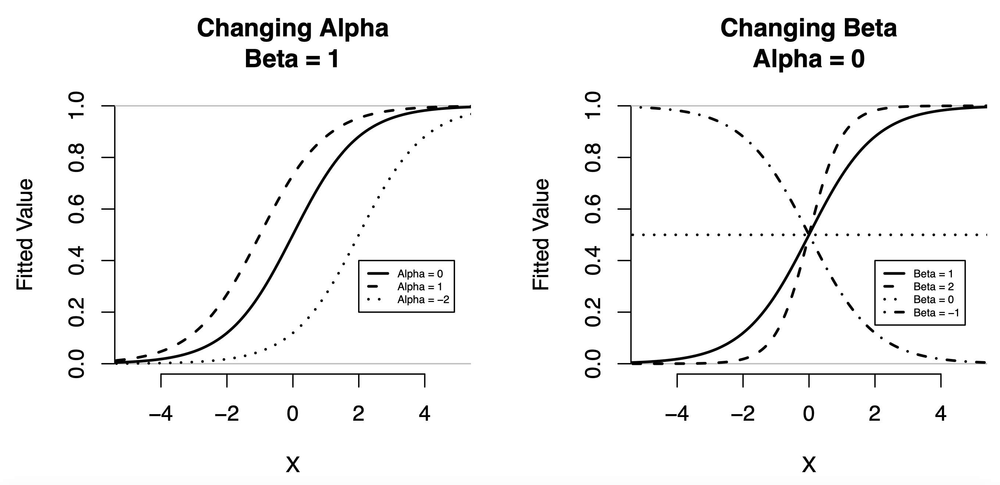
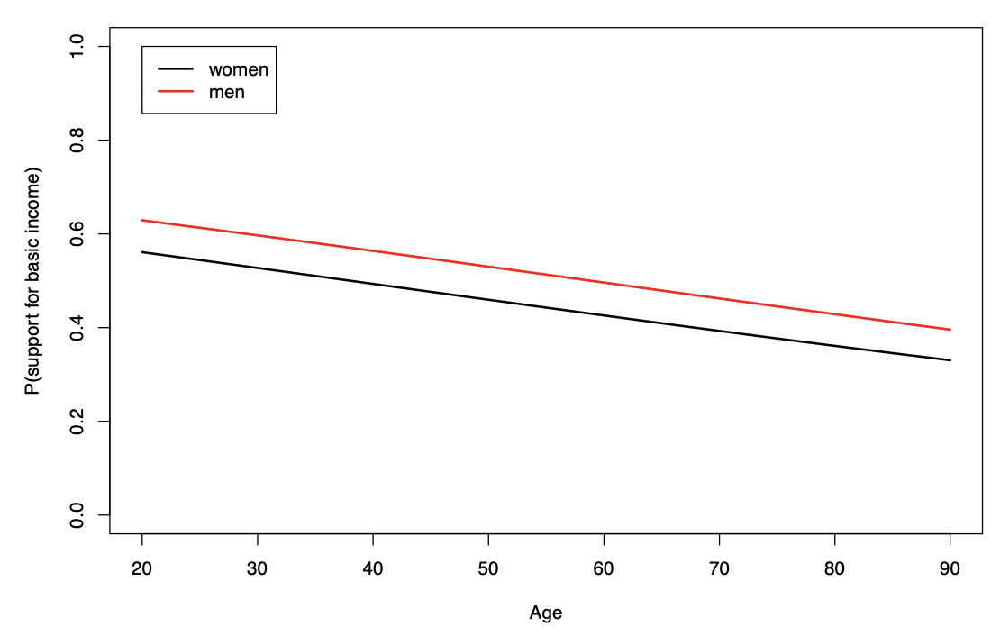

```{r setup, include=FALSE}
knitr::opts_chunk$set(echo = TRUE)
```

```{=html}
<style>
  body .main-container {
    max-width: 1100px;
    font-size: 12pt;
  }
</style>
```
[MY452A Homepage](https://kevinli03.github.io/notes/#MY452A_Regression_Analysis)

**Week 7, MY452A Applied Regression Analysis**

-   Title: Binary Logistic Regression I: Definition and Interpretation

-   Topics:

-   Readings:

<br />

------------------------------------------------------------------------

[MY452A Homepage](https://kevinli03.github.io/notes/#MY452A_Regression_Analysis)

# Key Points

Given $Pr(Y_i = 1) = \pi_i$, the [**logistic model**]{.underline} takes the form of:

$$
log \left( \frac{\pi_i}{1 - \pi_i} \right) = \alpha + \beta_1 X_{1i} + ... + \beta_k X_{ki}
$$

Where $\alpha$ is the intercept, $\beta_1, ..., \beta_k$ are the regression coefficients, and these must be estimated from the data.

<br />

Obviously for prediction tasks, we are interested in $\pi_i$, the probability unit $i$ is in $Y=1$. Thus, we can isolate $\pi_i$ as follows:

$$
log \left( \frac{\pi_i}{1 - \pi_i} \right) = \alpha + \beta_1 X_{1i} + ... + \beta_k X_{ki}
$$

Take exponential of both sides:

$$
\frac{\pi_i}{1 - \pi_i} = e^{(\alpha + \beta_1 X_{1i} + ... + \beta_k X_{ki})}
$$

Solving for $\pi_i$, we get:

$$
\pi_i = \frac{e^{(\alpha + \beta_1 X_{1i} + ... + \beta_k X_{ki})}}{1 + e^{(\alpha + \beta_1 X_{1i} + ... + \beta_k X_{ki})}}
$$

<br />

The [**odds**]{.underline} is the probabilities of the event and the non-event - so probability of $Y=1$ divided by probability of $Y = 0$:

$$
\text{odds} = \frac{\pi_i}{1 - \pi}
$$

The [**odds ratio**]{.underline} is the ratio of two odds, given two different explanatory values of an explanatory variable. Let us say $\text{odds}_i$ when $X=1$, and $\text{odds}_0$ is the odds when $X=0$:

$$
OR_{1,0} = \frac{\text{odds}_1}{\text{odds}_0} = \frac{\pi_1 / (1-\pi_1)}{\pi_0 / (1- \pi_0)}
$$

<br />

We can calculate odds ratios by first, estimating $\beta$, then do $e^{\beta}$.

So [**interpretation**]{.underline} is: If a one unit increase in $X$, is associated with a $e^{\beta}$ multiplicative increase in the odds of getting category $Y=1$.

-   So, when $e^\beta > 1$, then a one unit increase in $X$ is associated with a $(e^\beta - 1) \times 100$ percent increase in the odds of a unit being in category $Y=1$

    -   For example, if $OR = 1.28$, a one unit increase in $X$ is associated with a 28% increase in the odds of a unit being in category $Y=1$.

-   When $e^\beta < 1$, then a one unit increase in $X$ is associated with a $1-e^\beta)\times 100$ percent decrease in the odds of a unit being in category $Y=1$.

    -   For example, if $OR = 0.7$, a one unit increase in $X$ is associated with a 30% decrease in the odds of a unit being in category $Y=1$.

-   When $e^\beta = 1$, then a one unit increase in $X$ is associated with no change in the odds of a unit being in category $Y$.

<br />

------------------------------------------------------------------------

[MY452A Homepage](https://kevinli03.github.io/notes/#MY452A_Regression_Analysis)

# **Binary Response Variables**

### Introduction

In the first half of the course, we focused on linear regression, which is used for usually continuous $Y$ variables.

-   However, not all varaibles are continuous (or roughly continuous)

-   There are binary and categorical (a variable with a finite set of distinct values).

With these non-continuous variables, linear regression may produce nonsensical results. Thus, we need new models to deal with this.

<br />

**Binary** (or dummy, dichotomous) variables have two possible values (categories).

-   These categories are generally coded as category 0 and category 1.

-   You can notate either category as 0 or 1, but for some variables (like gender), there are norms.

<br />

Examples of binary response variables include:

-   Yes/no questions in surveys: agree/disagree with some view, do/don't do some activity

-   Politics: vote or abstain

-   Medicine: have/do not have an illness

-   Education: correct/incorrect answer, pass/fail

<br />

### Proportions and Probabilities

For binary response variables, we will be interested in the proportion of the units in the population that are a part of category $Y = 1$

We can also think of this as the probability $\pi$ that a randomly selected member of the population will have the value $Y=1$.

-   $\pi = Pr(Y = 1)$

-   $1 - \pi = Pr(Y = 0)$

The possible values of $\pi$ are $\pi \in [0, 1]$. If $\pi = 0$, no unit in the population has $Y=1$. If $\pi = 1$, all units in the population have $Y = 1$.

-   Why? Axioms of probability

<br />

### Bernoulli Distribution

In linear regression $Y$ is often assumed to be normally distributed.

-   This is especially the case for hypothesis testing

In a binary variable $Y$, the variable $Y$ now takes a Bernoulli distribution.

-   Bernoulli is a special case of the binomial distribution. It only has one parameter, expected value (no variance parameter like normal distribution).

-   The expected value of Bernoulli distribution $\mathbb{E} [Y] = \pi$

-   The variance of the Bernoulli distribution $Var[Y] = \pi (1 - \pi)$

We can calculate $\pi=\mathbb{E}[Y]$ for $Y$ by simply finding the mean of the variable.

-   Or, we can take the number of $Y=1$ observations divided by the total number of observations in $Y$.

<br />

However, $\mathbb{E}[Y]$ is not a regression. We want to see how the expected value varies with a change in explanatory variable $X$, in other words $\mathbb{E}[Y|X]$ or $\pi(X)$.

<br />

### Issues with Linear Regression

If $\pi = \mathbb{E}[Y]$, why can't we use linear regression, which is just $\mathbb{E}[Y|X]$?

Linear regression has a few issues for probabilities:

1.  Linear regression often outputs impossible probabilities above 1 and below 0. This is because the linear model, by definition, goes to $±∞$. But we know probabilities cannot exceed 1 and 0.
2.  Assumptions of normality cannot be satisfied for a binary $Y$
3.  Assumption of homoscedasticity cannot be satisfied, this that assumption says $Var(Y|X)$ is constant no matter $X$, however we know with binary $Y$, $Var[[Y] = \pi (1 - \pi)$, so if $\pi$ changes with $X$, the variance cannot be fixed.

To avoid these problems, we will now switch to a binary logistic model.

<br />

------------------------------------------------------------------------

[MY452A Homepage](https://kevinli03.github.io/notes/#MY452A_Regression_Analysis)

# **Logistic Regression Model**

### Binary Logistic Model

We have data $(Y_i, X_{1i} ... , X_{ki})$ for observations $i = 1,...,n$

-   Where $Y$ is a binary response variable, with values 0 or 1

-   $X_1, ..., X_k$ are $k$ explanatory variables.

-   Observations $Y_i$ are statistically independent of each other.

Given $Pr(Y_i = 1) = \pi_i$, the model takes the form of:

$$
log \left( \frac{\pi_i}{1 - \pi_i} \right) = \alpha + \beta_1 X_{1i} + ... + \beta_k X_{ki}
$$

Where $\alpha$ is the intercept, $\beta_1, ..., \beta_k$ are the regression coefficients, and these must be estimated from the data.

<br />

### Model for the Probabilities

Obviously for prediction tasks, we are interested in $\pi_i$, the probability unit $i$ is in $Y=1$. Thus, we can isolate $\pi_i$ as follows:

$$
log \left( \frac{\pi_i}{1 - \pi_i} \right) = \alpha + \beta_1 X_{1i} + ... + \beta_k X_{ki}
$$

Take exponential of both sides:

$$
\frac{\pi_i}{1 - \pi_i} = e^{(\alpha + \beta_1 X_{1i} + ... + \beta_k X_{ki})}
$$

Solving for $\pi_i$, we get:

$$
\pi_i = \frac{e^{(\alpha + \beta_1 X_{1i} + ... + \beta_k X_{ki})}}{1 + e^{(\alpha + \beta_1 X_{1i} + ... + \beta_k X_{ki})}}
$$

This implies a few things:

-   The equation will never produce any $\pi_i$ higher than 1 or lower than 0.

<br />

### Logistic Curves

As we can see below, the probabilities will never exceed 0 or 1.

{width="80%"}

<br />

------------------------------------------------------------------------

[MY452A Homepage](https://kevinli03.github.io/notes/#MY452A_Regression_Analysis)

# **Interpretation of Parameters**

### Qualitative Interpretation

The intercept $\alpha$ moves the fitted probabilities up and down.

-   WHen $\alpha$ is higher, fitted probabilities shift upward

-   When $\alpha$ is lower, fitted probabilities shift downward.

Coefficient $\beta$ decribes the association between $X$ and $\pi$:

-   When $\beta>0$, increasing $X$ gives larger $\pi$. In other words, higher $X$ is associated with higher $\Pr(Y=1)$.

-   When $\beta < 0$, increase $X$ gives smaller $\pi$. In other words, higher $X$ is associated with lower $\Pr(Y=0)$.

-   The larger $| \beta |$ is, the stronger the relationship (steeper the logistic curve is).

-   When $\beta = 0$, there is no relationship at all between $X$ and $\pi$.

<br />

### Odds Ratio

Remember our model from earlier:

$$
log \left( \frac{\pi_i}{1 - \pi_i} \right) = \alpha + \beta_1 X_{1i} + ... + \beta_k X_{ki}
$$

The output of $\beta$ in our model is hard to interpret. It technically means that increasing $X$ by one increases $log \left( \frac{\pi_i}{1 - \pi_i} \right)$ by $\beta$. But that does not mean anything useful for us.

<br />

We can instead interpret things in regard to odds. The odds is the probabilities of the event and the non-event - so probability of $Y=1$ divided by probability of $Y = 0$:

$$
\text{odds} = \frac{\pi_i}{1 - \pi}
$$

When solving for the odds from our model, we get:

$$
\frac{\pi_i}{1 - \pi_i} = e^{(\alpha + \beta_1 X_{1i} + ... + \beta_k X_{ki})}
$$

<br />

The **odds ratio** is the ratio of two odds, given two different explanatory values of an explantory variable. Let us say $\text{odds}_i$ when $X=1$, and $\text{odds}_0$ is the odds when $X=0$:

$$
OR_{1,0} = \frac{\text{odds}_1}{\text{odds}_0} = \frac{\pi_1 / (1-\pi_1)}{\pi_0 / (1- \pi_0)}
$$

The odds ratio is a measure of association between $Y$ and the $X$ which is varied in the comparison:

-   If $OR = 1$, there is no association - this is because that means $\text{odds}_1 = \text{odds}_0$, so changing $X$ had no effect on the odds.

-   If $OR > 1$, then that means $\text{odds}_1 > \text{odds}_0$, thus increasing $X$ increased the odds of outcome $Pr(Y=1)$.

-   If $OR < 1$, then that means $\text{odds}_1 < \text{odds}_0$, thus increasing $X$ decreased the odds of outcome $Pr(Y=1)$.

This also means, that going from $\text{odds}_0$ to $\text{odds}_1$, you have to multiply by the odds ratio $OR$. That means $OR$ represents the percent change between the odds.

<br />

### Interpreting Odds Ratios

We can calculate odds ratios by first, estimating $\beta$, then do $e^{\beta}$.

So interpretation is: If a one unit increase in $X$, is associated with a $e^{\beta}$ multiplicative increase in the odds of getting category $Y=1$.

-   So, when $e^\beta > 1$, then a one unit increase in $X$ is associated with a $(e^\beta - 1) \times 100$ percent increase in the odds of a unit being in category $Y=1$

    -   For example, if $OR = 1.28$, a one unit increase in $X$ is associated with a 28% increase in the odds of a unit being in category $Y=1$.

-   When $e^\beta < 1$, then a one unit increase in $X$ is associated with a $1-e^\beta)\times 100$ percent decrease in the odds of a unit being in category $Y=1$.

    -   For example, if $OR = 0.7$, a one unit increase in $X$ is associated with a 30% decrease in the odds of a unit being in category $Y=1$.

-   When $e^\beta = 1$, then a one unit increase in $X$ is associated with no change in the odds of a unit being in category $Y$.

<br />

------------------------------------------------------------------------

[MY452A Homepage](https://kevinli03.github.io/notes/#MY452A_Regression_Analysis)

# **Fitted Probabilities**

### Probabilities

The coefficients $\beta$ give a interpretation of the relationship between $X$ and $\pi$.

However, we can also be interested in the actual probabilities $\pi_i$ being output for each unit $i$.

-   For example, $X$ is age and $Y$ is vote for brexit, it would be interesting to see the probability a 20 year old votes for brexit, compared to probability a 60 year old votes for brexit.

<br />

To calculate fitted probabilities, we just plug things into the model in regards to $\pi_i$, after we have estimated the coefficients $\alpha$, $\beta_1, ..., \beta_k$:

$$
\hat{\pi}_i = \frac{e^{(\hat{\alpha} + \hat{\beta}_1 X_{1i} + ... + \hat{\beta}_k X_{ki})}}{1 + e^{(\hat{\alpha} + \hat{\beta}_1 X_{1i} + ... + \hat{\beta}_k X_{ki})}}
$$

<br />

### Interpretation

Note: no single number of probability can describe the effect of $X$ on $\pi$, since the fitted probability curve is not a straight line, so the rate of change i not smooth.

We can calculate fitted probabilities between groups/values of one explanatory variables (holding other explanatory variables constant), to illustrate the effect:

-   For example, if one variable is gender, and another is age, we can hold all other variables constant (by predicting with the mean of other variables), and plotting the fitted probabilities for females and males in respect to gender.

The figure illustrates this - holding all other variables except gender and age constant, and plot probabilities. This shows the difference between men and women.

{width="70%"}

<br />

### Marginal Fitted Probabilities

Average/Marginal Fitted Probabilities are another way to interpret the logsitic models.

Basically, what we do, is calculate the average fitted probabilties, when varying one $X$, and holding other $X$'s constant over multiple values of other $X$'s.

-   Or in other words, we vary one/two $X$

-   The other $X$'s we hold constant. But we do this multiple times at different values of $X$

-   Then we average out the effect of our $X$'s with the different values of $X$.

<br />

### Classification

If your goal is not the probabilities, but the actual values of $Y$, you will want to do classification.

-   So, our output is not probability $\hat{\pi}_i$, but either 0 or 1 for $\hat{Y}_i$.

So basically, we first calculate the probabilities in logit $\hat{\pi}_i$, then we assign observations to either $\hat{Y} = 0$ or $\hat{Y}=1$ based on the probabilities.

-   Typically, if $\hat{\pi}_i > 0.5$, then you assign to $\hat{Y}_i = 1$.

-   Although, you can alter this threshold depending on considerations with the application (example: are you scared of accidentally classifying to $Y = 1$, you might want to raise the threshold).

<br />
