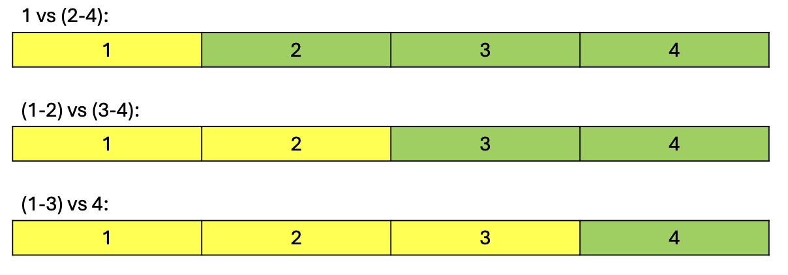
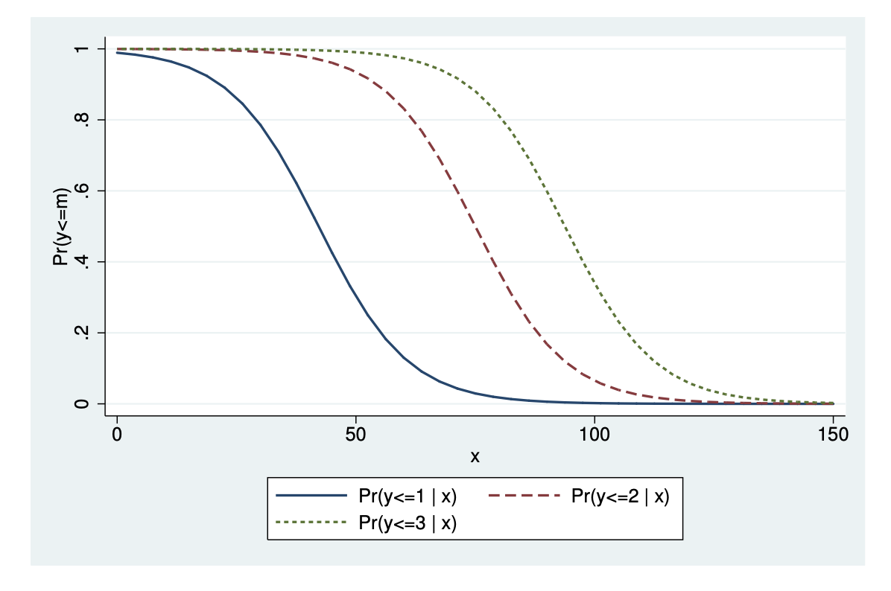
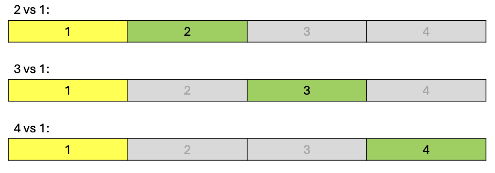

```{r setup, include=FALSE}
knitr::opts_chunk$set(echo = TRUE)
```

```{=html}
<style>
  body .main-container {
    max-width: 1100px;
    font-size: 12pt;
  }
</style>
```
[MY452A Homepage](https://kevinli03.github.io/notes/#MY452A_Regression_Analysis)

**Week 7, MY452A Applied Regression Analysis**

-   Title: Binary Logistic Regression I: Definition and Interpretation

-   Topics:

-   Readings:

<br />

------------------------------------------------------------------------

[MY452A Homepage](https://kevinli03.github.io/notes/#MY452A_Regression_Analysis)

# Key Points

<br />

------------------------------------------------------------------------

[MY452A Homepage](https://kevinli03.github.io/notes/#MY452A_Regression_Analysis)

# **Polytomous Response Variables**

### Introduction

Polytomous response variables are categorical variables with more than 2 categories

-   Last week, we talked about binary variables.

-   Note: categorical variables are both discrete (set of seperate categories) and finite (limited amount of categories)

There are two possibilities with these models

-   Polytomous variable that can be ordered: Ordinal Logistic Regression

    -   For example, how much do you like the product on the scale of disagree, neutral, or agree.

-   Polytomous variable that has no order: Multinomial Logistic Regression

    -   For example, which category is $i$ in: USA, UK, China (unordered)

    -   For example, what type of car: petrol, electric, or methanol

<br />

### Polytomous Explanatory Variables

Suppose that our outcome variable $Y$ has $C$ possible values/categories, labelled as categories $1, 2, ..., C$.

-   In binary logistic, $C = 2$. For today $C > 2$.

The parameters of interests are the probabilities of being in each category:

$$
\pi^{(j)} = P(Y = j) \quad \text{for} \quad j = 1, ..., C
$$

Note, the probabilities of all categories sum to 1: $\sum\limits_{j=1}^C \pi ^{(j)} = 1$

-   Thus, if we know $C-1$ probabilities, we know all of them, since $\pi^{(c-1)} = 1 - \sum\limits_{i=1}^{C-1} \pi ^{(j)}$

The distribution for such variables is the multinomial distribution (instead of the binomial distribution for binary logistic).

These properties hold for both ordered and unordered $Y$.

-   The difference is that when the categories, the labelling of categories $j=1, ..., C$ is arbitrary (we can call any category any number)

-   In an ordinal case, it is assumed the categories are labelled in the correct order.

<br />

### Starting Point of the Models

We have data on observations $(Y_i, X_{1i}, ... , X_{ki})$ for $i = 1, ...,n$.

-   $Y$ is a categorical polytomous response variable with $C$ categories

-   The $X$'s are explanatory variables

-   Observations $Y_i$ are statistically independent.

The model is for the probabilities $\pi^{(j)} = P(Y = j)$ for each category $j=1, ..., c$.

<br />

Note: this is just an extension of the binary logistic model. If we collapse the number of categories to $C=2$, then both multinomial and ordinal logistic regressions become the same.

<br />

The modelling of multinomial and ordinal logistic regression are very very similar:

-   Model specification, interpretation of regression coefficients, use of fitted probabilities for interpretation.

Existing topics we have covered still work with these topics:

-   Estimation using maximum likelihood

-   Tools of inference: z-tests, likelihood ratio tests, confidence intervals

-   The different types of explanatory variables (binary, categorical, continuous, etc.)

<br />

Note: ordinal logistic model is the "least important" model in this course:

-   Why? You could just use a linear regression, and treat $Y$ as continuous. This is especially for larger ordinal regression models.

Note: Multinomial Logistic models are more useful

-   If your goal is prediction, multinomial logistic regression is better than any other one

-   However, multinomial is very tedious - many many coefficients. If you want coefficients, ordinal might be better.

<br />

------------------------------------------------------------------------

[MY452A Homepage](https://kevinli03.github.io/notes/#MY452A_Regression_Analysis)

# **Ordinal Logistic Models**

### Cumulative Probabilities

The ordinal logistic model considers a set of $C-1$ dichotomies/binaries, obtained from the original $C$ categories:

-   Basically, reduce to set of binaries (like we did for explanatory variables).

The dichotomies/binaries are (let us use $C=4$ as an example):

1.  Category 1 vs. Categories 2-4 (predicts probabilities of unit $i$ being in category 1)
2.  Categories 1-2 vs. Categories 3-4 (predicts probabilities of unit $i$ being in categories 1-2)
3.  Categories 1-3 vs. Category 4 (predicts probabilities of unit $i$ being in categories 1-3

Basically, it combines categories, and finds cumulative probabilities.

<br />

The figure below shows this (yellow is the probability the model is predicting):

{width="80%"}

<br />

As we discussed above, ordinary logistic regression is estimating the cumulative probabilities:

$$
\gamma^{(j)} = Pr(Y≤j) = \pi^{(1)} + ... \pi^{(j)}
$$

Or more simply, $\gamma^{(j)}$ is the probability of being in category $j$ and every category before it, compared to the rest of the categories.

So in the example above, the binaries are:

1.  A model of cumulative probability of all categories below 1 (just 1), $\gamma^{(1)}$
2.  A model of the cumulative probability of all categories below 2 (categories 1 and 2), $\gamma^{(2)}$
3.  A model of the cumulative probability of all categories below 3 (categories 1-3), $\gamma^{(3)}$

<br />

### Ordinal Logistic Regression Model

The model, as discussed above, is a set of $C-1$ binary logistic models (estimated simultaneously).

The model is specified as:

$$
\gamma^{(j)} = Pr(Y≤j) = \frac{e^{\alpha^{(j)}-(\beta_1X_1+...+\beta_kX_k)}}{1 + e^{\alpha^{(j)}-(\beta_1X_1+...+\beta_kX_k)}}
$$

The intercept terms will be different for each binary logistic model:

-   So, $\alpha^{(1)} ≤ \alpha^{(2)} ≤ .... < \alpha^{(C-1)}$

-   Why? Cumulative probabilities can only increase as you add more categories.

The coefficients $\beta_1, ..., \beta_k$ are the same for each different binary logistic model.

-   Thus, no matter $j$, the coefficients are the same

-   Thus, there is only one set of regression coefficients.

-   This assumption is known as **proportional odds**, which is also why it is called the proportional odds model.

This means that the curves for $\gamma^{(1)}, ..., \gamma^{(C-1)}$ are all "parallel" (since same coefficients, but different intercepts

{width="70%"}

<br />

### Individual Probabilities

Cumulative probabilities are useful, but obviously, we care about individual probabilities of each category as well.

We can calculate the probabilities as follows:

-   Category 1: $Pr(Y=1) = \gamma^{(1)}$

-   Category $j$: $Pr(Y=j) = \gamma^{(j)} - \gamma^{(j-1)}$. Basically, for a specific category $j$, find the difference between the cumulative probability of that category $j$, and subtract the cumulative probability of category $j-1$.

-   Category $C$ (the final category): $Pr(Y=C) = 1 - \gamma^{(C-1)}$

<br />

### Interpretations of Coefficients

Ordinal logistic model considers a set of $C-1$ number of dichotomies.

The coefficients are interpreted the same way as a normal binary logistic model:

-   So odds ratios is still $e^{\beta_j}$.

So basically, $\beta_j$ is interpreted as following:

-   Controlling for all other explanatory variables, an increase in one unit of $X_j$ increases the odds of higher category $Y$ by $e^{\beta_j}$ multiplicative factor. (So if $e^{\beta_j}$ is greater than 1, it means odds increases, and if below 1, that means odds decreases).

-   I say higher category $Y$, because our variable is ordinal (ordered). Note: it is not lower (despite our probabilities being for the cumulative probabilities below), because we include a minus in the model specification (see above).

A more logical way to interpret things may be using fitted probabilities (for both cumulative and individual probabilities of categories).

<br />

### Proportional Odds Assumption

We stated that the proportional odds assumption is that the coefficients $\beta_1, ..., \beta_k$ are all the same for all binaries.

This restricts the flexibility of the model - it assumes all the dichotomies/binaries have the same relationship.

-   This could be addressed by the multinomial logistic model, as we will see next.

<br />

------------------------------------------------------------------------

[MY452A Homepage](https://kevinli03.github.io/notes/#MY452A_Regression_Analysis)

# **Multinomial Logistic Regression**

### Model Intuition

In the ordinal logistic regression, we compared different dichotomies of cumulative probabilities

-   But, we cannot do that with non-ordered variables.

-   Cumulative probabilities make little sense for non-ordered categories

Thus, the multinomial does not collapse categories like the ordinal did. We still compare dichotomies/binaries, but between each individual categories. (still $C-1$ dichotomies)

For example, when you have $C=4$ categories, your dichotomies would be:

-   Category 1 vs. category 2

-   Category 1 vs. category 3

-   Category 1 vs. category 4

Category 1 is the reference category (similar to explanatory variables). It is arbitrary, can be any category (since categories are not ordered).

The figure below shows this:

{width="80%"}

<br />

### Multinomial Logistic Model

The model is essentially a set of $C-1$ binary logistic models (estimated simultaneously) for each response categories $j = 2, ..., C$, in comparison against a reference category $j = 1$.

$$
\log \left( \frac{\pi_i^{(j)}}{\pi_i^{(1)}} \right) = \alpha^{(j)} + \beta_1^{(j)} X_{ki} + ... + \beta_k^{(j)}X_{ki}
$$

And we do this for each category $j = 2, ..., c$ (against category 1).

We refer to the ratio $\frac{\pi_i^{(j)}}{\pi_i^{(1)}}$ as the odds of category $j$ vs. category 1.

The output of the multinomial logistic regression will be just multiple binary logistic models.

<br />

### Probabilities for Specific Categories

We can also model for the probabilities.

Probability of reference category 1 is:

$$
\pi_i^{(1)} = \frac{1}{1 + e^{\alpha^{(2)}+\beta_1^{(2)}X_{1i}+...} +... + e^{\alpha^{(C)}+\beta_1^{(C)}X_{1i}+...}}
$$

Probability for reference category $j$ not category 1 is:

$$
\pi_i^{(j)} = \frac{e^{\alpha^{(j)}+\beta_1^{(j)}X_{1i}+...}}{1 + e^{\alpha^{(2)}+\beta_1^{(2)}X_{1i}+...} +... + e^{\alpha^{(C)}+\beta_1^{(C)}X_{1i}+...}}
$$

If $\alpha^{(1)}, \beta^{(1)}_1, ... ,\beta_k^{(1)}$ are all equal to 0, then we get the formula:

$$
\pi_i^{(j)} = \frac{e^{\alpha^{(j)}+\beta_1^{(j)}X_{1i}+...+\beta_k^{(j)}X_{ki}}}{\sum_{l = 1}^C e^{\alpha^{(l)}+\beta_1^{(l)}X_{1i}+...+\beta_k^{(l)}X_{ki}}}
$$

That formula can be used to calculate fitted probabilities.

-   We can do classification for which category $j$ that $\hat\pi^{(j)}$ is the highest.

<br />

### Interpretation of Coefficients

The coefficients of each dichotomy/binary is interpreted the same as binary logistic regression

-   So the exponential is the odds ratios

-   Remember, the probability is always the chance of being in the reference category for each dichotomy

How do we report odds ratios between two non-reference levels of $Y$?

-   Easy way with a computer - re-fit the model changing the reference level

-   We can also calculate the differences of the coefficients of two non-reference levels, then take the exponential (this is possible due to log rules).

<br />

### Statistical Inference

Confidence intervals are the same as binary logistic regression.

Z-tests for single coefficient null hypothesis are the same as logistic regression, however, are not very useful.

-   Why not useful? The test only considers if relationship is significant between two categories (and ignores the other categories).

-   Thus, the p-value just says if there is a significant relationship between $X_j$ to the comparions between the reference category and category $j$, and none of the other categories.

-   But, we are generally interested in how $X_j$ affects the choices of all categories.

<br />

Instead, we want to test the null hypothesis that a given $X_j$ has no effect on the probability of any category of the response variable:

$$
H_0: \beta_j^{(1)} = \beta_j^{(2)}=...=\beta_j^{(C)} = 0
$$

-   Basically, all coefficients in all of the dichotomies are equal to 0.

For this, we can use the likelihood ratio test in the same way.

-   Create a model without $X_j$, and one with $X_j$. Then run the test and see the p-value.

<br />

------------------------------------------------------------------------

[MY452A Homepage](https://kevinli03.github.io/notes/#MY452A_Regression_Analysis)

# **Discrete Choice Models**

This part is non-examinable.

### Alternative Specific Explanatory Variables

Example: an experiment where respondents were asked to (hypothetically) choose between different cars (electric, petrol, diesel).

-   The choices were presented with information about them, such as the price of the car, range of the car, and maximum speed.

Each of these variables has different values for different choices that were presented to a respondent.

-   So the same electric car, but we tell different individuals different profiles of cars (price, speed, range).

<br />

So far, we have considered one type of explanatory variable:

-   $X_i$, which is the characteristics of the chooser $i$. For example, if individual $i$ has $X$ amount of education, how likely will they choose which car?

But, there is another type of explanatory variable:

-   $W_{ij}$, a characteristic of the choice $j$ for chooser $i$.

We want to know both how the characteristics of the chooser $i$, and the characteristics of the choice $j$, affect the probabilities of each category.

-   These are important for understanding individual choices

-   Data is often gathered from observations (revealed preferences), and experiments (stated preferences).

This is abstract, so let us show examples:

<br />

### Examples

Example 1: choosing the mode of transport:

-   $X_i$ (individual characteristics) are the person's age, income, and occupation

-   $W_{ij}$ (choice characteristics): time and cost of travel for each choice of transport.

<br />

Example 2: Higher education choice:

-   $Y$ is the choice of college course from a set of alternatives

-   $W_j$ is the average grade of course $j$ in the past.

<br />

### Mixed Logit Model

The mixed logit model includes both $W_{ij}$ and $X_i$:

$$
\pi_i^{(j)} = \frac{e^{\alpha^{(j)}+\beta_1^{(j)}X_{1i}+...+\beta_k^{(j)}X_{ki} + \gamma_0 + \gamma_1 W_{ij} + ...}}{\sum_{l = 1}^C e^{\alpha^{(l)}+\beta_1^{(l)}X_{1i}+...+\beta_k^{(l)}X_{ki} + \gamma_0 + \gamma W_{ij}}}
$$

So basically, within each exponential, we add $\gamma_0 + \gamma_1 W_{ij} + ...$

-   If there are no $W_{ij}$, we get a normal multinomial logistic model

-   If there are no $X_i$, we get the conditional logit model, which only includes $W_{ij}$ explanatory variables.
